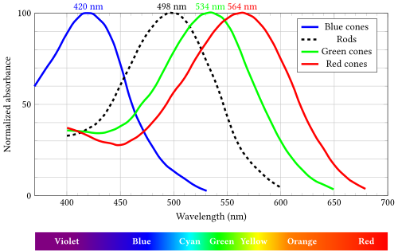

# [Draft] 1회차 Chapter 2. 인간의 색 인지와 삼색 이론

## 학습 목표

이 장의 목표는 색공간(color space)이 왜 인간 시각(human vision)에서 출발하는지 이해하는 것이다. 색은 빛의 물리적 성질만으로 결정되는 것이 아니라, 그 빛을 인간의 눈과 뇌가 어떻게 받아들이는지에 따라 결정된다. 따라서 색공간을 이해하려면 먼저 빛의 스펙트럼(spectrum), 파장(wavelength), 원추세포(cone cells), 삼색 이론(trichromatic theory), 색상 매칭(color matching)의 기본 아이디어를 잡아야 한다.

이 장을 마치면 청중은 다음을 설명할 수 있어야 한다.

- 빛의 스펙트럼(spectrum)과 파장(wavelength)이 색 인지(color perception)와 어떻게 연결되는가
- 인간 눈의 원추세포(cone cells)가 색을 구분하는 생물학적 기반이 되는 이유는 무엇인가
- 삼색 이론(trichromatic theory)이 RGB 색공간과 어떤 직관적 연결을 갖는가
- 서로 다른 스펙트럼이 같은 색으로 보일 수 있는 이유는 무엇인가
- 색상 매칭(color matching) 실험이 CIE XYZ와 CIE xy 색도도(CIE xy chromaticity diagram)로 이어지는 출발점이 되는 이유는 무엇인가

## 핵심 질문

- 색은 빛의 파장(wavelength) 하나로만 결정되는가?
- 흰색 빛은 "색이 없는 빛"인가, 아니면 여러 파장의 빛이 섞인 결과인가?
- 인간은 왜 보통 세 종류의 원추세포(cone cells)를 통해 색을 구분한다고 말하는가?
- 삼색 이론(trichromatic theory)은 "세 가지 색만 있으면 세상의 모든 빛을 물리적으로 만들 수 있다"는 뜻인가?
- 서로 다른 스펙트럼(spectrum)이 어떻게 같은 색으로 보일 수 있는가?
- 색상 매칭(color matching)은 색공간 표준을 만드는 데 어떤 역할을 하는가?
- CIE 등색 함수(CIE color matching functions)는 원추세포의 직접 응답 곡선인가, 아니면 표준 관찰자(standard observer)를 정의하기 위한 함수인가?

## 상세 설명

### 1. 빛의 스펙트럼(Spectrum): 색의 물리적 출발점

색 이야기는 빛에서 시작한다. 빛은 전자기파(electromagnetic wave)의 한 부분이고, 인간이 볼 수 있는 범위를 가시광선(visible light)이라고 부른다. 가시광선은 대략 380 nm에서 700 nm 근처의 파장(wavelength)을 갖는 빛으로 설명하는 경우가 많다. 다만 이 범위는 사람과 조건에 따라 조금씩 달라질 수 있으므로, 절대적인 경계라기보다 인간 시각이 주로 반응하는 대략적인 범위로 이해하면 된다.

파장(wavelength)은 빛의 물리적 특성을 나타내는 값이다. 짧은 파장 쪽은 보라색/파란색 계열로, 긴 파장 쪽은 빨간색 계열로 지각되는 경향이 있다. 예를 들어 단일 파장에 가까운 빛을 보면 특정한 색상(hue)으로 느껴질 수 있다.

하지만 실제 세계의 빛은 대부분 하나의 파장만으로 이루어져 있지 않다. 태양광, 조명, 디스플레이(display), 물체에서 반사된 빛은 여러 파장의 빛이 섞인 형태다. 어떤 빛에 각 파장이 얼마나 들어 있는지를 나타낸 것이 스펙트럼(spectrum) 또는 더 구체적으로는 분광 분포(spectral power distribution, SPD)다.

여기서 중요한 점은 "빛의 스펙트럼"과 "우리가 느끼는 색"이 1:1로 완전히 대응하지 않는다는 것이다. 스펙트럼은 물리적 분포이고, 색 인지(color perception)는 인간 시각 시스템의 반응 결과다. 두 빛의 스펙트럼이 서로 달라도 인간에게 같은 색으로 보일 수 있고, 반대로 같은 물리적 빛이라도 관찰 조건에 따라 다르게 보일 수 있다.

이 장에서는 먼저 가장 기본적인 연결만 잡는다.

```text
빛의 스펙트럼
-> 눈의 광수용기 반응
-> 인간의 색 인지
-> 색을 숫자로 표현하려는 색공간의 필요성
```

즉 색공간(color space)은 순수하게 물리학만의 결과도 아니고, 임의로 만든 숫자 체계도 아니다. 인간이 빛을 어떻게 구분해 느끼는지를 표준화해서 다루려는 시도다.

### 2. 인간 시각(Human Vision)과 원추세포(Cone Cells)

인간의 망막(retina)에는 빛에 반응하는 광수용기(photoreceptors)가 있다. 대표적으로 막대세포(rod cells)와 원추세포(cone cells)가 있다.

막대세포(rod cells)는 어두운 환경에서 민감하게 작동하며, 밝기와 명암을 감지하는 데 중요하다. 반면 원추세포(cone cells)는 상대적으로 밝은 환경에서 색을 구분하는 데 핵심적인 역할을 한다.

일반적인 인간 색각(color vision)은 세 종류의 원추세포를 기반으로 설명한다.

- L 원추세포(L cone): 긴 파장(long wavelength) 영역에 상대적으로 더 민감하다
- M 원추세포(M cone): 중간 파장(medium wavelength) 영역에 상대적으로 더 민감하다
- S 원추세포(S cone): 짧은 파장(short wavelength) 영역에 상대적으로 더 민감하다

여기서 L, M, S를 빨강, 초록, 파랑 원추세포라고 단순히 부르기도 하지만, 엄밀하게는 "빨강만 감지하는 세포", "초록만 감지하는 세포", "파랑만 감지하는 세포"가 아니다. 각 원추세포는 넓은 파장 범위에 걸쳐 반응하고, 민감도 곡선이 서로 겹친다. 인간의 시각 시스템은 세 종류 원추세포의 상대적인 반응 패턴을 바탕으로 색을 구분한다.

예를 들어 어떤 빛이 L 원추세포를 강하게, M 원추세포를 중간 정도로, S 원추세포를 약하게 자극한다면 우리는 그 반응 조합을 특정 색으로 인지한다. 다른 스펙트럼을 가진 빛이라도 세 원추세포의 반응 조합이 충분히 비슷하면 같은 색처럼 보일 수 있다.

이 점이 색공간의 핵심으로 이어진다. 인간 색각이 대체로 세 종류의 원추세포 반응을 기반으로 한다면, 많은 색을 세 개의 값으로 표현할 수 있다는 아이디어가 나온다. RGB 색공간(color space)이 세 채널을 사용하는 배경에는 이런 생물학적 사실과 삼색 이론(trichromatic theory)이 있다.

다만 주의할 점이 있다. 실제 원추세포 반응은 생물학적 기반이고, 뒤에서 배울 CIE XYZ나 CIE 등색 함수(CIE color matching functions)는 표준 관찰자(standard observer)를 정의하기 위한 측색 표준이다. CIE 등색 함수를 원추세포의 직접 응답 곡선처럼 설명하면 부정확하다. 두 개념은 연결되어 있지만 같은 것은 아니다.

### 3. 삼색 이론(Trichromatic Theory): 세 반응값으로 색을 설명하려는 관점

삼색 이론(trichromatic theory)은 인간의 색 인지(color perception)가 세 종류의 수용기 반응 조합으로 설명될 수 있다는 이론이다. 역사적으로는 Young-Helmholtz 이론으로도 알려져 있으며, 현대적으로는 L, M, S 원추세포(cone cells)의 반응을 기반으로 이해한다.

이 이론의 중요한 직관은 다음과 같다.

```text
인간은 빛의 전체 스펙트럼을 그대로 읽는 것이 아니라,
세 종류 원추세포의 반응 조합을 통해 색을 구분한다.
```

따라서 우리 눈은 분광 분석기(spectrometer)처럼 각 파장의 에너지를 모두 따로 기록하지 않는다. 대신 스펙트럼이 원추세포들을 얼마나 자극하는지에 따라 색을 느낀다. 이 때문에 물리적으로 다른 스펙트럼이 같은 색으로 보이는 현상이 가능하다. 이런 색을 조건등색(metameric color), 그 현상을 조건등색(metamerism)이라고 부른다.

예를 들어 어떤 노란색 빛을 생각해 보자. 한 경우에는 노란색에 해당하는 단일 파장 근처의 빛일 수 있다. 다른 경우에는 빨강 계열 빛과 초록 계열 빛이 함께 섞인 결과일 수 있다. 두 빛의 스펙트럼은 다르지만, 인간의 원추세포 반응 조합이 비슷하면 둘 다 노란색으로 보일 수 있다.

이것이 디스플레이(display)가 색을 만드는 원리와도 연결된다. 디스플레이는 세상의 모든 스펙트럼을 물리적으로 그대로 재현하지 않는다. 대신 R, G, B 세 원색(color primaries)의 빛을 조절해 인간에게 목표 색과 같은 색처럼 보이는 원추세포 반응 조합을 만든다.

따라서 "RGB로 색을 만든다"는 말은 "목표 빛의 스펙트럼을 완전히 복제한다"는 뜻이 아니다. 더 정확하게는, 인간 시각에서 목표 색과 일치하거나 충분히 비슷하게 보이는 자극을 세 원색의 조합으로 만든다는 뜻이다.

### 4. 색상 매칭(Color Matching)의 기본 아이디어

색상 매칭(color matching)은 어떤 기준 색(test color)을 몇 개의 기본 빛(primary lights)의 조합으로 맞춰 보는 실험적 아이디어다. 청중에게는 다음 장면으로 설명할 수 있다.

```text
왼쪽: 기준 색
오른쪽: R, G, B 세 빛을 섞어 만든 색

관찰자는 오른쪽의 R, G, B 양을 조절해
왼쪽과 같은 색으로 보이도록 맞춘다.
```

이때 중요한 것은 물리적 스펙트럼이 완전히 같아야 하는 것이 아니라, 관찰자에게 같은 색으로 보이면 매칭(match)으로 본다는 점이다. 색상 매칭 실험은 인간 관찰자가 색을 어떻게 같다고 판단하는지 측정하는 방법이다.

색상 매칭의 기본 직관은 매우 실용적이다. 어떤 색을 세 기본 빛의 양으로 맞출 수 있다면, 그 색을 세 개의 숫자로 기록할 수 있다. 이 아이디어가 RGB 표현과 색공간(color space)의 출발점이 된다.

하지만 실제 색상 매칭 실험에서는 문제가 생긴다. 어떤 기준 색은 선택한 R, G, B 기본 빛을 더하는 것만으로는 맞추기 어렵고, 기준 색 쪽에 기본 빛 하나를 더해야만 균형이 맞는 경우가 있다. 수학적으로는 이것이 음수 RGB 값처럼 나타난다. 이 문제는 다음 장에서 CIE RGB 색상 일치 함수(CIE RGB color matching functions)와 CIE XYZ의 등장으로 이어진다.

지금 단계에서 기억할 핵심은 다음과 같다.

```text
색상 매칭은 "스펙트럼을 복제하는 실험"이 아니라,
"인간 관찰자에게 같은 색으로 보이는 조건을 찾는 실험"이다.
```

이 관점이 있어야 CIE XYZ, CIE xy 색도도, 표준 관찰자(standard observer)를 자연스럽게 이해할 수 있다.

### 5. CIE 표준으로 이어지는 연결고리

삼색 이론(trichromatic theory)은 인간 색각의 생물학적 기반을 설명해 준다. 색상 매칭(color matching)은 이 기반을 측정 가능한 실험으로 옮긴다. CIE 표준은 이런 실험 결과를 바탕으로 색을 장치 독립적(device-independent)으로 다루기 위한 좌표계를 만든다.

다만 여기서 용어를 조심해야 한다.

CIE 등색 함수(CIE color matching functions)는 L, M, S 원추세포(cone cells)의 생물학적 반응 곡선을 그대로 그린 것이 아니다. CIE 등색 함수는 특정 색상 매칭 실험과 변환 과정을 바탕으로 정의된 표준 관찰자(standard observer)의 함수다. 즉 실제 사람의 평균적 색상 매칭 행동을 표준화해 색 계산에 사용할 수 있도록 만든 함수로 이해하는 편이 정확하다.

이 구분은 뒤에서 CIE XYZ와 CIE xy 색도도(CIE xy chromaticity diagram)를 배울 때 중요하다. CIE XYZ는 인간 시각과 무관한 임의의 수학이 아니라 색상 매칭에서 출발하지만, 동시에 실제 원추세포 곡선을 그대로 쓰는 생리학 모델도 아니다. 색공간 세미나에서는 이 균형을 유지해야 한다.

정리하면 Chapter 2의 위치는 다음과 같다.

```text
빛의 스펙트럼
-> 원추세포 기반의 색 인지
-> 삼색 이론
-> 색상 매칭 실험
-> CIE RGB / CIE XYZ / CIE xy 색도도
```

다음 Chapter 3에서는 이 흐름을 이어 받아 CIE XYZ와 CIE xy 색도도가 어떻게 만들어졌는지 살펴본다.

## 용어 노트

### 색 인지(Color Perception)

색 인지(color perception)는 빛의 물리적 스펙트럼(spectrum)을 인간 시각 시스템이 해석한 결과다. 같은 스펙트럼이라도 관찰 조건에 따라 다르게 보일 수 있고, 서로 다른 스펙트럼도 같은 색으로 보일 수 있다.

### 스펙트럼(Spectrum)과 분광 분포(Spectral Power Distribution, SPD)

스펙트럼(spectrum)은 빛이 파장(wavelength)에 따라 어떻게 구성되어 있는지를 나타내는 개념이다. 분광 분포(spectral power distribution, SPD)는 각 파장에 어느 정도의 에너지가 있는지를 더 구체적으로 표현한다.

### 파장(Wavelength)

파장(wavelength)은 빛의 물리적 특성을 나타내는 값이다. 가시광선(visible light) 범위에서는 파장에 따라 보라색, 파란색, 초록색, 노란색, 빨간색 등으로 지각되는 경향이 있다. 그러나 실제 색 인지(color perception)는 단일 파장만으로 결정되지 않는다.

### 원추세포(Cone Cells)

원추세포(cone cells)는 밝은 환경에서 색을 구분하는 데 중요한 망막의 광수용기(photoreceptors)다. 일반적인 인간 색각은 L, M, S 세 종류의 원추세포 반응 조합으로 설명할 수 있다. 각 원추세포는 특정 파장 하나에만 반응하지 않고 넓은 범위에 걸쳐 겹쳐 반응한다.

### 삼색 이론(Trichromatic Theory)

삼색 이론(trichromatic theory)은 인간 색각이 세 종류의 수용기 반응 조합으로 설명될 수 있다는 이론이다. RGB 색공간이 세 채널을 사용하는 직관적 배경과 연결되지만, RGB 원색이 곧 L, M, S 원추세포와 동일하다는 뜻은 아니다.

### 색상 매칭(Color Matching)

색상 매칭(color matching)은 기준 색과 비교 색이 관찰자에게 같아 보이도록 기본 빛의 양을 조절하는 실험적 방법이다. 이는 색을 세 개의 값으로 표현할 수 있다는 아이디어와 CIE 표준 색공간의 출발점이 된다.

### 조건등색(Metamerism)

조건등색(metamerism)은 서로 다른 스펙트럼(spectrum)을 가진 빛이 특정 관찰 조건에서 같은 색으로 보이는 현상이다. 디스플레이(display)가 실제 물체의 스펙트럼을 그대로 복제하지 않고도 비슷한 색을 보여줄 수 있는 이유와 연결된다.

### 등색 함수(Color Matching Functions)

등색 함수(color matching functions)는 색상 매칭(color matching) 결과를 바탕으로 각 파장의 빛을 표준 관찰자(standard observer)가 어떻게 세 값으로 표현하는지 나타내는 함수다. CIE 등색 함수(CIE color matching functions)는 원추세포(cone cells)의 직접 응답 곡선이 아니라, 색 계산을 위한 표준 관찰자 함수로 이해해야 한다.

## 그림 후보

> 아래 그림은 슬라이드 제작 시 후보로 검토할 자료다. 최종 사용 전에는 각 출처 페이지에서 라이선스와 저작자 표기를 확인한다.

- `가시광선과 파장`: [Linear visible spectrum](https://commons.wikimedia.org/wiki/File:Linear_visible_spectrum.svg) - 빛의 파장(wavelength)과 색 지각의 출발점을 소개할 때 사용.
  
- `삼색 이론`: [Color sensitivity curves](https://commons.wikimedia.org/wiki/File:1416_Color_Sensitivity.svg) - 원추세포(cone cells) 민감도와 삼색 색채 이론(trichromatic theory)을 설명하는 후보.
  
- `색상 매칭 실험 직관`: [Additive colour mixing](https://commons.wikimedia.org/wiki/File:Additive_Colour_Mixing.svg) - 세 기본 빛(primary lights)의 가산 혼합(additive mixing)을 직관적으로 보여준다.
  

## 실무 예시와 데모 아이디어

### 예시 1. 같은 노란색처럼 보이는 두 빛

노란색 단일 파장에 가까운 빛과, 빨간색 빛과 초록색 빛을 섞어 만든 빛을 비교한다. 두 빛의 스펙트럼(spectrum)은 다르지만 관찰자에게 비슷한 노란색으로 보일 수 있다.

이 예시는 조건등색(metamerism)을 설명하기 좋다. 디스플레이(display)의 노란색은 실제 노란색 파장 하나를 내는 방식이 아니라, 주로 R과 G 채널의 조합으로 인간 시각에 노란색처럼 보이게 만드는 방식이다.

### 예시 2. 프리즘 또는 분광 이미지로 흰색 보기

흰색 LED, 태양광, 형광등, 스마트폰 화면의 흰색을 비교해 본다. 모두 흰색으로 보일 수 있지만 분광 분포(spectral power distribution, SPD)는 서로 다를 수 있다. 가능하다면 간단한 분광기 앱이나 공개된 SPD 그래프를 보여준다.

이 데모의 목적은 "흰색은 스펙트럼이 하나로 정해진 색"이 아니라, 관찰 조건과 시각 반응에 따라 흰색으로 인지될 수 있는 여러 물리적 분포가 있다는 점을 보여주는 것이다.

### 예시 3. RGB 슬라이더로 색상 매칭 감각 만들기

화면 한쪽에는 기준 색을 두고, 다른 쪽에는 R, G, B 슬라이더로 조절하는 색 패치를 둔다. 청중에게 세 채널 값을 조절해 기준 색과 비슷하게 맞추게 한다.

이 데모는 색상 매칭(color matching)의 직관을 만들기 좋다. 실제 CIE 실험과 같지는 않지만, "기준 색을 세 기본 빛의 양으로 맞춘다"는 아이디어를 빠르게 체감할 수 있다.

### 예시 4. 스펙트럼과 RGB 값의 차이 보여주기

같은 sRGB 값으로 보이는 색이라도 실제 디스플레이 패널, 조명, 물체 표면에서는 스펙트럼(spectrum)이 다를 수 있음을 설명한다. RGB 값은 인간 시각과 장치 표준에 맞춘 표현이지, 빛의 전체 스펙트럼을 저장한 데이터가 아니다.

이 예시는 "RGB 이미지 파일은 분광 데이터가 아니다"라는 실무적 메시지로 연결할 수 있다. 색공간(color space)은 색 인지를 다루는 강력한 모델이지만, 조명 설계, 재료 분석, 카메라 센서 보정처럼 스펙트럼 자체가 중요한 분야에서는 별도의 분광 정보가 필요할 수 있다.

## 추천 진행 흐름

### 1. 색을 물리와 지각으로 나누어 시작하기

처음에는 "색은 빛의 성질인가, 눈의 반응인가?"라는 질문으로 시작한다. 답은 둘 중 하나가 아니라 둘의 관계다. 빛에는 스펙트럼(spectrum)이 있고, 인간은 그 빛을 시각 시스템으로 해석한다는 구조를 잡아 준다.

### 2. 스펙트럼(Spectrum)과 파장(Wavelength) 설명하기

가시광선(visible light), 파장(wavelength), 분광 분포(spectral power distribution, SPD)를 소개한다. 이때 단일 파장 색과 여러 파장이 섞인 빛을 구분해 설명한다. 흰색 빛도 물리적으로는 다양한 스펙트럼 조합으로 만들어질 수 있다는 점을 짚는다.

### 3. 원추세포(Cone Cells)로 넘어가기

망막(retina)의 막대세포(rod cells)와 원추세포(cone cells)를 간단히 구분하고, 색 인지(color perception)에서는 L, M, S 원추세포의 반응 조합이 중요하다고 설명한다. 이때 L/M/S를 빨강/초록/파랑 센서처럼 지나치게 단순화하지 않도록 주의한다.

### 4. 삼색 이론(Trichromatic Theory) 연결하기

인간이 스펙트럼 전체를 직접 기록하지 않고 세 종류 원추세포 반응 조합으로 색을 구분한다는 점을 설명한다. 여기서 RGB 색공간(color space)의 세 채널 구조와 연결하되, RGB 원색과 원추세포가 동일하다고 말하지 않는다.

### 5. 조건등색(Metamerism)과 디스플레이(Display) 예시 제시하기

서로 다른 스펙트럼이 같은 색으로 보일 수 있다는 조건등색(metamerism)을 소개한다. 디스플레이가 실제 물체의 스펙트럼을 복제하는 것이 아니라, 인간에게 같은 색처럼 보이는 R, G, B 조합을 만든다는 점을 실무 예시로 연결한다.

### 6. 색상 매칭(Color Matching)에서 CIE로 넘어가기

마지막에는 색상 매칭(color matching) 실험의 기본 장면을 설명한다. 기준 색을 세 기본 빛으로 맞추는 실험에서 색을 세 숫자로 표현하는 아이디어가 나오고, 이 흐름이 다음 장의 CIE RGB, CIE XYZ, CIE xy 색도도(CIE xy chromaticity diagram)로 이어진다고 예고한다.

## 짧은 마무리 요약

색은 빛의 스펙트럼(spectrum)과 인간 시각(human vision)이 만나는 지점에서 만들어지는 지각적 결과다. 인간의 일반적인 색각은 L, M, S 원추세포(cone cells)의 반응 조합을 기반으로 설명할 수 있고, 이 생물학적 기반이 삼색 이론(trichromatic theory)과 RGB식 색 표현의 중요한 배경이 된다.

하지만 RGB 값이나 색공간(color space)은 빛의 전체 스펙트럼을 그대로 저장하는 방식이 아니다. 서로 다른 스펙트럼도 같은 색으로 보일 수 있으며, 색상 매칭(color matching)은 바로 이 인간 관찰자의 "같아 보임"을 측정해 색을 숫자로 표현하려는 출발점이다.

다음 장에서는 이 아이디어가 어떻게 CIE RGB 색상 일치 함수(CIE RGB color matching functions), CIE XYZ, CIE xy 색도도(CIE xy chromaticity diagram)로 표준화되는지 살펴본다.
