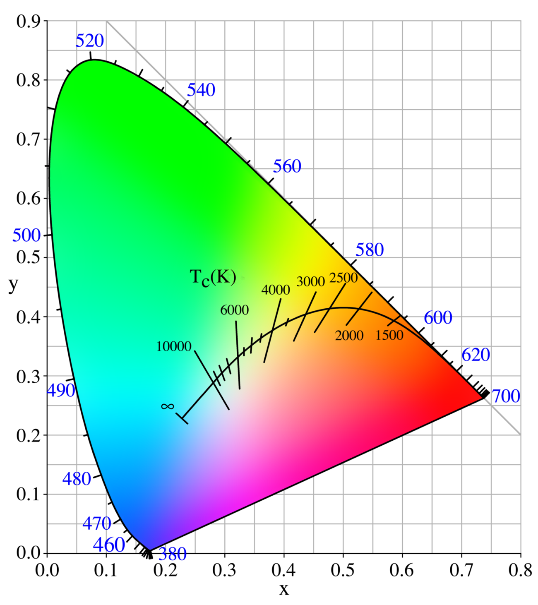

# [Draft] 1회차 Chapter 5. CIE xy 색도도로 색공간 읽기

## 학습 목표

이 장의 목표는 CIE xy 색도도(CIE xy chromaticity diagram)를 실제 색공간(color space) 표준을 읽는 도구로 사용하는 법을 익히는 것이다. spectral locus, 비분광색(non-spectral colors), 색역 삼각형(gamut triangle), 원색(color primaries), 화이트 포인트(white point)를 이해하고, sRGB, Rec.709, Display P3, Adobe RGB, Rec.2020을 CIE xy 위에서 비교한다.

이 장을 마치면 청중은 다음을 설명할 수 있어야 한다.

- CIE xy 색도도에서 spectral locus와 보라선(line of purples)이 무엇을 의미하는가
- 색역 삼각형(gamut triangle)이 RGB 색공간의 어떤 정보를 보여주는가
- 원색(color primaries)과 화이트 포인트(white point)를 CIE xy 좌표로 읽는 방법
- sRGB, Rec.709, Display P3, Adobe RGB, Rec.2020의 색역 차이를 큰 방향성으로 비교하는 방법
- CIE xy 색도도는 밝기(brightness)나 휘도(luminance)를 직접 보여주지 않는다는 한계

## 핵심 질문

- CIE xy 색도도의 말발굽 모양 경계는 무엇을 나타내는가?
- spectral locus 위의 색과 RGB 원색을 섞어 만든 색은 어떤 차이가 있는가?
- 보라색 계열은 왜 스펙트럼의 단일 파장 경계가 아니라 직선 경계로 닫히는가?
- RGB 색공간의 삼각형은 왜 세 원색을 이은 모양이 되는가?
- 화이트 포인트가 같으면 두 색공간은 같은 색공간인가?
- Rec.709와 sRGB는 색역이 같은데 완전히 같은 표준이라고 말해도 되는가?
- CIE xy 그림만 보고 HDR 표현 능력을 판단할 수 있는가?

## 상세 설명

### 1. CIE xy 색도도는 색도 지도다

CIE xy 색도도(CIE xy chromaticity diagram)는 CIE XYZ에서 밝기 크기를 정규화해 만든 색도(chromaticity) 지도다. 이 지도에서는 색이 얼마나 밝은지보다, 밝기와 분리된 색의 위치를 본다.

이 장에서 CIE xy를 읽을 때 기본 규칙은 다음과 같다.

```text
x, y 좌표 = 색도 위치
삼각형 꼭짓점 = RGB 원색(color primaries)
삼각형 내부 = 해당 RGB 색공간이 만들 수 있는 색도 범위
화이트 포인트 = 흰색 기준의 색도 위치
```

다만 이 지도는 색의 밝기(brightness)나 휘도(luminance)를 직접 보여주지 않는다. 같은 xy 좌표라도 CIE XYZ의 `Y` 값이 다르면 더 밝거나 어두운 색이 될 수 있다. 따라서 CIE xy는 "어떤 색도인가"를 보는 지도이지, "얼마나 밝게 낼 수 있는가"를 보는 지도는 아니다.

### 2. Spectral locus와 보라선

CIE xy 색도도의 바깥쪽 말발굽 모양 곡선은 스펙트럼 궤적(spectral locus)이다. 이는 가시광선(visible light) 범위의 단색광(monochromatic light), 즉 특정 파장 하나에 가까운 빛의 색도 좌표를 연결한 경계다.

짧은 파장 쪽은 보라/파랑 계열, 중간 파장 쪽은 초록 계열, 긴 파장 쪽은 빨강 계열로 이어진다. 이 곡선 위의 색은 특정 파장의 빛에 가까운 색도이며, 일반적으로 매우 순도 높은 색으로 볼 수 있다.

하지만 CIE xy 경계는 spectral locus만으로 닫히지 않는다. 짧은 파장 끝과 긴 파장 끝을 잇는 직선 경계가 필요하다. 이 선을 보라선(line of purples)이라고 부른다. 보라색과 자홍색 계열은 단일 파장 하나로 나타나는 스펙트럼 색(spectral color)이 아니라, 짧은 파장과 긴 파장 빛의 혼합으로 지각되는 비분광색(non-spectral colors)이다.

따라서 CIE xy의 전체 외곽은 다음 두 부분으로 볼 수 있다.

```text
spectral locus: 단색광의 색도 경계
line of purples: 단색광으로는 나오지 않는 보라/자홍 계열 경계
```

### 3. 비분광색(Non-Spectral Colors)

비분광색(non-spectral colors)은 특정 단일 파장 하나에 대응하지 않는 색이다. 대표적인 예가 자홍(magenta) 계열이다. 스펙트럼을 순서대로 펼치면 빨강에서 보라로 이어지는 물리적 파장 순서는 있지만, 빨강과 파랑을 섞었을 때 느끼는 자홍은 단일 파장 색이 아니다.

이 점은 디스플레이(display) 색을 설명할 때 중요하다. RGB 디스플레이는 단일 파장 전체를 재현하는 장치가 아니다. 세 원색(color primaries)의 빛을 섞어 인간 시각에 목표 색처럼 보이는 자극을 만든다. 따라서 spectral locus 안쪽의 많은 색은 여러 파장 또는 여러 원색의 혼합으로 만들어진 색도다.

비분광색을 이해하면 CIE xy 색도도가 단순한 "무지개 그림"이 아니라, 인간 색상 매칭(color matching) 결과를 정리한 색도 공간이라는 점이 더 분명해진다.

### 4. 색역 삼각형(Gamut Triangle)과 원색

RGB 색공간(color space)은 보통 세 원색(color primaries)을 정의한다. 각 원색은 CIE xy 좌표로 표현할 수 있고, 이 세 점을 연결하면 색역 삼각형(gamut triangle)이 된다.

RGB 값은 세 원색을 어떤 비율로 섞는지 나타낸다. 세 원색의 양수 조합으로 만들 수 있는 색도는 CIE xy 평면에서 이 삼각형 내부에 놓인다. 그래서 삼각형이 넓을수록 더 넓은 색도 범위를 표현할 수 있다.

하지만 삼각형이 넓다고 항상 더 좋은 것은 아니다. 넓은 색역(wide gamut)은 더 많은 색을 표현할 잠재력을 주지만, 파일의 색공간 정보와 색관리(color management)가 정확하지 않으면 색이 과장되거나 틀어질 수 있다. 중요한 것은 색역의 크기만이 아니라, 해당 RGB 값이 어떤 원색과 화이트 포인트, 전송 특성(transfer characteristics) 안에서 해석되는지 아는 것이다.

### 5. 화이트 포인트(White Point)

화이트 포인트(white point)는 해당 색공간에서 흰색으로 간주하는 기준 색도다. CIE xy 색도도에서는 하나의 점으로 표시된다. sRGB, Rec.709, Display P3, Adobe RGB, Rec.2020은 모두 일반적으로 D65 화이트 포인트(D65 white point)를 사용한다.

화이트 포인트는 색공간 변환(color space conversion)에서 매우 중요하다. 두 색공간의 원색이 다르더라도 화이트 포인트가 같으면 변환이 단순해질 수 있다. 반대로 화이트 포인트가 다르면, CIE XYZ를 거치는 과정에서 화이트 포인트 적응(chromatic adaptation)이 필요할 수 있다.

다만 화이트 포인트가 같다고 해서 두 색공간이 같은 것은 아니다. 원색이 다르면 색역이 다르고, 전송 특성이 다르면 RGB 코드값(code value)의 해석도 달라질 수 있다.

### 6. 주요 RGB 색공간 비교

다음 비교는 CIE xy 색도도 위에서 색역 삼각형을 읽는 실무적 감각을 만들기 위한 것이다.

### sRGB와 Rec.709

sRGB와 Rec.709는 같은 RGB 원색(color primaries)과 D65 화이트 포인트(white point)를 사용한다. 따라서 CIE xy 위의 색역 삼각형(gamut triangle)은 사실상 같다.

```text
Red   x=0.640, y=0.330
Green x=0.300, y=0.600
Blue  x=0.150, y=0.060
White D65, x=0.3127, y=0.3290
```

하지만 두 표준은 같은 색공간이라고 말하면 안 된다. CIE xy 색도도에는 원색과 화이트 포인트만 보이고, 전송 특성(transfer characteristics), 신호 범위(color range), 행렬 계수(matrix coefficients), 사용 환경은 보이지 않기 때문이다.

| 항목 | sRGB | Rec.709 / BT.709 |
|---|---|---|
| 주 사용처 | 웹(web), 컴퓨터 그래픽(computer graphics), 이미지 파일, 일반 사진, UI, 데스크톱 색관리 | HDTV, SDR 방송/영상 제작, 카메라 신호, 편집/송출, 영상 코덱의 `bt709` 표기 |
| 기본 성격 | 디스플레이와 컴퓨터 환경을 위한 기본 RGB 색공간(default RGB colour space) | HDTV 프로그램 제작과 국제 교환을 위한 영상 신호 표준 |
| 색도 좌표 | Rec.709와 동일한 primaries와 D65 | sRGB와 동일한 primaries와 D65 |
| RGB 표현 | 보통 `R'G'B'` 또는 ICC 기반 RGB 이미지로 다룸 | `R'G'B'`에서 `Y'CbCr`로 변환해 영상 신호로 다루는 경우가 많음 |
| transfer | sRGB 고유의 piecewise transfer function | Rec.709 OETF(opto-electronic transfer function), 실제 표시 쪽은 보통 BT.1886 EOTF(electro-optical transfer function)와 함께 설명 |
| range 관습 | 이미지/그래픽에서는 보통 full range, 8-bit 기준 0..255 | 방송/비디오에서는 limited range가 흔함. 8-bit 기준 Y' 16..235, Cb/Cr 16..240 계열 |

sRGB는 웹과 컴퓨터 그래픽 환경의 기본값에 가깝다. PNG, JPEG, CSS 색상, UI asset, 일반 사진 파일을 다룰 때 프로파일이 없으면 sRGB로 가정되는 경우가 많다. sRGB 표준은 기준 디스플레이(reference display), 기준 viewing environment, D65 white point, 약 2.2에 가까운 비선형 transfer를 함께 정의한다. 즉 sRGB의 목표는 "컴퓨터와 웹에서 RGB 숫자를 일관된 색으로 해석하자"에 가깝다.

Rec.709는 HDTV 영상 표준이다. 원색과 D65 white point만 정의하는 것이 아니라, 영상 신호를 만들기 위한 opto-electronic transfer function, luma 신호 `Y'`를 만들 때 쓰는 계수, `Cb/Cr` 색차 신호, 샘플링 구조, 디지털 양자화 범위까지 함께 다룬다. 그래서 영상 파일에서 `color_primaries=bt709`, `transfer_characteristics=bt709`, `matrix_coefficients=bt709`, `color_range=tv` 같은 식으로 여러 항목이 따로 표시될 수 있다.

sRGB transfer function은 linear RGB `C`를 non-linear code value `C'`로 바꿀 때 다음과 같은 piecewise curve를 사용한다.

```text
sRGB encoding transfer

C' = 12.92 C                         for C <= 0.0031308
C' = 1.055 C^(1/2.4) - 0.055          for C > 0.0031308
```

반대로 sRGB 값을 linear RGB로 되돌릴 때는 다음 inverse transfer를 쓴다.

```text
sRGB inverse transfer

C = C' / 12.92                        for C' <= 0.04045
C = ((C' + 0.055) / 1.055)^2.4        for C' > 0.04045
```

Rec.709의 transfer characteristic은 보통 카메라 또는 source 쪽 opto-electronic transfer function(OETF)으로 정의된다. 선형 scene light 또는 image luminance `L`을 전기적 영상 신호 `V`로 바꾸는 식이다.

```text
Rec.709 OETF

V = 4.5 L                             for 0 <= L < 0.018
V = 1.099 L^0.45 - 0.099              for 0.018 <= L <= 1
```

이 두 함수는 비슷해 보이지만 같은 함수가 아니다. sRGB는 낮은 영역의 breakpoint가 `0.0031308`이고 지수부가 `1/2.4` 형태이며, Rec.709 OETF는 breakpoint가 `0.018`, slope가 `4.5`, 지수가 `0.45`다. 중간 톤에서는 결과가 아주 크게 다르지 않을 수 있지만, 표준적으로는 서로 다른 transfer characteristic이다.

또 하나의 중요한 차이는 sRGB가 보통 이미지의 RGB 값 자체를 어떻게 표시할지까지 함께 다루는 반면, Rec.709는 원래 HDTV 영상 신호의 source OETF를 정의하고 display EOTF는 별도 권고인 BT.1886과 함께 다루는 경우가 많다는 점이다. 그래서 영상 처리에서는 다음을 분리해서 읽어야 한다.

```text
color_primaries = bt709
  원색과 D65 white point

transfer_characteristics = bt709
  Rec.709 OETF 기반의 비선형 신호 해석

matrix_coefficients = bt709
  R'G'B'와 Y'CbCr 사이의 luma/chroma 행렬

color_range = tv 또는 pc
  limited range인지 full range인지
```

따라서 "sRGB와 Rec.709는 CIE xy에서 같은 삼각형이다"라는 말은 맞지만, "sRGB 이미지와 Rec.709 영상을 같은 방식으로 디코딩하면 된다"는 뜻은 아니다. 예를 들어 같은 `R'G'B' = (128, 128, 128)`이라도 sRGB 이미지로 해석할 때와 Rec.709 영상 신호로 해석할 때는 inverse transfer, range, Y'CbCr matrix 적용 여부가 달라질 수 있다.

따라서 CIE xy 그림만 보면 둘의 색역은 같아 보이지만, 파일이나 영상 신호를 해석할 때는 transfer, matrix, range 같은 다른 항목도 확인해야 한다.

### Display P3

Display P3는 DCI-P3 계열의 넓은 색역 원색을 기반으로 하되 일반적으로 D65 화이트 포인트를 사용하는 디스플레이 색공간이다. sRGB보다 특히 빨강과 초록 방향으로 더 넓은 색역을 제공해, 더 채도 높은 빨강, 주황, 초록 계열을 표현할 수 있다.

웹, 모바일 기기, 현대 디스플레이에서 Display P3 이미지가 자주 등장한다. 하지만 P3 값을 sRGB로 잘못 해석하면 색이 달라지므로 색관리(color management)가 중요하다.

### Adobe RGB

Adobe RGB는 sRGB보다 특히 초록-청록(cyan-green) 방향으로 넓은 색역을 갖는다. 인쇄 워크플로와 사진 작업에서 자주 언급된다. CIE xy 위에서 보면 sRGB 삼각형보다 초록 원색이 더 바깥쪽에 있어, 특정 인쇄 색역과의 대응에서 유리한 경우가 있다.

### Rec.2020

Rec.2020은 UHDTV와 HDR 워크플로에서 중요한 매우 넓은 색역 표준이다. CIE xy 위에서 sRGB, Display P3, Adobe RGB보다 훨씬 큰 삼각형을 갖는다. 특히 원색이 spectral locus에 가까운 매우 순도 높은 위치에 있다.

하지만 Rec.2020 삼각형이 넓다고 해서 모든 Rec.2020 콘텐츠가 항상 그 넓은 색을 실제로 사용한다는 뜻은 아니다. 또한 실제 디스플레이가 Rec.2020 전체를 재현하는 것도 쉽지 않다. CIE xy의 2D 색역과 실제 디스플레이의 밝기별 재현 능력, 즉 컬러 볼륨(color volume)은 별도로 보아야 한다.

## 용어 노트

### 스펙트럼 궤적(Spectral Locus)

CIE xy 색도도에서 단색광(monochromatic light)의 색도 좌표를 연결한 말발굽 모양 경계다.

### 보라선(Line of Purples)

spectral locus의 짧은 파장 끝과 긴 파장 끝을 잇는 직선 경계다. 이 선 위의 보라/자홍 계열은 단일 파장으로 나타나는 스펙트럼 색이 아니라 비분광색(non-spectral colors)이다.

### 비분광색(Non-Spectral Colors)

특정 단일 파장 하나에 대응하지 않는 색이다. 자홍(magenta) 계열처럼 여러 파장 또는 원색의 혼합으로 지각되는 색이 대표적이다.

### 색역(Gamut)

특정 색공간이나 장치가 표현할 수 있는 색의 범위다. CIE xy에서는 RGB 원색을 연결한 삼각형 내부로 자주 표현하지만, 밝기별 재현 범위까지 포함하려면 컬러 볼륨(color volume)을 따로 보아야 한다.

### 원색(Color Primaries)

RGB 색공간에서 R, G, B 기본색의 CIE xy 위치다. 원색 위치가 다르면 같은 RGB 숫자라도 다른 측색적 색(colorimetric color)을 의미할 수 있다.

### 화이트 포인트(White Point)

흰색 기준의 색도 위치다. sRGB, Rec.709, Display P3, Adobe RGB, Rec.2020은 일반적으로 D65 화이트 포인트를 사용한다.

## 그림 후보

> 아래 그림은 슬라이드 제작 시 후보로 검토할 자료다. 최종 사용 전에는 각 출처 페이지에서 라이선스와 저작자 표기를 확인한다.

- `색공간 삼각형 읽기`: [CIE1931xy gamut comparison of sRGB, Display P3, Rec.2020](https://commons.wikimedia.org/wiki/File:CIE1931xy_gamut_comparison_of_sRGB_P3_Rec2020.svg) - primaries가 삼각형을 만들고 gamut을 정의한다는 설명의 대표 그림.
  
- `화이트 포인트와 색온도`: [Planckian locus](https://commons.wikimedia.org/wiki/File:PlanckianLocus.png) - white point, color temperature, Planckian locus의 관계를 설명할 때 사용.
  
- `D65 기준`: [CIE standard illuminant D65](https://commons.wikimedia.org/wiki/File:CIE_standard_illuminant_D65.svg) - sRGB/Rec.709 계열의 D65 white point를 소개하는 후보.

## 실무 예시와 데모 아이디어

### 예시 1. 색공간 삼각형 겹쳐 보기

CIE xy 위에 sRGB/Rec.709, Display P3, Adobe RGB, Rec.2020 삼각형을 겹쳐 표시한다. 어떤 방향으로 색역이 넓어지는지 시각적으로 비교한다.

### 예시 2. 같은 RGB 값, 다른 원색

`RGB = (255, 0, 0)`을 sRGB와 Display P3에서 각각 해석했을 때 xy 좌표가 다르다는 점을 보여준다. 같은 숫자라도 원색이 다르면 실제 빨강의 색도 위치가 달라진다.

### 예시 3. P3 색을 sRGB로 클리핑하기

Display P3에는 들어오지만 sRGB 삼각형 밖에 있는 색을 하나 고른다. 이를 sRGB로 변환할 때 클리핑(clipping) 또는 색역 매핑(gamut mapping)이 필요하다는 점을 보여준다.

### 예시 4. xy만 보고 밝기를 판단하지 않기

같은 xy 좌표를 가진 두 색 패치를 서로 다른 `Y` 값으로 표시한다. CIE xy 위치는 같지만 화면에서는 더 밝고 어둡게 보인다는 점을 통해 "xy에는 밝기 정보가 없다"는 한계를 확인한다.

## 추천 진행 흐름

### 1. CIE xy를 지도처럼 소개하기

처음에는 CIE xy를 색도 지도라고 말한다. 지도에서 외곽, 삼각형, 기준점이 무엇을 의미하는지 큰 구조를 먼저 잡는다.

### 2. 외곽 경계 읽기

spectral locus와 line of purples를 설명한다. 단색광과 비분광색을 구분하고, 자홍 계열이 단일 파장 색이 아니라는 점을 강조한다.

### 3. RGB 삼각형 읽기

원색 세 점을 연결하면 색역 삼각형이 된다고 설명한다. 삼각형 내부가 해당 RGB 색공간의 색도 표현 범위라는 직관을 만든다.

### 4. 주요 색공간 비교하기

sRGB/Rec.709, Display P3, Adobe RGB, Rec.2020을 차례로 겹쳐 보며 어떤 방향으로 넓어지는지 설명한다. Rec.709와 sRGB는 xy 색역은 같지만 표준의 전체 정의는 다르다는 점을 덧붙인다.

### 5. CIE xy의 한계로 마무리하기

마지막에는 CIE xy가 밝기 정보를 직접 보여주지 않는다는 점을 다시 강조한다. 이 한계가 2회차의 컬러 볼륨(color volume), HDR, 톤매핑(tone mapping)으로 이어진다고 예고한다.

## 짧은 마무리 요약

CIE xy 색도도(CIE xy chromaticity diagram)는 색공간을 읽는 데 매우 유용한 색도 지도다. spectral locus는 단색광의 경계, 보라선(line of purples)은 비분광색 경계, RGB 삼각형은 원색(color primaries)이 만드는 색역(gamut)을 보여준다. 화이트 포인트(white point)는 흰색 기준점으로 표시된다.

sRGB와 Rec.709는 xy 색역이 같고, Display P3와 Adobe RGB는 sRGB보다 넓은 특정 방향의 색역을 제공하며, Rec.2020은 훨씬 넓은 UHD/HDR 계열 색역을 정의한다. 그러나 CIE xy는 밝기(brightness)나 휘도(luminance)를 직접 보여주지 않는다. 따라서 색역 삼각형은 중요한 출발점이지만, 실제 재현 능력은 전송 특성, 색관리, 디스플레이 특성, 컬러 볼륨까지 함께 보아야 한다.
