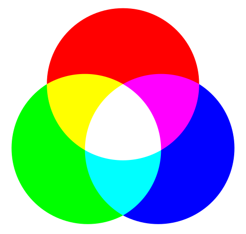
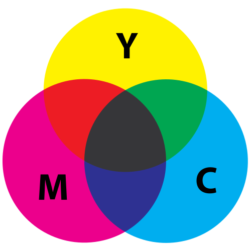
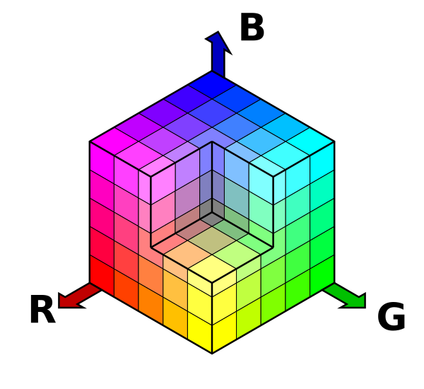
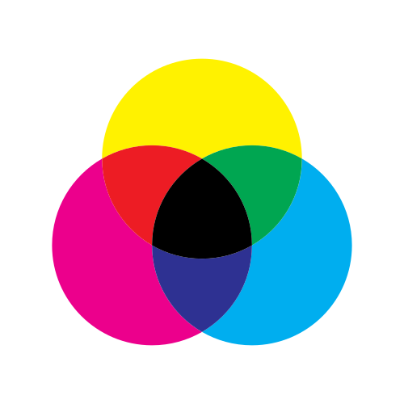

# [Draft] 1회차 Chapter 8. RGB와 CMYK: 디스플레이 색과 인쇄 색의 차이

## 학습 목표

이 장의 목표는 RGB와 CMYK를 단순히 "화면용 색"과 "인쇄용 색"으로 외우는 것을 넘어, 빛을 직접 내는 디스플레이(display)와 조명을 반사하는 인쇄물(print)이 색을 만드는 방식이 근본적으로 다르다는 점을 이해하는 것이다. 또한 CMYK 변환이 RGB의 단순 반전이 아니라 특정 인쇄 조건(print condition)에 맞춘 색 재해석 과정임을 설명할 수 있어야 한다.

이 장을 마치면 청중은 다음을 설명할 수 있어야 한다.

- RGB 가산혼합(additive mixing)과 CMYK 감산혼합(subtractive mixing)의 차이
- 모니터는 빛을 방출하고 인쇄물은 빛을 반사한다는 차이
- CMYK가 RGB의 단순한 inverse가 아닌 이유
- 잉크(ink), 용지(paper), 인쇄기(press), 조명(viewing light)이 CMYK 색에 미치는 영향
- 총잉크량 제한(total ink limit), 블랙 생성(black generation), GCR/UCR의 필요성
- 리치 블랙(rich black), 레지스트레이션 블랙(registration black), 별색(spot color), 프로세스 컬러(process color)의 차이
- 소프트 프루핑(soft proofing)과 인쇄용 ICC 프로파일(print ICC profile)의 역할

## 핵심 질문

- 화면에서 밝은 빨강을 인쇄하면 왜 같은 느낌으로 나오지 않을 수 있는가?
- CMYK는 `C=1-R`, `M=1-G`, `Y=1-B`처럼 계산하면 되는가?
- 같은 CMYK 값이 왜 종이와 인쇄 조건에 따라 다르게 보이는가?
- K 검정 잉크는 왜 필요한가?
- CMY를 많이 쓰면 더 진하고 좋은 검정이 되는가?
- 리치 블랙(rich black)과 레지스트레이션 블랙(registration black)은 왜 구분해야 하는가?
- 인쇄 전에 소프트 프루핑(soft proofing)을 하는 이유는 무엇인가?

## 상세 설명

### 1. RGB는 가산혼합(Additive Mixing)이다

RGB는 빛을 더해 색을 만드는 방식이다. 디스플레이(display)는 빨강(red), 초록(green), 파랑(blue) 발광 요소를 조절해 눈에 들어오는 빛을 만든다. 아무 빛도 내지 않으면 검정에 가깝고, 세 채널의 빛을 충분히 더하면 흰색에 가까워진다.

그래서 RGB를 가산혼합(additive mixing)이라고 부른다.

```text
R + G = 노랑 계열
G + B = 청록 계열
B + R = 마젠타 계열
R + G + B = 흰색 계열
```

물론 실제 디스플레이 색은 원색(color primaries), 화이트 포인트(white point), 전송 함수(transfer function), 최대 밝기, 패널 특성에 따라 달라진다. 하지만 기본 직관은 "빛을 더할수록 밝아진다"이다.

### 2. CMYK는 감산혼합(Subtractive Mixing)이다

인쇄물은 스스로 빛을 내지 않는다. 주변 조명이 종이에 닿고, 잉크와 종이가 일부 파장의 빛을 흡수하고 나머지를 반사한다. 우리가 보는 인쇄 색은 반사되어 눈에 들어온 빛이다.

CMY의 기본 잉크는 이상적으로 다음 역할을 한다.

- 시안(Cyan): 빨강 계열 빛을 흡수한다
- 마젠타(Magenta): 초록 계열 빛을 흡수한다
- 노랑(Yellow): 파랑 계열 빛을 흡수한다

잉크를 더 많이 올릴수록 더 많은 빛이 흡수되므로 결과는 어두워지는 방향으로 간다. 그래서 CMYK는 감산혼합(subtractive mixing)이라고 부른다.

하지만 실제 잉크는 이상적인 필터가 아니다. CMY 세 잉크를 모두 100%로 올린다고 완벽하고 중성적인 검정이 나오지 않는다. 탁하고 불안정한 어두운 갈색이나 회색처럼 보일 수 있고, 건조와 번짐 문제도 생긴다. 그래서 K, 즉 검정 잉크(black ink)가 필요하다.

### 3. CMYK는 RGB의 단순 반대가 아니다

입문 단계에서는 CMY를 RGB의 보색(complementary color)처럼 설명할 수 있다. 하지만 실무 변환에서 CMYK를 `C=1-R`, `M=1-G`, `Y=1-B`로 계산하면 안 된다. 이유는 세 가지다.

첫째, RGB는 특정 RGB 색공간 안의 빛 신호이고, CMYK는 특정 인쇄 조건에서 잉크 양을 의미한다. 서로 물리적 매체가 다르다.

둘째, 인쇄 색은 잉크, 용지, 인쇄기, 망점(dot), 건조, 코팅, 관찰 조명에 따라 달라진다. 같은 CMYK 값이라도 코팅지(coated paper)와 비코팅지(uncoated paper)에서 다른 색으로 보인다.

셋째, 하나의 색을 만들 수 있는 CMYK 조합이 여러 개일 수 있다. 예를 들어 어두운 회색을 CMY 조합으로 만들 수도 있고, K를 많이 써서 만들 수도 있다. 어떤 조합을 선택할지는 블랙 생성(black generation), 총잉크량 제한(total ink limit), 인쇄 안정성, 비용, 이미지 특성에 따라 달라진다.

따라서 RGB to CMYK 변환은 특정 인쇄용 ICC 프로파일(print ICC profile)을 사용해, 목표 인쇄 조건에서 재현 가능한 색과 적절한 잉크 조합을 찾는 과정이다.

### 4. 인쇄 조건(Print Condition)이 색을 결정한다

CMYK 값은 장치 의존(device-dependent) 성격이 강하다. 같은 `C=70 M=20 Y=0 K=0`이라도 어떤 잉크, 어떤 종이, 어떤 인쇄기, 어떤 조명에서 보느냐에 따라 결과가 달라진다.

중요한 인쇄 조건은 다음과 같다.

- 잉크(ink): 색재, 농도, 투명도, 건조 특성
- 용지(paper): 백색도, 흡수성, 코팅 여부, 표면 질감
- 인쇄기(press): 장비 특성, 압력, 속도, 관리 상태
- 망점(dot)과 스크리닝(screening): 하프톤(halftone) 구조와 dot gain
- 관찰 조명(viewing light): D50 기준 조명 같은 평가 조건

인쇄용 ICC 프로파일은 이런 조건을 표준화하거나 측정한 결과를 담아, 색관리(color management) 시스템이 RGB/Lab/XYZ 색을 특정 CMYK 값으로 변환할 수 있게 한다.

### 5. 총잉크량 제한(Total Ink Limit)

CMYK 네 채널을 모두 높이면 종이에 올라가는 잉크 총량이 커진다. 예를 들어 `C=100 M=100 Y=100 K=100`이면 총잉크량은 400%다. 하지만 실제 인쇄에서는 종이가 감당할 수 있는 잉크량에 한계가 있다.

총잉크량 제한(total ink limit)은 한 지점에 올라갈 수 있는 CMYK 잉크 합의 최대치를 정하는 규칙이다. 예를 들어 어떤 인쇄 조건에서는 300%, 다른 조건에서는 260%처럼 제한할 수 있다.

총잉크량을 넘기면 건조가 늦어지고, 잉크가 번지거나 묻어나고, 그림자 디테일이 뭉개질 수 있다. 따라서 좋은 CMYK 변환은 색만 맞추는 것이 아니라 인쇄 가능한 잉크 조합을 만들어야 한다.

### 6. 블랙 생성(Black Generation), GCR, UCR

검정 잉크(K)를 어떻게 사용할지는 CMYK 변환의 중요한 설계다.

UCR(Under Color Removal)은 어두운 중성 영역에서 CMY를 줄이고 K로 대체하는 방식이다. 주로 그림자와 회색 영역에서 총잉크량을 줄이고 안정적인 검정을 얻는 데 도움을 준다.

GCR(Gray Component Replacement)은 중성 성분을 더 넓은 색 영역에서 K로 대체하는 방식이다. CMY가 함께 만들어내는 회색 성분을 K로 바꾸면 잉크 사용량을 줄이고 색 안정성을 높일 수 있다.

두 방식 모두 "검정을 더 많이 쓰면 무조건 좋다"는 뜻은 아니다. 이미지의 질감, 피부톤, 그림자 디테일, 인쇄 조건에 따라 적절한 black generation 설정이 달라진다.

### 7. 리치 블랙(Rich Black)과 레지스트레이션 블랙(Registration Black)

리치 블랙(rich black)은 K 100%에 CMY를 일부 섞어 더 깊고 풍부하게 보이는 검정을 만드는 방식이다. 큰 면적의 검정 배경이나 그래픽 요소에서 사용될 수 있다.

레지스트레이션 블랙(registration black)은 C, M, Y, K를 모두 100%로 올린 검정이다. 이는 인쇄판 정합(registration)을 확인하기 위한 표시 등에 쓰이는 개념이지, 일반 디자인의 검정으로 쓰면 안 된다. 총잉크량이 지나치게 높아 건조, 번짐, 뒤묻음 문제가 생기기 쉽다.

본문 텍스트처럼 작은 글자는 보통 K 100% 단색 검정을 사용하는 것이 안전하다. CMY가 섞인 검정 텍스트는 판 맞춤이 조금만 어긋나도 색 번짐처럼 보일 수 있다.

### 8. 별색(Spot Color)과 프로세스 컬러(Process Color)

프로세스 컬러(process color)는 CMYK 네 잉크의 조합으로 색을 재현하는 방식이다. 일반적인 풀컬러 인쇄가 여기에 해당한다.

별색(spot color)은 특정 색 잉크를 별도로 사용하는 방식이다. 브랜드 컬러, 금속색, 형광색, CMYK로 안정적으로 재현하기 어려운 색에 사용된다. 별색은 CMYK 변환과 다르게 별도의 잉크와 인쇄판을 전제로 하므로 비용과 제작 조건이 달라진다.

### 9. 소프트 프루핑(Soft Proofing)과 인쇄용 ICC 프로파일

소프트 프루핑(soft proofing)은 모니터에서 인쇄 결과를 미리 시뮬레이션하는 과정이다. RGB 이미지를 실제로 CMYK로 바꾸기 전 또는 바꾼 뒤, 선택한 인쇄용 ICC 프로파일과 용지 흰색, 잉크 검정, 렌더링 의도(rendering intent)를 고려해 화면에서 예상 결과를 본다.

정확한 소프트 프루핑을 위해서는 모니터 프로파일(monitor profile)과 인쇄용 ICC 프로파일(print ICC profile)이 모두 중요하다. 모니터가 제대로 보정(calibration)되어 있지 않으면 화면 프루프 자체를 믿기 어렵고, 인쇄 프로파일이 실제 인쇄 조건과 다르면 결과 예측이 어긋난다.

## 용어 노트

### 가산혼합(Additive Mixing)

빛을 더해 색을 만드는 방식이다. RGB 디스플레이가 대표적이며, 빛을 더할수록 밝아지는 방향으로 간다.

### 감산혼합(Subtractive Mixing)

잉크나 필터가 빛을 흡수해 남은 빛을 보는 방식이다. CMYK 인쇄가 대표적이며, 잉크를 더할수록 반사되는 빛이 줄어 어두워지는 방향으로 간다.

### 총잉크량 제한(Total Ink Limit)

한 지점에 올라가는 C, M, Y, K 잉크 합의 최대치다. 인쇄 가능성, 건조, 번짐, 그림자 디테일과 직접 연결된다.

### 블랙 생성(Black Generation)

CMY와 K를 어떤 비율로 사용해 중성색과 어두운 색을 만들지 정하는 방식이다. GCR과 UCR이 대표적인 전략이다.

### GCR(Gray Component Replacement)

CMY 조합의 회색 성분을 K로 대체하는 방식이다. 잉크량을 줄이고 색 안정성을 높이는 데 도움을 줄 수 있다.

### UCR(Under Color Removal)

어두운 중성 영역에서 CMY를 줄이고 K를 사용하는 방식이다. 그림자 영역의 총잉크량 관리에 중요하다.

### 리치 블랙(Rich Black)

K 100%에 CMY를 일부 더해 깊은 검정 느낌을 만드는 조합이다. 큰 면적에는 유용할 수 있지만 작은 텍스트에는 주의가 필요하다.

### 레지스트레이션 블랙(Registration Black)

C, M, Y, K를 모두 100%로 쓰는 검정이다. 일반 디자인 검정으로 쓰면 총잉크량 문제가 생기므로 피해야 한다.

### 소프트 프루핑(Soft Proofing)

선택한 인쇄 조건과 ICC 프로파일을 바탕으로 모니터에서 인쇄 결과를 미리 시뮬레이션하는 과정이다.

## 그림 후보

> 아래 그림은 슬라이드 제작 시 후보로 검토할 자료다. 최종 사용 전에는 각 출처 페이지에서 라이선스와 저작자 표기를 확인한다.

- `RGB 가산 혼합`: [Additive colour mixing](https://commons.wikimedia.org/wiki/File:Additive_Colour_Mixing.svg) - 디스플레이는 빛을 더하는 additive color라는 점을 설명.
  
- `CMYK 감산 혼합`: [CMYK subtractive color mixing](https://commons.wikimedia.org/wiki/File:CMYK_subtractive_color_mixing.svg) - 인쇄는 잉크가 빛을 흡수하는 subtractive color라는 점을 설명.
  
- `RGB 색공간 좌표`: [RGB color cube](https://commons.wikimedia.org/wiki/File:RGBCube_a.svg) - RGB 값이 장치/색공간 좌표라는 설명에 사용.
  
- `CMYK 모델`: [CMYK color model](https://commons.wikimedia.org/wiki/File:CMYK_color_model.svg) - CMYK가 RGB의 단순 inverse가 아니라 black generation과 인쇄 조건을 포함한다는 설명의 후보.
  

## 실무 예시와 데모 아이디어

### 예시 1. RGB 밝은 초록을 CMYK로 변환하기

sRGB 또는 Display P3의 채도 높은 초록 패치를 CMYK 프로파일로 변환한다. 변환 후 채도가 낮아지거나 색상이 달라지는 모습을 보여주면 RGB 색역과 인쇄 색역의 차이를 설명하기 좋다.

### 예시 2. 같은 CMYK 값, 다른 용지 프로파일

같은 이미지나 색 패치를 코팅지(coated) 프로파일과 비코팅지(uncoated) 프로파일로 각각 변환한다. 종이와 인쇄 조건이 CMYK 색에 얼마나 큰 영향을 주는지 보여준다.

### 예시 3. K 100%, 리치 블랙, 레지스트레이션 블랙 비교

세 가지 검정 패치를 준비한다.

```text
K 100%
Rich black 예: C 40 M 30 Y 30 K 100
Registration black: C 100 M 100 Y 100 K 100
```

용도와 위험성을 비교한다. 실제 수치는 인쇄소와 프로파일에 따라 달라질 수 있으므로 예시값으로만 사용한다고 설명한다.

### 예시 4. 소프트 프루핑 켜기/끄기

이미지 편집 도구에서 인쇄용 ICC 프로파일을 선택하고 soft proof를 켰을 때와 껐을 때를 비교한다. 종이 흰색과 잉크 검정을 시뮬레이션하면 화면이 덜 밝고 덜 선명해 보일 수 있다는 점을 설명한다.

## 추천 진행 흐름

### 1. 빛을 내는 화면과 빛을 반사하는 종이로 시작하기

처음에는 장치 차이를 물리적으로 설명한다. 모니터는 빛을 내고, 인쇄물은 조명을 반사한다. 이 한 문장이 RGB와 CMYK의 차이를 이해하는 출발점이다.

### 2. 가산혼합과 감산혼합을 대비하기

RGB는 빛을 더할수록 밝아지고, CMYK는 잉크가 빛을 흡수하므로 잉크가 많아질수록 어두워진다. 이때 CMY를 RGB의 단순 반대로 계산하는 것은 실무 변환이 아니라 입문용 직관에 가깝다고 구분한다.

### 3. 인쇄 조건의 중요성을 설명하기

잉크, 종이, 인쇄기, 망점, 조명 조건을 나열하며 같은 CMYK 값도 조건에 따라 달라진다고 설명한다. 여기서 인쇄용 ICC 프로파일의 필요성을 연결한다.

### 4. CMYK 변환의 잉크 제약을 다루기

총잉크량 제한(total ink limit), 블랙 생성(black generation), GCR/UCR을 설명한다. 이 부분에서 CMYK 변환은 색 재현과 인쇄 가능성을 동시에 다루는 최적화 문제라고 말할 수 있다.

### 5. 실무 주의사항으로 마무리하기

리치 블랙, 레지스트레이션 블랙, 별색, 소프트 프루핑을 다룬다. 마지막에는 "인쇄용 프로파일 없이 RGB를 감으로 CMYK로 바꾸지 않는다"는 메시지를 남긴다.

## 짧은 마무리 요약

RGB는 빛을 더해 색을 만드는 가산혼합(additive mixing)이고, CMYK는 잉크가 빛을 흡수하고 종이가 반사한 빛을 보는 감산혼합(subtractive mixing)이다. 모니터는 빛을 직접 내지만 인쇄물은 주변 조명을 반사하므로, 두 매체의 색 재현 방식은 근본적으로 다르다.

CMYK 변환은 RGB의 단순한 inverse가 아니다. 특정 잉크, 종이, 인쇄기, 조명 조건에서 재현 가능한 색과 잉크 조합을 찾는 과정이다. 그래서 인쇄용 ICC 프로파일(print ICC profile), 총잉크량 제한(total ink limit), 블랙 생성(black generation), GCR/UCR, 소프트 프루핑(soft proofing)이 필요하다.
