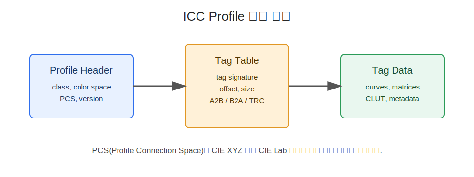

# [Draft] 1회차 Chapter 10. ICC Profile 상세 스펙 읽기

## 학습 목표

이 장의 목표는 ICC 프로파일(ICC Profile)을 추상적인 "색관리 파일"로만 보지 않고, 실제 내부 구조를 읽을 수 있게 하는 것이다. 헤더(header), 프로파일 클래스(profile class), 데이터 색공간(data color space), PCS(Profile Connection Space), 태그 테이블(tag table), 주요 태그(tag)를 살펴보며 matrix/TRC 기반 프로파일과 LUT 기반 프로파일의 차이를 이해한다.

이 장을 마치면 청중은 다음을 설명할 수 있어야 한다.

- ICC 프로파일 헤더(header)에 어떤 정보가 들어 있는가
- 프로파일/장치 클래스(profile/device class)가 변환 방향과 용도를 어떻게 알려주는가
- 데이터 색공간(data color space)과 PCS Lab/XYZ 필드를 어떻게 구분하는가
- 버전(version), 렌더링 의도(rendering intent), illuminant/D50 PCS 정보의 의미
- 태그 테이블(tag table)과 주요 태그 `rXYZ`, `gXYZ`, `bXYZ`, `rTRC`, `gTRC`, `bTRC`, `wtpt`, `chad`, `A2B0`, `B2A0`, `desc`, `cprt`의 역할
- matrix/TRC 프로파일과 LUT 프로파일의 차이
- display/input/output/device link profile의 차이

## 핵심 질문

- ICC 프로파일 파일을 열면 어디부터 읽어야 하는가?
- `RGB` 색공간 프로파일과 `CMYK` 색공간 프로파일은 어떤 필드에서 구분되는가?
- PCS가 `Lab`인지 `XYZ`인지는 어디에 나타나는가?
- `rXYZ`와 `rTRC`가 있으면 무엇을 알 수 있는가?
- `A2B0`와 `B2A0`는 왜 출력 프로파일에서 중요하게 보이는가?
- `wtpt`와 `chad`는 화이트 포인트와 어떤 관계가 있는가?
- display profile과 device link profile은 왜 성격이 다른가?

## 상세 설명

### 1. ICC Profile은 Header와 Tag Table로 읽는다

ICC 프로파일(ICC Profile)은 크게 헤더(header)와 태그 테이블(tag table), 그리고 각 태그 데이터(tag data)로 읽을 수 있다. 헤더는 프로파일 전체의 기본 정보를 담고, 태그 테이블은 어떤 태그가 어디에 저장되어 있는지 알려준다.

단순화하면 다음 구조다.

```text
ICC Profile
-> Header
-> Tag table
-> Tag data blocks
```

프로파일을 분석할 때는 먼저 헤더에서 "이 프로파일이 어떤 종류의 프로파일인가"를 확인하고, 그 다음 태그 테이블에서 실제 변환에 필요한 태그가 무엇인지 본다.

### 2. Header에서 보는 주요 항목

헤더(header)에는 프로파일의 전체 성격을 알려주는 필드가 들어 있다.

- 프로파일 크기(profile size)
- CMM 타입(preferred CMM type)
- 프로파일 버전(profile version)
- 프로파일/장치 클래스(profile/device class)
- 데이터 색공간(data color space)
- PCS(Profile Connection Space): `Lab` 또는 `XYZ`
- 생성 시간(creation date/time)
- 파일 시그니처(profile file signature)
- 플랫폼(platform)
- 플래그(flags)
- 제조사/모델(device manufacturer/model)
- 렌더링 의도(rendering intent)
- PCS illuminant: 일반적으로 D50 PCS 기준
- 프로파일 creator
- profile ID

이 장에서 특히 중요한 것은 profile class, data color space, PCS, version, rendering intent, illuminant다. 이 필드들만 잘 읽어도 프로파일의 기본 방향을 잡을 수 있다.

### 3. Profile/Device Class

프로파일 클래스(profile class)는 이 프로파일이 어떤 종류의 장치나 변환을 설명하는지 알려준다. 대표적인 클래스는 다음과 같다.

- display profile: 모니터 같은 디스플레이 장치
- input profile: 스캐너, 카메라 같은 입력 장치
- output profile: 프린터, 인쇄 조건 같은 출력 장치
- device link profile: 특정 소스와 목적지 사이의 직접 변환
- color space profile: sRGB, Lab 같은 추상 색공간
- abstract profile: 색 효과나 보정 변환
- named color profile: 별색 같은 이름 기반 색

display profile은 보통 RGB 디스플레이의 색 재현을 설명한다. output profile은 CMYK 프린터나 인쇄 조건처럼 출력 장치의 색 재현과 역변환을 담는 경우가 많다. device link profile은 PCS를 사용자에게 노출하는 일반 연결형 프로파일이라기보다, 특정 소스에서 특정 목적지로 가는 변환을 고정한 프로파일이다.

### 4. Data Color Space와 PCS

데이터 색공간(data color space)은 프로파일이 다루는 장치 쪽 색값의 채널 구조를 나타낸다. 예를 들어 `RGB`, `GRAY`, `CMYK`, `Lab` 같은 값이 올 수 있다.

PCS(Profile Connection Space)는 장치 색값을 연결하는 공통 색공간이다. ICC 프로파일의 PCS 필드는 `XYZ` 또는 `Lab`일 수 있다. 여기서 다시 강조해야 할 점은 ICC PCS가 항상 CIE Lab만은 아니라는 것이다.

예를 들어 RGB display profile은 data color space가 `RGB`이고 PCS가 `XYZ`일 수 있다. 어떤 output profile은 data color space가 `CMYK`이고 PCS가 `Lab`일 수 있다. 두 필드는 서로 다른 층위의 정보를 말한다.

```text
Data color space = 이 프로파일이 받거나 내보내는 장치 색값 형식
PCS              = 다른 프로파일과 연결할 때 쓰는 공통 색공간
```

### 5. Version과 Rendering Intent

ICC 프로파일 버전(version)은 v2인지 v4인지에 따라 태그 해석과 PCS 연결 방식, 색관리 시스템 호환성에 영향을 줄 수 있다. 실무에서는 오래된 워크플로와 소프트웨어 때문에 v2 프로파일이 여전히 널리 쓰이고, 더 명확한 색관리 모델을 위해 v4 프로파일을 사용하는 경우도 있다.

렌더링 의도(rendering intent)는 헤더에도 기본값으로 들어 있다. 다만 실제 변환에서 어떤 rendering intent를 사용할지는 애플리케이션 설정, CMM(Color Management Module), 프로파일의 태그 구성에 따라 달라질 수 있다.

### 6. Illuminant와 D50 PCS

ICC PCS는 D50 기준과 연결된다. 헤더의 illuminant 필드는 PCS illuminant를 나타내며, 일반적으로 D50을 가리킨다. 이것은 프로파일 내부의 색이 공통 기준 백색(reference white)에 어떻게 맞춰져 있는지 이해하는 데 중요하다.

RGB 프로파일이 원래 D65 화이트 포인트(D65 white point)를 갖더라도, ICC 프로파일 안에서는 D50 PCS와 연결하기 위한 적응 정보가 필요할 수 있다. 이 맥락에서 `wtpt`와 `chad` 태그가 중요하게 등장한다.

### 7. Tag Table과 주요 태그

태그 테이블(tag table)은 프로파일에 어떤 태그가 들어 있는지, 각 태그 데이터가 파일의 어디에 있는지 알려준다. 태그는 4글자 시그니처(signature)로 식별된다.

대표적인 태그는 다음과 같다.

- `rXYZ`, `gXYZ`, `bXYZ`: RGB 원색의 XYZ 값
- `rTRC`, `gTRC`, `bTRC`: R, G, B 채널의 tone reproduction curve
- `wtpt`: media white point
- `chad`: chromatic adaptation matrix
- `A2B0`: device/data color space에서 PCS로 가는 변환, 보통 rendering intent 0용
- `B2A0`: PCS에서 device/data color space로 가는 변환, 보통 rendering intent 0용
- `desc`: 프로파일 설명(description)
- `cprt`: 저작권(copyright) 정보

여기서 `A2B0`의 `A`와 `B`는 프로파일 데이터 색공간과 PCS 사이의 방향을 뜻한다고 이해하면 된다. 일반적으로 A는 장치 쪽 색공간, B는 PCS 쪽을 가리킨다. 그래서 `A2B0`는 장치 색값에서 PCS로, `B2A0`는 PCS에서 장치 색값으로 가는 변환이다.

숫자 `0`, `1`, `2`는 렌더링 의도와 연결된다. 보통 `0`은 perceptual, `1`은 relative colorimetric, `2`는 saturation과 연결되는 식으로 쓰인다. 다만 정확한 사용은 프로파일 버전과 태그 구성, CMM 구현을 함께 봐야 한다.

### 8. Matrix/TRC 기반 프로파일

matrix/TRC 기반 프로파일은 RGB 디스플레이나 단순 RGB 색공간에서 흔히 볼 수 있다. 주요 구성은 다음과 같다.

```text
rXYZ, gXYZ, bXYZ = RGB 원색의 PCS XYZ 값
rTRC, gTRC, bTRC = 각 채널의 톤 곡선
```

이 구조에서는 RGB 값을 TRC로 선형화하고, RGB 원색 행렬을 사용해 PCS로 변환한다. sRGB나 Display P3 같은 단순 RGB 프로파일을 이해할 때 매우 중요하다.

장점은 구조가 단순하고 해석하기 쉽다는 것이다. 단점은 장치의 비선형적이고 복잡한 색 재현 특성을 모두 표현하기 어렵다는 점이다.

### 9. LUT 기반 프로파일

LUT 기반 프로파일은 더 복잡한 장치 특성을 표현하기 위해 lookup table을 사용한다. 출력 장치(output device), 특히 프린터나 인쇄 프로파일에서 자주 볼 수 있다.

예를 들어 CMYK 인쇄 프로파일은 단순 행렬로 설명하기 어렵다. 잉크 상호작용, 용지, dot gain, 총잉크량 제한, black generation 같은 요소가 얽혀 있기 때문이다. 그래서 `A2B0`, `B2A0` 같은 LUT 태그가 중요한 역할을 한다.

LUT 기반 프로파일은 더 유연하지만, 내부를 사람이 직관적으로 읽기는 어렵다. 또한 perceptual rendering intent 같은 결과는 프로파일 제작자의 gamut mapping 설계에 크게 의존한다.

### 10. Display, Input, Output, Device Link Profile

display profile은 모니터가 RGB 값을 어떤 색으로 표시하는지 설명한다. 보통 matrix/TRC 구조가 많지만, 고급 디스플레이 프로파일은 LUT를 포함할 수 있다.

input profile은 카메라나 스캐너 같은 입력 장치가 측정한 RGB 값을 PCS 색으로 해석하기 위해 사용된다. 입력 장치는 조명과 센서 특성의 영향을 크게 받으므로 프로파일 조건을 함께 봐야 한다.

output profile은 프린터나 인쇄 조건의 색 재현을 설명한다. CMYK output profile은 LUT 기반인 경우가 많고, PCS에서 CMYK로 가는 `B2A` 변환이 중요하다.

device link profile은 특정 소스 프로파일에서 특정 목적지 프로파일로 가는 변환을 하나의 프로파일로 고정한 것이다. 예를 들어 특정 CMYK에서 다른 CMYK로 변환하면서 K 보존이나 총잉크량 제어를 강하게 유지하고 싶을 때 사용할 수 있다.

## 용어 노트

### Header

ICC 프로파일의 기본 정보를 담은 고정 영역이다. 프로파일 클래스, 데이터 색공간, PCS, 버전, 렌더링 의도, illuminant 같은 필드를 확인한다.

### Data Color Space

프로파일이 다루는 장치 쪽 색값의 색공간이다. `RGB`, `CMYK`, `GRAY`, `Lab` 등이 올 수 있다.

### PCS(Profile Connection Space)

다른 프로파일과 연결할 때 사용하는 공통 색공간이다. ICC PCS는 CIE XYZ 또는 CIE Lab일 수 있다.

### Tag Table

프로파일 안에 어떤 태그가 들어 있고 각 태그 데이터가 어디에 있는지 알려주는 목록이다.

### `rXYZ`, `gXYZ`, `bXYZ`

RGB 원색의 XYZ 값을 담는 태그다. matrix/TRC RGB 프로파일에서 RGB to XYZ 행렬의 핵심 정보가 된다.

### `rTRC`, `gTRC`, `bTRC`

R, G, B 채널의 tone reproduction curve를 담는 태그다. 코드값과 선형화 사이의 관계를 설명한다.

### `wtpt`

미디어 화이트 포인트(media white point)를 나타내는 태그다.

### `chad`

색순응 변환(chromatic adaptation) 행렬을 담는 태그다. 원래 백색과 D50 PCS 연결을 이해할 때 중요하다.

### `A2B0`, `B2A0`

장치 색공간과 PCS 사이의 LUT 기반 변환 태그다. 출력 프로파일이나 복잡한 장치 프로파일에서 중요하다.

## 그림 후보

> 아래 그림은 슬라이드 제작 시 후보로 검토할 자료다. 최종 사용 전에는 각 출처 페이지에서 라이선스와 저작자 표기를 확인한다.

- `ICC 공식 스펙`: [ICC.1:2022 specification](https://www.color.org/specification/ICC.1-2022-05.pdf) - header, tag table, A2B/B2A transform을 읽을 때 공식 원문으로 연결.
  
- `ICC v4 설명`: [ICC v4 specification notes](https://www.color.org/v4spec.xalter) - v2/v4 차이와 PCS D50 기반 설명을 보강할 때 사용.
- `iccMAX 연결 구조`: [iccMAX connection guidance](https://www.color.org/iccmax/connection5.xalter) - profile connection과 device link/profile 구조 차이를 설명하는 공식 후보.

## 실무 예시와 데모 아이디어

### 예시 1. `exiftool` 또는 `iccDump`로 프로파일 헤더 보기

sRGB 프로파일과 인쇄용 CMYK 프로파일을 각각 덤프해 profile class, data color space, PCS, version을 비교한다. 청중에게 "먼저 헤더를 읽는다"는 습관을 만들어 주기 좋다.

### 예시 2. sRGB 프로파일의 matrix/TRC 태그 확인

`rXYZ`, `gXYZ`, `bXYZ`, `rTRC`, `gTRC`, `bTRC`를 찾아 RGB 원색과 TRC가 어떻게 프로파일 안에 들어 있는지 보여준다.

### 예시 3. CMYK 프로파일의 `A2B0`/`B2A0` 확인

인쇄용 CMYK 프로파일에서 LUT 태그를 찾아본다. 왜 CMYK 출력 프로파일이 단순 matrix/TRC로 설명되기 어려운지 연결한다.

### 예시 4. `desc`와 `cprt` 확인

프로파일 설명(description)과 저작권(copyright) 태그를 확인한다. 실무에서 파일 이름만 믿지 말고 프로파일 내부 설명도 함께 확인하자는 메시지를 줄 수 있다.

## 추천 진행 흐름

### 1. ICC 파일을 "읽을 수 있는 구조"로 소개하기

처음에는 ICC 프로파일이 마법 상자가 아니라 header와 tag table로 구성된 데이터 파일이라고 말한다. 구조를 알면 최소한 무엇을 확인해야 하는지 알 수 있다.

### 2. Header 필드를 먼저 읽기

profile class, data color space, PCS, version, rendering intent, illuminant를 중심으로 설명한다. 특히 data color space와 PCS를 혼동하지 않도록 강조한다.

### 3. 주요 태그로 넘어가기

RGB 프로파일에서는 `rXYZ/gXYZ/bXYZ`와 `rTRC/gTRC/bTRC`, CMYK 프로파일에서는 `A2B0/B2A0`가 중요하다는 식으로 프로파일 종류와 태그를 연결한다.

### 4. Matrix/TRC와 LUT를 비교하기

단순 RGB 색공간은 matrix/TRC로 설명하기 쉽고, 인쇄 프로파일은 LUT가 필요한 이유를 설명한다. 이때 잉크와 종이의 비선형성을 함께 언급한다.

### 5. 프로파일 클래스별 용도를 정리하기

display, input, output, device link profile의 차이를 마지막에 정리한다. 다음 장의 표준별 정리로 넘어갈 준비를 만든다.

## 짧은 마무리 요약

ICC 프로파일(ICC Profile)은 헤더(header), 태그 테이블(tag table), 태그 데이터(tag data)로 읽을 수 있다. 헤더에서는 profile class, data color space, PCS Lab/XYZ, version, rendering intent, illuminant/D50 PCS를 확인하고, 태그 테이블에서는 실제 변환에 필요한 태그를 찾는다.

RGB display profile은 `rXYZ/gXYZ/bXYZ`와 `rTRC/gTRC/bTRC`를 가진 matrix/TRC 구조로 설명되는 경우가 많고, 인쇄용 output profile은 `A2B0/B2A0` 같은 LUT 기반 변환을 사용하는 경우가 많다. 프로파일을 읽을 때는 파일 이름보다 내부의 class, data color space, PCS, tag 구성을 확인해야 한다.
