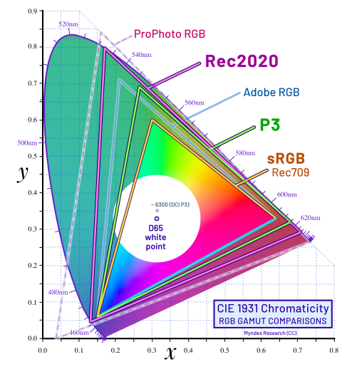

# [Draft] 1회차 Chapter 11. 1회차 마무리: 표준별 정의 항목 정리

## 학습 목표

이 장의 목표는 1회차에서 다룬 색공간(color space)과 색 표준(color standard)을 표처럼 비교하며 정리하는 것이다. 표준 이름만 외우는 대신, 원색(color primaries), 화이트 포인트(white point), 전송 특성(transfer characteristics), 행렬 계수(matrix coefficients), 색 범위(color range), WCG(Wide Color Gamut) 여부, ICC 프로파일(ICC Profile) 또는 메타데이터(metadata)와의 관계를 분리해서 읽는 습관을 만든다.

이 장을 마치면 청중은 다음을 설명할 수 있어야 한다.

- sRGB, Rec.709, Display P3, Adobe RGB, Rec.2020의 핵심 정의 항목
- 같은 D65 화이트 포인트를 쓰더라도 원색과 전송 특성이 다를 수 있다는 점
- 영상 표준에서는 primaries, transfer, matrix, range metadata를 따로 확인해야 한다는 점
- WCG 여부가 단순히 "좋다/나쁘다"가 아니라 표현 가능한 색역의 차이라는 점
- 인쇄 CMYK 프로파일은 특정 인쇄 조건과 연결된다는 점

## 핵심 질문

- sRGB와 Rec.709는 같은 색공간인가, 비슷하지만 다른 표준인가?
- Display P3와 Adobe RGB는 둘 다 넓은 색역인데 무엇이 다른가?
- Rec.2020은 왜 매우 넓은 색역 표준으로 분류되는가?
- 영상 파일에서 color primaries와 matrix coefficients를 따로 저장하는 이유는 무엇인가?
- ICC 프로파일과 영상 메타데이터(metadata)는 같은 역할을 하는가?
- 주요 인쇄용 CMYK 프로파일은 왜 하나의 보편 CMYK가 아니라 인쇄 조건별 프로파일인가?

## 상세 설명

### 1. 표준 이름보다 정의 항목을 읽는다

색공간과 색 표준을 볼 때 가장 위험한 습관은 이름만 보고 의미를 단정하는 것이다. "sRGB니까 웹용", "Rec.709니까 방송용", "P3니까 넓은 색역"처럼 기억하는 것은 출발점으로는 유용하지만 실무에서는 부족하다.

표준을 읽을 때는 다음 항목을 분리해서 확인해야 한다.

- 원색(color primaries)
- 화이트 포인트(white point)
- 전송 특성(transfer characteristics)
- 행렬 계수(matrix coefficients)
- 색 범위(color range)
- WCG(Wide Color Gamut) 여부
- ICC 프로파일(ICC Profile) 또는 메타데이터(metadata)와의 관계

특히 영상에서는 원색, 전송 특성, 행렬 계수, 색 범위가 별도의 메타데이터로 전달될 수 있다. 따라서 "Rec.709"라는 이름만으로 전체 파이프라인의 모든 해석이 자동으로 끝난다고 보면 안 된다.

### 2. 표준별 요약

아래 표는 1회차 마무리용 개념 정리다. 실제 실무에서는 표준 문서, 파일 메타데이터, ICC 프로파일, 애플리케이션 설정을 함께 확인해야 한다.

| 표준/프로파일 | 원색(Primaries) | 화이트 포인트(White Point) | 전송 특성(Transfer) | 행렬 계수(Matrix) | 색 범위(Range) | WCG 여부 | ICC/Profile/Metadata 관계 |
|---|---|---|---|---|---|---|---|
| sRGB | sRGB/Rec.709와 같은 xy 원색 | D65 | sRGB transfer curve | 일반 RGB 이미지에서는 별도 YCbCr matrix 개념이 핵심은 아님 | 보통 full range RGB | 아님 | ICC 프로파일로 명시 가능. 웹/일반 이미지에서 무프로파일 RGB는 sRGB로 가정되는 경우가 많음 |
| Rec.709 | sRGB와 같은 xy 원색 | D65 | Rec.709 OETF 계열, 실제 디스플레이 감마/BT.1886 맥락과 함께 다룸 | Rec.709 YCbCr matrix | 영상에서는 limited range가 흔함, full range도 가능 | 아님 | 영상 스트림 메타데이터의 primaries/transfer/matrix/range가 중요 |
| Display P3 | DCI-P3 계열 원색, white는 보통 D65인 Display P3 | D65 | 보통 sRGB transfer curve를 쓰는 Display P3 이미지가 흔함 | RGB 이미지 자체에는 YCbCr matrix가 핵심은 아님 | 보통 full range RGB | WCG | ICC 프로파일로 명시 가능. Apple/웹 WCG 이미지에서 자주 사용 |
| Adobe RGB | sRGB보다 넓은 green 영역의 Adobe RGB 원색 | D65 | 대략 gamma 2.2 계열 | RGB 이미지 자체에는 YCbCr matrix가 핵심은 아님 | 보통 full range RGB | WCG | 사진/인쇄 전 워크플로에서 ICC 프로파일로 명시 |
| Rec.2020 | 매우 넓은 Rec.2020 원색 | D65 | SDR, HLG, PQ 등 맥락에 따라 다름 | Rec.2020 non-constant luminance 또는 constant luminance matrix 등 | 영상에서는 limited/full range 확인 필요 | WCG | 영상 메타데이터에서 primaries/transfer/matrix/range를 반드시 분리 확인 |
| 주요 인쇄용 CMYK profile | RGB primaries가 아니라 잉크/인쇄 조건의 CMYK 재현 특성 | PCS는 D50 기준, 실제 종이 백색과 viewing condition 고려 | TRC보다는 LUT 기반 변환이 흔함 | RGB-YCbCr matrix 개념과 다름 | 0-100% CMYK 잉크값, total ink limit 포함 | RGB식 WCG 개념과 직접 비교 어려움 | ICC output profile로 특정 인쇄 조건을 설명. 예: FOGRA, GRACoL, SWOP, Japan Color 계열 |

### 3. sRGB와 Rec.709

sRGB와 Rec.709는 RGB 원색(color primaries)과 D65 화이트 포인트(white point)가 같다는 점 때문에 자주 함께 언급된다. 하지만 둘을 완전히 같은 표준이라고 말하면 곤란하다.

sRGB는 주로 컴퓨터 그래픽, 웹, 일반 이미지에서 쓰이는 RGB 색공간이며, 자체 sRGB 전송 곡선(transfer curve)을 갖는다. Rec.709는 HDTV 영상 표준이며, 영상 신호에서는 OETF, 디스플레이 감마, BT.1886, YCbCr 행렬 계수(matrix coefficients), limited range 같은 요소가 함께 등장한다.

따라서 두 표준은 색도 원색 면에서는 매우 가깝지만, 사용 맥락과 신호 해석 항목이 다르다.

### 4. Display P3와 Adobe RGB

Display P3와 Adobe RGB는 둘 다 sRGB보다 넓은 색역(wide gamut)을 갖는다. 하지만 넓어지는 방향이 다르다.

Display P3는 영화용 DCI-P3 원색 계열을 기반으로 하면서, 일반 디스플레이와 이미지 워크플로에서는 D65 화이트 포인트를 쓰는 경우가 많다. Apple 기기와 웹의 wide-gamut 이미지에서 자주 등장한다.

Adobe RGB는 특히 초록 계열 영역이 sRGB보다 넓어, 사진과 인쇄 전 워크플로에서 자주 사용되어 왔다. 다만 Adobe RGB 이미지를 sRGB로 잘못 해석하면 색이 탁하거나 다르게 보일 수 있으므로 ICC 프로파일 관리가 중요하다.

### 5. Rec.2020

Rec.2020은 UHDTV와 HDR 영상 맥락에서 자주 등장하는 매우 넓은 색역 표준이다. Rec.2020 원색은 CIE xy 색도도에서 sRGB나 Display P3보다 훨씬 넓은 삼각형을 만든다.

하지만 실제 콘텐츠가 Rec.2020 컨테이너를 쓴다고 해서 모든 색이 Rec.2020 경계까지 꽉 차 있다는 뜻은 아니다. 많은 HDR 콘텐츠는 Rec.2020으로 신호를 표시하지만 실제 색은 P3 범위 안에 머무르는 경우도 있다.

Rec.2020에서는 특히 transfer characteristics가 중요하다. SDR Rec.2020인지, HLG인지, PQ인지에 따라 밝기 해석이 완전히 달라진다. 이 부분은 2회차의 HDR 파이프라인에서 더 자세히 다룬다.

### 6. 주요 인쇄용 CMYK Profile

인쇄용 CMYK는 하나의 보편 색공간이 아니다. FOGRA, GRACoL, SWOP, Japan Color 같은 프로파일은 각각 특정 인쇄 조건(print condition)을 설명한다. 코팅지, 비코팅지, 잉크, 인쇄 표준, 지역 워크플로에 따라 적절한 프로파일이 달라진다.

CMYK 프로파일은 RGB 원색 삼각형처럼 단순히 CIE xy 위의 삼각형으로 이해하기 어렵다. CMYK는 잉크 조합, 총잉크량 제한(total ink limit), black generation, 종이 백색, dot gain 같은 요소를 포함한다. 그래서 인쇄용 프로파일은 대개 LUT 기반 output profile로 다루어진다.

### 7. ICC Profile과 Metadata의 관계

정지 이미지 워크플로에서는 ICC 프로파일(ICC Profile)이 색 해석의 핵심 정보를 담는 경우가 많다. sRGB, Display P3, Adobe RGB 이미지는 ICC 프로파일로 색공간을 명시할 수 있다.

영상 워크플로에서는 컨테이너(container)나 스트림(stream)의 색 메타데이터(metadata)가 중요하다. 대표적으로 color primaries, transfer characteristics, matrix coefficients, color range가 별도로 저장될 수 있다.

두 방식은 목적이 비슷하다. 색값을 어떻게 해석할지 알려주는 것이다. 하지만 파일 형식, 파이프라인, 변환 방식이 다르므로 ICC와 영상 메타데이터를 같은 것으로 취급하면 안 된다.

## 용어 노트

### 원색(Color Primaries)

RGB 색공간에서 R, G, B 기본색의 CIE xy 위치다. 색역(gamut) 삼각형의 꼭짓점이 된다.

### 화이트 포인트(White Point)

흰색 기준이다. sRGB, Rec.709, Display P3, Adobe RGB, Rec.2020은 보통 D65를 사용하지만, ICC PCS와 인쇄 워크플로에서는 D50이 중요하다.

### 전송 특성(Transfer Characteristics)

코드값(code value)과 선형광(linear light) 또는 디스플레이 출력 사이의 관계다. sRGB curve, Rec.709 OETF, PQ, HLG 등이 여기에 해당한다.

### 행렬 계수(Matrix Coefficients)

영상 신호에서 RGB와 YCbCr 사이를 변환할 때 사용하는 계수다. Rec.709와 Rec.2020의 matrix는 다르며, 잘못 해석하면 색이 틀어진다.

### 색 범위(Color Range)

영상 신호의 코드값 범위 해석이다. full range와 limited range를 잘못 해석하면 검정과 흰색, 대비가 크게 달라진다.

### WCG(Wide Color Gamut)

sRGB/Rec.709보다 넓은 색역을 갖는 색공간이나 시스템을 가리킬 때 쓰는 표현이다. Display P3, Adobe RGB, Rec.2020이 대표적이다.

## 그림 후보

> 아래 그림은 슬라이드 제작 시 후보로 검토할 자료다. 최종 사용 전에는 각 출처 페이지에서 라이선스와 저작자 표기를 확인한다.

- `표준별 gamut 비교`: [CIE1931xy gamut comparison of sRGB, Display P3, Rec.2020](https://commons.wikimedia.org/wiki/File:CIE1931xy_gamut_comparison_of_sRGB_P3_Rec2020.svg) - sRGB, Display P3, Rec.2020의 primaries와 WCG 차이를 한 장으로 정리.
  
- `sRGB 단독`: [CIExy1931 sRGB](https://commons.wikimedia.org/wiki/File:CIExy1931_sRGB.svg) - 표준별 정의 항목을 하나씩 읽을 때 기준 예시.
- `Rec.2020 단독`: [CIExy1931 Rec.2020](https://commons.wikimedia.org/wiki/File:CIExy1931_Rec_2020.svg) - wide color gamut이 색도도에서 어떻게 보이는지 설명.

## 실무 예시와 데모 아이디어

### 예시 1. sRGB와 Display P3의 같은 RGB 값 비교

`RGB=(255,0,0)`을 sRGB와 Display P3로 각각 해석해 CIE xy 위치가 달라지는 것을 보여준다. 표준 이름보다 primaries가 중요하다는 점을 연결한다.

### 예시 2. Rec.709 영상의 metadata 확인

`ffprobe` 같은 도구로 영상의 color primaries, transfer characteristics, matrix coefficients, color range를 확인한다. 네 항목이 서로 독립적으로 기록될 수 있음을 보여준다.

### 예시 3. Adobe RGB 이미지를 sRGB로 잘못 열기

Adobe RGB 이미지에서 ICC 프로파일을 무시하거나 sRGB로 잘못 할당했을 때 색이 달라지는 모습을 보여준다.

### 예시 4. CMYK 프로파일별 변환 비교

같은 RGB 이미지를 서로 다른 CMYK output profile로 변환한다. 목적지 프로파일에 따라 CMYK 값과 예상 인쇄 색이 달라진다는 점을 보여준다.

## 추천 진행 흐름

### 1. "표준 이름이 아니라 항목을 읽는다"로 시작하기

장 시작에서 핵심 메시지를 먼저 제시한다. sRGB, Rec.709, P3 같은 이름보다 primaries, white point, transfer, matrix, range를 분리해서 읽어야 한다고 말한다.

### 2. 표를 함께 읽기

표를 한 줄씩 모두 설명하기보다, 각 열이 무엇을 의미하는지 먼저 설명한다. 그 다음 sRGB/Rec.709, Display P3/Adobe RGB, Rec.2020, CMYK profile 순서로 비교한다.

### 3. 비슷한 표준끼리 대비하기

sRGB와 Rec.709는 primaries가 같지만 맥락이 다르고, Display P3와 Adobe RGB는 둘 다 WCG지만 넓어지는 방향과 사용 맥락이 다르다는 식으로 대비한다.

### 4. 영상 메타데이터와 ICC 프로파일을 구분하기

이미지에서는 ICC 프로파일, 영상에서는 metadata가 중요하다는 점을 설명한다. 둘 다 색 해석 정보를 전달하지만 같은 구조는 아니라고 정리한다.

### 5. 1회차 핵심 메시지로 닫기

RGB 숫자만 보지 말고 그 숫자를 정의하는 항목을 함께 보아야 한다는 메시지로 마무리한다. 다음 실습 장에서 이 차이를 직접 확인한다고 예고한다.

## 짧은 마무리 요약

1회차의 핵심은 색공간과 표준을 이름으로 외우지 않는 것이다. sRGB, Rec.709, Display P3, Adobe RGB, Rec.2020, 인쇄용 CMYK 프로파일은 각각 원색(color primaries), 화이트 포인트(white point), 전송 특성(transfer characteristics), 행렬 계수(matrix coefficients), 색 범위(color range), WCG 여부, ICC/profile/metadata 관계로 나누어 읽어야 한다.

같은 RGB 값도 표준이 다르면 다른 색을 의미할 수 있고, 같은 표준 이름처럼 보여도 이미지와 영상 파이프라인에서 확인해야 할 항목이 다를 수 있다. 좋은 색관리의 첫 단계는 표준 이름 뒤에 숨어 있는 정의 항목을 분리해 확인하는 것이다.
