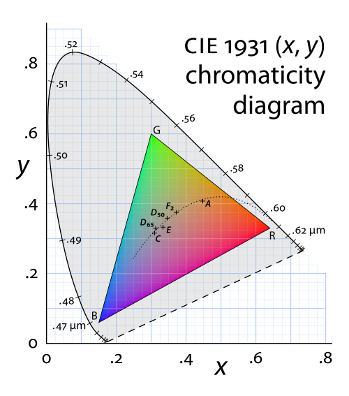
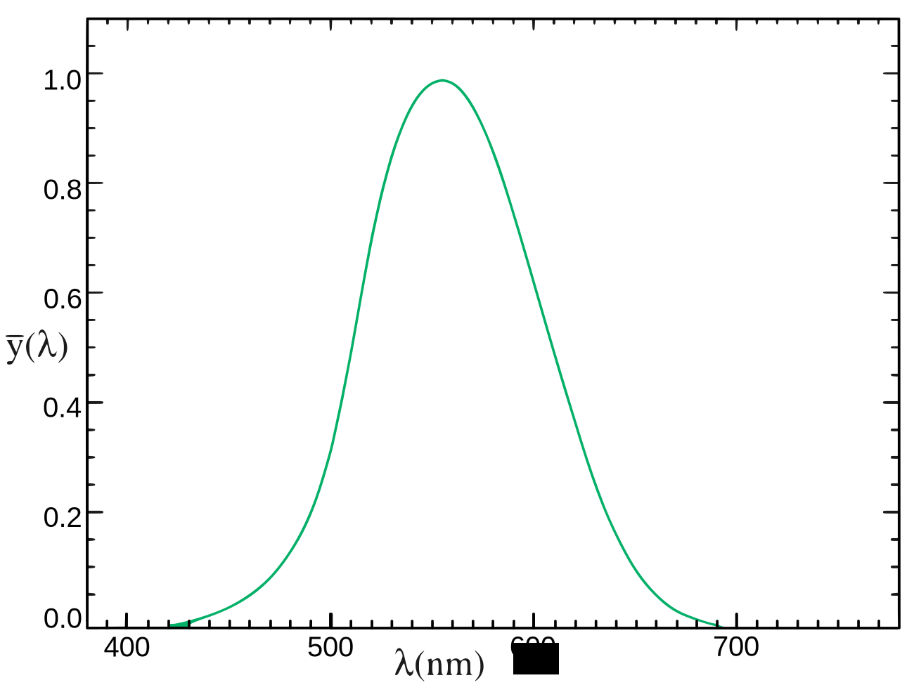

# [Draft] 2회차 Chapter 1. 1회차 복습: 색도(Chromaticity)와 밝기(Brightness)의 분리

## 학습 목표

이 장의 목표는 1회차에서 다룬 CIE xy 색도도(CIE xy chromaticity diagram)와 CIE XYZ를 2회차의 밝기(brightness), 휘도(luminance), HDR(High Dynamic Range) 논의로 연결하는 것이다. CIE xy는 색의 종류를 보는 지도이고, CIE XYZ의 `Y`는 상대 휘도(relative luminance)에 대응한다. 그러나 xy 평면의 색역(gamut)만으로는 어떤 색을 얼마나 밝게 재현할 수 있는지 알 수 없다.

이 장을 마치면 청중은 색도(chromaticity)와 밝기(brightness)를 분리해서 말할 수 있고, HDR을 이해하려면 색역의 2차원 삼각형에 밝기 축이 추가되어야 한다는 점을 설명할 수 있어야 한다.

## 핵심 질문

- CIE xy 색도도(CIE xy chromaticity diagram)는 무엇을 보여주고 무엇을 보여주지 않는가?
- CIE XYZ의 `Y`는 왜 상대 휘도(relative luminance)와 연결되는가?
- 색역(gamut) 삼각형은 2차원에서 어떤 정보를 요약하는가?
- 같은 xy 좌표의 색도라도 밝기가 달라질 수 있는가?
- HDR(High Dynamic Range)을 이해할 때 왜 별도의 밝기 축이 필요한가?

## 상세 설명

### 1. CIE xy는 색도(Chromaticity) 지도다

1회차에서 본 CIE xy 색도도(CIE xy chromaticity diagram)는 색도(chromaticity)를 2차원 좌표로 표현하는 지도다. CIE XYZ의 세 값 `X`, `Y`, `Z`를 합으로 정규화하면 다음과 같은 좌표를 얻는다.

```text
x = X / (X + Y + Z)
y = Y / (X + Y + Z)
```

이 변환은 밝기와 관련된 크기 정보를 일부 분리하고, 색의 종류 또는 색도 위치를 보기 쉽게 만든다. 그래서 xy 평면에서는 스펙트럼 궤적(spectral locus), 화이트 포인트(white point), 원색(color primaries), 색역(gamut)을 한눈에 비교하기 좋다.

하지만 xy 좌표만으로는 그 색이 얼마나 밝은지 알 수 없다. 같은 `x, y` 좌표를 가진 빨강도 어둡게 표시될 수 있고, 매우 밝게 표시될 수도 있다. xy 색도도는 "어떤 색도인가"를 잘 보여주지만, "얼마나 밝은가"를 직접 보여주는 도구는 아니다.

### 2. CIE XYZ의 Y는 상대 휘도(Relative Luminance)에 대응한다

CIE XYZ에서 `Y`는 인간 시각의 명소시 밝기 민감도와 맞도록 설계되어 상대 휘도(relative luminance)에 대응한다. 여기서 휘도(luminance)는 물리적으로 단위 면적과 방향당 빛의 세기를 나타내는 측광량이고, 상대 휘도는 절대 단위보다는 기준 흰색에 대한 상대적 밝기 비율로 쓰인다.

주의할 점은 `Y`가 항상 절대 휘도(absolute luminance)를 뜻하지는 않는다는 것이다. 색공간 변환이나 이미지 처리에서는 보통 기준 흰색을 `Y = 1.0` 또는 `Y = 100`으로 둔 상대값으로 다룬다. 반면 HDR에서는 실제 디스플레이가 몇 니트(nits, cd/m2)까지 빛을 낼 수 있는지가 중요해진다.

따라서 1회차의 XYZ `Y`는 밝기 축으로 가는 중요한 연결고리지만, HDR 표시를 말하려면 상대 휘도와 절대 휘도를 구분해야 한다.

### 3. 색역(Gamut)은 보통 2차원 색도 범위다

sRGB, Rec.709, Display P3, Rec.2020 같은 RGB 표준은 CIE xy 평면에서 R, G, B 원색(color primaries)을 세 점으로 표시할 수 있다. 세 점을 이으면 삼각형이 되고, 이 삼각형 안쪽이 그 RGB 원색 조합으로 표현할 수 있는 색도 범위를 나타낸다.

이것이 흔히 말하는 색역(gamut) 비교다.

```text
sRGB 삼각형     = 비교적 좁은 색도 범위
Display P3 삼각형 = 더 넓은 빨강/초록 방향 색도 범위
Rec.2020 삼각형   = 매우 넓은 색도 범위
```

하지만 이 삼각형은 2차원 정보다. 특정 디스플레이가 그 삼각형 안의 색을 어느 밝기까지 낼 수 있는지, 매우 밝은 노랑이나 청록을 얼마나 유지할 수 있는지, 최대 밝기에서 채도가 얼마나 줄어드는지는 xy 색역만으로 알 수 없다.

### 4. HDR에는 밝기 축이 필요하다

SDR(Standard Dynamic Range) 환경에서는 상대적으로 제한된 밝기 범위를 전제로 작업하는 경우가 많다. 이때는 색역 삼각형과 전송 함수(transfer function)를 맞추는 것만으로도 많은 문제를 설명할 수 있다.

HDR(High Dynamic Range)에서는 상황이 달라진다. HDR의 핵심은 단순히 색역이 넓어지는 것이 아니라, 더 넓은 밝기 범위를 신호와 디스플레이가 다룬다는 점이다. 같은 Rec.2020 색역을 사용하더라도 100 nits 기준 SDR로 표시하는지, 1,000 nits HDR 디스플레이에서 표시하는지에 따라 재현 결과는 크게 달라진다.

이때 필요한 개념이 컬러 볼륨(color volume)이다. 컬러 볼륨은 색도(chromaticity) 평면에 밝기 또는 휘도 축을 더해, 디스플레이나 시스템이 어떤 색을 어느 밝기까지 재현할 수 있는지 3차원적으로 보는 관점이다.

## 용어 노트

### 색도(Chromaticity)

색도(chromaticity)는 밝기 정보를 분리하고 색의 성질을 좌표로 표현한 것이다. CIE xy 색도도는 색도 위치를 보여주는 대표적인 도구다.

### 휘도(Luminance), 명도(Lightness), 밝기(Brightness)

휘도(luminance)는 물리적 측광량이다. 명도(lightness)는 기준 흰색에 대한 지각적 밝기 느낌을 더 많이 반영하는 개념이다. 밝기(brightness)는 일상적이고 넓은 표현이므로, 기술 설명에서는 가능한 경우 휘도, 상대 휘도, 명도를 구분해서 말하는 것이 좋다.

### 상대 휘도(Relative Luminance)

상대 휘도(relative luminance)는 기준 흰색에 대한 상대적인 휘도 값이다. CIE XYZ의 `Y`는 보통 상대 휘도와 연결되어 쓰인다.

### 색역(Gamut)

색역(gamut)은 특정 색공간이나 장치가 표현할 수 있는 색의 범위다. CIE xy 평면에서는 주로 2차원 색도 범위로 표시된다.

### 컬러 볼륨(Color Volume)

컬러 볼륨(color volume)은 색역에 밝기 축을 더한 재현 가능 범위다. 색 자체의 구성요소라기보다, 장치와 시스템이 색을 어떤 밝기까지 재현할 수 있는지 설명하는 개념이다.

## 그림 후보

> 아래 그림은 슬라이드 제작 시 후보로 검토할 자료다. 최종 사용 전에는 각 출처 페이지에서 라이선스와 저작자 표기를 확인한다.

- `색도 복습`: [1931 chromaticity diagram](https://commons.wikimedia.org/wiki/File:1931_chromaticity_diagram.svg) - xy 색도도는 색의 위치를 보여주지만 밝기 크기는 직접 보여주지 않는다는 복습용.
  
- `휘도 민감도`: [CIE 1931 luminosity function](https://commons.wikimedia.org/wiki/File:CIE_1931_Luminosity.svg) - 대문자 Y와 luminance 개념을 다시 연결할 때 사용.
  
- `밝기 축 추가`: [The principle of the CIELAB colour space](https://commons.wikimedia.org/wiki/File:The_principle_of_the_CIELAB_colour_space.svg) - 색도와 lightness/brightness를 분리해서 생각하는 전환 그림.
  

## 실무 예시와 데모 아이디어

### 예시 1. 같은 xy 좌표, 다른 Y 값

동일한 색도 좌표 `x, y`를 가진 패치를 여러 밝기로 보여준다. 색상은 비슷하게 유지되지만 어두운 빨강, 중간 빨강, 밝은 빨강처럼 보일 수 있음을 보여준다.

### 예시 2. sRGB와 Rec.2020 삼각형 비교

CIE xy 위에 sRGB, Display P3, Rec.2020 삼각형을 겹쳐 보여준다. 이 그림은 색도 범위 비교에는 좋지만 HDR의 밝기 재현력까지 설명하지는 못한다는 점을 바로 이어서 짚는다.

### 예시 3. 색역 삼각형에서 컬러 볼륨으로 확장

2D 삼각형을 먼저 보여준 뒤, 위쪽으로 밝기 축을 세운 3D 도식으로 확장한다. 같은 색역이라도 최대 휘도(peak luminance)가 다르면 컬러 볼륨이 달라진다는 메시지를 전달한다.

## 추천 진행 흐름

### 1. 1회차의 핵심을 한 문장으로 복습하기

"1회차는 색의 위치를 맞추는 법이었다"로 시작한다. CIE xy 색도도, 원색, 화이트 포인트, 색공간 변환을 짧게 되짚는다.

### 2. xy가 보여주는 것과 숨기는 것 구분하기

CIE xy는 색도 지도라고 설명한다. 이어서 xy에는 밝기 정보가 직접 들어 있지 않다는 점을 강조한다.

### 3. XYZ의 Y를 밝기 축으로 연결하기

CIE XYZ의 `Y`가 상대 휘도에 대응한다는 점을 설명하되, HDR에서 말하는 절대 휘도와 혼동하지 않게 한다.

### 4. 색역에서 컬러 볼륨으로 넘어가기

sRGB, Display P3, Rec.2020 삼각형을 예로 들어 색역을 정리한 뒤, HDR에서는 밝기 축이 추가되어야 한다고 연결한다.

## 짧은 마무리 요약

CIE xy 색도도(CIE xy chromaticity diagram)는 색도(chromaticity)를 보는 지도이고, CIE XYZ의 `Y`는 상대 휘도(relative luminance)에 대응한다. 색역(gamut) 삼각형은 2차원 색도 범위를 잘 보여주지만, 어떤 색을 얼마나 밝게 재현할 수 있는지는 보여주지 못한다.

2회차에서는 이 빠진 축, 즉 밝기(brightness)와 휘도(luminance)를 본격적으로 다룬다. HDR(High Dynamic Range)을 이해하려면 색역만이 아니라 밝기 축과 컬러 볼륨(color volume)을 함께 보아야 한다.
