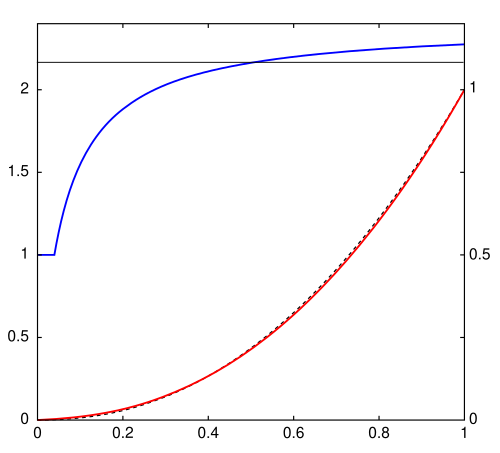

# [Draft] 2회차 Chapter 3. 감마(Gamma), OETF, EOTF

## 학습 목표

이 장의 목표는 감마(Gamma)를 막연한 "밝기 보정"이 아니라, 장면의 빛(scene light), 영상 신호(signal), 디스플레이 빛(display light) 사이의 비선형 관계로 이해하는 것이다. 특히 OETF(Opto-Electronic Transfer Function), EOTF(Electro-Optical Transfer Function), OOTF(Opto-Optical Transfer Function)를 구분하고, sRGB 곡선(sRGB curve), Rec.709 OETF, BT.1886 EOTF가 파이프라인에서 맡는 역할을 설명할 수 있어야 한다.

이 장에서는 바턴 램프(Barten ramp), 밴딩(banding), 계조(gradation), 대비 민감도(contrast sensitivity)를 통해 지각 기반 양자화(perceptual quantization)로 이어지는 배경도 잡는다.

## 핵심 질문

- 감마(Gamma)는 왜 영상과 디스플레이 역사에서 중요해졌는가?
- 바턴 램프(Barten ramp)는 밴딩(banding)과 계조 인지(gradation perception)를 설명할 때 왜 유용한가?
- 인간의 대비 민감도(contrast sensitivity)는 코드값 배분과 어떤 관련이 있는가?
- OETF, EOTF, OOTF는 각각 어느 구간의 관계를 말하는가?
- sRGB 곡선, Rec.709 OETF, BT.1886 EOTF는 서로 같은 것인가?

## 상세 설명

### 1. 감마의 역사적 배경

감마(Gamma)는 원래 CRT(Cathode Ray Tube) 디스플레이의 입력 전압과 출력 빛 사이의 비선형 관계와 깊게 연결되어 있다. CRT는 입력 신호가 두 배가 된다고 출력 빛이 정확히 두 배가 되지 않았다. 출력은 대략 입력의 거듭제곱 형태를 따랐고, 이 관계를 감마 곡선(gamma curve)으로 설명했다.

방송과 영상 시스템은 이 비선형성을 단순한 결함으로만 보지 않았다. 인간 시각도 밝기에 선형적으로 반응하지 않으므로, 비선형 신호는 제한된 대역폭과 비트 수 안에서 계조를 더 효율적으로 배분하는 데 도움이 되었다. 결과적으로 감마는 장치 특성, 인간 지각, 신호 효율이 만나는 지점이 되었다.

오늘날에는 모든 전송 함수를 감마라고 부르면 부정확하다. sRGB, Rec.709, BT.1886, PQ, HLG는 모두 코드값과 빛 사이의 관계를 다루지만, 형태와 목적이 다르다. 그래서 현대 영상 표준에서는 OETF, EOTF, OOTF 같은 용어로 어느 구간의 변환인지 구분한다.

### 2. 바턴 램프와 계조 인지

바턴 램프(Barten ramp)는 인간이 밝기 변화와 밴딩(banding)을 어떻게 느끼는지 설명할 때 자주 언급되는 지각 모델 배경과 연결된다. 핵심은 사람이 모든 밝기 영역에서 같은 절대 차이에 똑같이 민감하지 않다는 것이다.

밴딩은 연속적인 밝기 변화가 충분히 촘촘한 코드값으로 표현되지 못해 계단처럼 보이는 현상이다. 특히 어두운 영역이나 완만한 그라데이션(gradation)에서 코드 간격이 눈에 띄면 쉽게 드러난다.

인간 시각의 대비 민감도(contrast sensitivity)는 배경 밝기, 공간 주파수, 관찰 조건에 따라 달라진다. 이 특성을 고려하면 코드값을 물리적 휘도(luminance)에 균등하게 배분하는 것보다, 사람이 차이를 느끼는 방식에 맞게 배분하는 편이 효율적이다. 이 생각은 HDR에서 PQ(Perceptual Quantizer) 같은 지각 기반 전송 함수로 이어진다.

### 3. OETF, EOTF, OOTF의 구분

OETF(Opto-Electronic Transfer Function)는 장면의 빛(scene light)을 전기적 또는 디지털 신호(signal)로 바꾸는 함수다. 카메라가 장면의 선형광을 영상 코드값으로 기록할 때의 변환으로 이해하면 좋다.

EOTF(Electro-Optical Transfer Function)는 전기적 또는 디지털 신호를 디스플레이 빛(display light)으로 바꾸는 함수다. 즉 코드값이 화면에서 실제로 어느 휘도로 나오는지를 정의한다.

OOTF(Opto-Optical Transfer Function)는 장면의 빛에서 최종 디스플레이 빛까지의 전체 관계다. 카메라 OETF와 디스플레이 EOTF를 단순히 수학적으로만 이어 붙인 것 이상으로, 관찰 환경과 제작 의도까지 반영할 수 있다.

```text
scene light
-> OETF
-> signal
-> EOTF
-> display light

scene light -> display light 전체 관계 = OOTF
```

이 구분을 잡아야 Rec.709의 OETF와 BT.1886의 EOTF를 같은 "감마"로 뭉뚱그리지 않을 수 있다.

### 4. sRGB 곡선, Rec.709 OETF, BT.1886 EOTF

sRGB 곡선(sRGB curve)은 컴퓨터 그래픽과 웹 이미지에서 널리 쓰이는 전송 곡선이다. 낮은 값 근처에는 선형 구간이 있고, 나머지는 대략 감마 2.4에 가까운 형태를 갖는다. sRGB 값은 일반적으로 표시용 비선형 RGB로 보아야 하며, 물리적 계산 전에는 선형화(linearization)가 필요하다.

Rec.709 OETF는 HDTV 카메라 신호를 위한 장면 빛에서 신호로의 변환이다. 흔히 Rec.709 감마라고 부르지만, 정확히는 OETF다. 낮은 구간에는 선형에 가까운 구간이 있고, 높은 구간은 거듭제곱 형태를 갖는다.

BT.1886 EOTF는 Rec.709 SDR 디스플레이의 기준 표시 특성을 정의하기 위해 사용되는 EOTF다. 이상적인 검정과 실제 디스플레이의 블랙 레벨(black level)을 고려해, SDR 마스터링과 표시에서 일관된 톤 재현을 목표로 한다.

정리하면 sRGB, Rec.709 OETF, BT.1886 EOTF는 모두 비선형 관계를 다루지만 쓰이는 위치와 목적이 다르다.

## 용어 노트

### 감마(Gamma)

감마(Gamma)는 코드값과 빛 사이의 거듭제곱형 비선형 관계를 설명하는 용어다. 관습적으로 넓게 쓰이지만, 표준을 읽을 때는 OETF, EOTF, OOTF를 구분하는 편이 정확하다.

### OETF(Opto-Electronic Transfer Function)

OETF는 장면의 빛(scene light)을 영상 신호(signal)로 변환하는 함수다. 카메라 쪽 인코딩에 가깝다.

### EOTF(Electro-Optical Transfer Function)

EOTF는 영상 신호(signal)를 디스플레이 빛(display light)으로 변환하는 함수다. 표시 장치가 코드값을 휘도로 해석하는 방식이다.

### OOTF(Opto-Optical Transfer Function)

OOTF는 장면의 빛(scene light)과 최종 디스플레이 빛(display light) 사이의 전체 관계다. 단순한 함수 조합뿐 아니라 제작 의도와 관찰 환경의 영향을 포함할 수 있다.

### 밴딩(Banding)과 계조(Gradation)

밴딩(banding)은 연속적인 계조(gradation)가 코드값 부족이나 부적절한 처리 때문에 계단처럼 보이는 현상이다.

### 대비 민감도(Contrast Sensitivity)

대비 민감도(contrast sensitivity)는 사람이 밝기 차이나 패턴 차이를 감지하는 능력이다. 밝기 수준과 공간 주파수, 관찰 조건에 따라 달라진다.

## 그림 후보

> 아래 그림은 슬라이드 제작 시 후보로 검토할 자료다. 최종 사용 전에는 각 출처 페이지에서 라이선스와 저작자 표기를 확인한다.

- `감마 곡선`: [Gamma correction curve](https://commons.wikimedia.org/w/index.php?search=gamma+correction+curve&title=Special:MediaSearch&type=image) - 감마(gamma)를 단일 숫자 곡선으로 소개할 때 사용할 후보 검색 링크.
- `sRGB transfer`: [sRGB gamma curve](https://commons.wikimedia.org/wiki/File:SRGB_gamma.svg) - 실제 표준 전송 특성은 단순 power law가 아닐 수 있다는 설명에 사용.
  
- `OETF/EOTF 비교`: [Linear distribution versus gamma corrected distribution](https://commons.wikimedia.org/wiki/File:Linear_Distribution_versus_Gamma_Corrected_Distribution.svg) - 장면 빛, 신호, 디스플레이 빛 사이의 비선형 매핑을 시각화하는 보조 그림.

## 실무 예시와 데모 아이디어

### 예시 1. 선형 램프와 감마 인코딩 램프 비교

0부터 1까지의 선형광 램프를 그대로 8비트로 양자화한 경우와 sRGB 또는 감마 인코딩 후 양자화한 경우를 비교한다. 어두운 영역의 밴딩 차이를 보여주기 좋다.

### 예시 2. 같은 "감마"라는 말의 혼동 찾기

파일 메타데이터에는 Rec.709 transfer가 있고, 디스플레이 타깃은 BT.1886인 사례를 보여준다. 둘을 모두 "709 감마"라고 부르면 파이프라인의 어느 지점을 말하는지 불분명해진다.

### 예시 3. ffprobe로 transfer 확인

`ffprobe`에서 `color_transfer` 값을 확인하고, 그것이 OETF/EOTF 중 어느 쪽 표준 이름과 관련되는지 설명한다. 실제 처리는 소프트웨어와 파이프라인에 따라 달라질 수 있으므로 메타데이터와 처리 단계를 함께 보아야 한다.

## 추천 진행 흐름

### 1. 감마를 역사에서 출발시키기

CRT의 비선형 출력과 인간 시각의 비선형 민감도가 맞물렸다는 이야기로 감마를 소개한다.

### 2. 밴딩과 계조를 눈으로 보여주기

바턴 램프와 그라데이션 예시를 통해 "왜 비선형 배분이 필요한가"를 지각적으로 이해시킨다.

### 3. OETF/EOTF/OOTF를 파이프라인 도식으로 정리하기

scene light, signal, display light를 세 칸으로 놓고 각각의 함수가 어디에 있는지 표시한다.

### 4. 대표 표준을 위치별로 배치하기

sRGB 곡선, Rec.709 OETF, BT.1886 EOTF를 같은 감마 가족으로만 묶지 말고, 각각 어디에 쓰이는지 분리해서 설명한다.

## 짧은 마무리 요약

감마(Gamma)는 코드값과 빛 사이의 비선형 관계를 설명하는 오래된 핵심 개념이지만, 현대 영상 파이프라인에서는 OETF, EOTF, OOTF를 구분해야 한다. OETF는 장면 빛에서 신호로, EOTF는 신호에서 디스플레이 빛으로, OOTF는 장면에서 표시 결과까지의 전체 관계를 말한다.

비선형 전송 함수는 단순한 장치 보정이 아니라 인간 시각의 대비 민감도와 계조 인지까지 연결된다. 이 흐름이 다음 장의 PQ(Perceptual Quantizer)와 HLG(Hybrid Log-Gamma) 이해로 이어진다.
