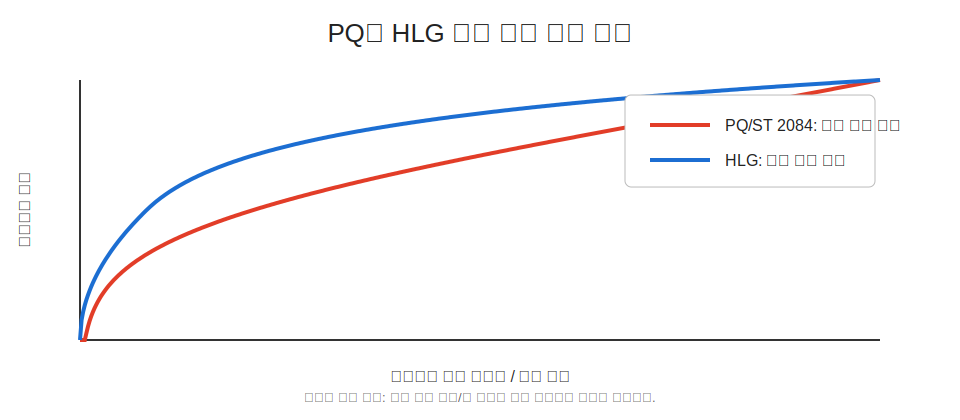

# [Draft] 2회차 Chapter 4. PQ(Perceptual Quantizer)와 HLG(Hybrid Log-Gamma) 상세

## 학습 목표

이 장의 목표는 HDR(High Dynamic Range)에서 널리 쓰이는 두 전송 방식인 PQ(Perceptual Quantizer)와 HLG(Hybrid Log-Gamma)를 구분해서 이해하는 것이다. PQ는 ST 2084 EOTF로 표준화된 절대 밝기 기반 전송 함수이고, HLG는 방송 워크플로를 고려한 상대 밝기 기반 HDR 방식이다.

이 장을 마치면 청중은 PQ가 10,000 nits 범위를 어떻게 다루는지, HDR10에서 어떤 방식으로 쓰이는지, HLG가 왜 SDR(Standard Dynamic Range) 호환성을 고려해 설계되었는지, 그리고 PQ와 HLG의 실무적 차이가 무엇인지 설명할 수 있어야 한다.

## 핵심 질문

- PQ(Perceptual Quantizer)는 왜 지각 기반 전송 함수라고 불리는가?
- ST 2084 EOTF는 코드값을 어떤 절대 휘도(absolute luminance)로 해석하는가?
- 10,000 nits는 실제 콘텐츠가 항상 10,000 nits라는 뜻인가?
- HDR10은 PQ를 어떻게 사용하고 어떤 메타데이터(metadata)를 함께 전달하는가?
- HLG(Hybrid Log-Gamma)는 왜 방송 친화적이라고 말하는가?
- PQ와 HLG의 차이는 absolute vs relative 말고 무엇이 있는가?

## 상세 설명

### 1. PQ는 절대 밝기 기반 EOTF다

PQ(Perceptual Quantizer)는 SMPTE ST 2084로 표준화된 EOTF(Electro-Optical Transfer Function)다. PQ의 핵심은 영상 코드값이 디스플레이의 절대 휘도(absolute luminance)에 대응한다는 점이다. 즉 특정 PQ 코드값은 특정 nit 값에 대응하도록 설계되어 있다.

PQ는 최대 10,000 nits까지의 휘도 범위를 표현할 수 있도록 정의되어 있다. 여기서 10,000 nits는 PQ 곡선의 표현 상한을 뜻한다. 모든 HDR 콘텐츠가 10,000 nits로 마스터링된다는 뜻은 아니다. 실제 HDR10 콘텐츠는 흔히 1,000 nits 또는 4,000 nits 마스터링 디스플레이(mastering display)를 기준으로 제작될 수 있고, 최종 표시 장치는 자신의 능력에 맞게 톤매핑(tone mapping)을 수행한다.

PQ는 디스플레이 참조(display-referred) 성격이 강하다. 코드값이 장면의 상대적인 빛이라기보다, 기준 표시 휘도에 직접 연결되기 때문이다.

### 2. PQ와 인간 시각 모델의 관계

PQ는 사람이 밝기 차이를 감지하는 방식에 맞춰 코드값을 배분하려는 전송 함수다. 바턴 램프(Barten ramp), 대비 민감도(contrast sensitivity), JND(Just Noticeable Difference) 같은 인간 시각 모델 배경과 연결된다.

핵심은 제한된 비트 수로 매우 넓은 휘도 범위를 표현할 때, 코드값을 물리적 휘도에 균등하게 나누는 것은 비효율적이라는 점이다. 어두운 영역에서는 작은 차이가 눈에 잘 띄고, 밝은 영역에서는 같은 절대 차이가 덜 민감하게 느껴질 수 있다. PQ는 이런 지각 특성을 고려해 10비트(10-bit) 또는 12비트(12-bit) 신호에서도 HDR 계조를 효율적으로 표현하도록 설계되었다.

따라서 PQ는 단순한 "밝은 감마"가 아니다. SDR 감마의 연장이라기보다 HDR 휘도 범위를 지각적으로 양자화하기 위한 별도의 EOTF로 이해하는 편이 정확하다.

### 3. HDR10에서 PQ가 쓰이는 방식

HDR10은 일반적으로 Rec.2020 계열 원색(color primaries), PQ/ST 2084 전송 특성(transfer characteristics), 10비트 신호, 정적 메타데이터(static metadata)를 함께 사용하는 HDR 영상 방식으로 이해할 수 있다.

HDR10 메타데이터에는 보통 마스터링 디스플레이 색 볼륨(mastering display color volume), MaxCLL(Maximum Content Light Level), MaxFALL(Maximum Frame-Average Light Level) 같은 정보가 들어갈 수 있다. 이 정보는 표시 장치가 콘텐츠를 자신의 최대 휘도(peak luminance)와 특성에 맞게 톤매핑하는 데 힌트를 준다.

다만 메타데이터가 있다고 해서 표시 결과가 모든 장치에서 완전히 같아지는 것은 아니다. HDR10은 장치별 톤매핑 구현 차이를 허용한다. 같은 HDR10 파일도 TV, 모니터, 플레이어, OS 설정에 따라 하이라이트 처리와 전체 밝기 인상이 달라질 수 있다.

### 4. HLG는 상대 밝기 기반 방송 친화 HDR이다

HLG(Hybrid Log-Gamma)는 BBC와 NHK가 방송 워크플로를 고려해 만든 HDR 방식이다. 이름처럼 낮은 구간은 감마(gamma)에 가깝고, 높은 구간은 로그(log) 형태를 사용한다.

HLG의 중요한 특징은 상대 밝기(relative brightness) 기반이라는 점이다. PQ처럼 코드값이 특정 절대 nit 값에 직접 대응하는 방식이 아니라, 표시 장치와 환경에 따라 OOTF(Opto-Optical Transfer Function)를 통해 최종 밝기 관계가 정해진다.

이 설계는 방송에 유리하다. 생방송이나 송출 환경에서는 장면마다 정교한 메타데이터를 만들고 전달하기 어렵고, SDR 수신 환경과의 어느 정도 호환성도 중요하다. HLG 신호는 SDR 디스플레이에서 완벽한 HDR로 보이지는 않지만, 기존 감마 계열 디스플레이에서도 어느 정도 볼 수 있는 그림을 목표로 설계되었다.

### 5. PQ와 HLG의 차이

PQ와 HLG의 차이는 다음처럼 정리할 수 있다.

```text
PQ  = 절대 휘도 기반, ST 2084 EOTF, HDR10/영화/OTT 맥락에 강함
HLG = 상대 밝기 기반, 방송 친화 설계, 메타데이터 의존도가 낮음
```

PQ는 제작자가 특정 마스터링 디스플레이와 절대 휘도 기준을 두고 화면을 설계하기 좋다. 대신 표시 장치가 콘텐츠보다 낮은 최대 밝기를 가질 때 톤매핑이 중요해진다.

HLG는 라이브 방송과 호환성에 강점이 있다. 정적 또는 동적 메타데이터(dynamic metadata)에 덜 의존하고, 다양한 수신 환경에서 그럭저럭 안정적인 표시를 목표로 한다. 대신 PQ처럼 코드값 하나가 명확한 절대 nit 값을 가리키는 방식은 아니다.

## 용어 노트

### PQ(Perceptual Quantizer)

PQ는 HDR 휘도 범위를 인간 시각의 지각 특성에 맞춰 양자화하기 위해 설계된 전송 방식이다. SMPTE ST 2084 EOTF로 표준화되어 있다.

### ST 2084 EOTF

ST 2084 EOTF는 PQ의 표준 이름이다. 영상 신호 코드값을 최대 10,000 nits 범위의 절대 휘도로 해석한다.

### 절대 휘도(Absolute Luminance)

절대 휘도(absolute luminance)는 nit 또는 cd/m2 같은 물리 단위로 표현되는 휘도다. PQ에서는 코드값과 절대 휘도 대응이 중요하다.

### HLG(Hybrid Log-Gamma)

HLG는 낮은 구간의 감마 형태와 높은 구간의 로그 형태를 결합한 HDR 방식이다. 상대 밝기 기반이고 방송 친화적이다.

### HDR10

HDR10은 PQ/ST 2084, 10비트, Rec.2020 계열 색 정보, 정적 HDR 메타데이터를 사용하는 대표적인 HDR 영상 방식이다.

## 그림 후보

> 아래 그림은 슬라이드 제작 시 후보로 검토할 자료다. 최종 사용 전에는 각 출처 페이지에서 라이선스와 저작자 표기를 확인한다.

- `PQ/ST 2084 곡선`: [PQ EOTF (SMPTE2084)](https://commons.wikimedia.org/wiki/File:PQ_EOTF_%28SMPTE2084%29.png) - 코드값이 절대 휘도(absolute luminance)에 대응한다는 설명의 핵심 후보.
- `HLG 곡선`: [Hybrid Log-Gamma](https://commons.wikimedia.org/wiki/File:Hybrid_Log-Gamma.svg) - 낮은 구간 gamma, 높은 구간 log 구조를 설명할 때 사용.
  
- `JND/시각 민감도 배경`: [Contrast sensitivity function search result](https://commons.wikimedia.org/w/index.php?search=contrast+sensitivity+function&title=Special:MediaSearch&type=image) - PQ가 지각 기반 양자화(perceptual quantization)를 목표로 한다는 배경 설명용 후보 검색 링크.

## 실무 예시와 데모 아이디어

### 예시 1. PQ 코드값과 nit 대응 보기

PQ 곡선 그래프를 보여주고 코드값이 선형 휘도와 전혀 균등하게 대응하지 않는다는 점을 설명한다. 10,000 nits 상한은 표현 범위이지 모든 콘텐츠의 실제 피크가 아니라는 점을 강조한다.

### 예시 2. 같은 HDR10 콘텐츠의 장치별 톤매핑 비교

1,000 nits HDR10 콘텐츠를 600 nits 모니터와 1,500 nits TV에서 표시할 때 결과가 어떻게 달라질 수 있는지 비교한다. 메타데이터는 힌트이고 최종 톤매핑은 장치 판단이 들어간다는 점을 보여준다.

### 예시 3. PQ와 HLG 그래프 비교

PQ는 절대 nit 축으로, HLG는 상대 신호와 표시 환경 기반으로 설명한다. 두 그래프를 나란히 놓으면 영화/OTT와 방송 맥락의 차이를 설명하기 쉽다.

## 추천 진행 흐름

### 1. PQ를 "HDR용 감마"가 아니라 ST 2084 EOTF로 소개하기

PQ가 절대 휘도 기반이라는 점을 먼저 잡는다. 10,000 nits의 의미를 오해하지 않게 설명한다.

### 2. 인간 시각 모델과 코드값 배분 연결하기

바턴 램프, 대비 민감도, 지각 기반 양자화라는 흐름을 짧게 복습한다.

### 3. HDR10으로 실무 위치 잡기

PQ가 HDR10에서 어떻게 쓰이고, 메타데이터가 어떤 역할을 하는지 설명한다.

### 4. HLG를 방송 문제에서 출발시키기

라이브 방송, SDR 호환성, 낮은 메타데이터 의존도를 이유로 HLG 설계를 소개한다.

### 5. PQ와 HLG를 비교표로 마무리하기

absolute vs relative, 메타데이터 의존도, 대표 사용처, 톤매핑 방식의 차이를 정리한다.

## 짧은 마무리 요약

PQ(Perceptual Quantizer)는 ST 2084 EOTF로 표준화된 절대 휘도 기반 HDR 전송 함수다. 최대 10,000 nits까지 표현할 수 있지만, 실제 콘텐츠와 디스플레이는 그보다 낮은 피크 휘도에서 동작할 수 있고 이때 톤매핑(tone mapping)이 중요해진다.

HLG(Hybrid Log-Gamma)는 상대 밝기 기반의 방송 친화 HDR 방식이다. PQ는 영화, OTT, HDR10 맥락에 강하고, HLG는 라이브 방송과 SDR 호환성을 고려한 워크플로에 강하다.
