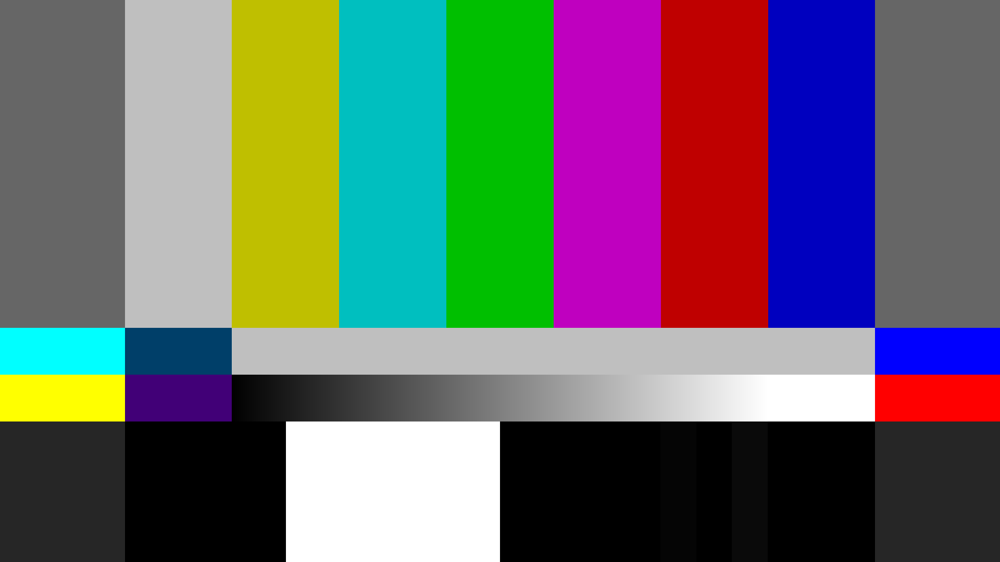
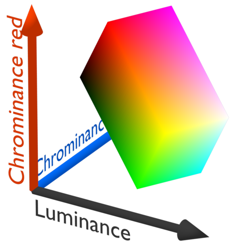

# [Draft] 2회차 Chapter 6. 색 범위(Color Range) 상세

## 학습 목표

이 장의 목표는 색 범위(color range)를 색역(gamut), 전송 함수(transfer function), 행렬 계수(matrix coefficients)와 분리해서 이해하는 것이다. color range는 디지털 코드값 중 어느 구간을 유효한 영상 신호로 해석할지에 대한 약속이다.

이 장을 마치면 청중은 full range와 limited/video/legal range의 차이, 8비트와 10비트 코드 범위, headroom/footroom, RGB range와 YCbCr range의 차이, `ffprobe`의 `color_range=pc/jpeg/tv/mpeg` 표기를 설명할 수 있어야 한다.

## 핵심 질문

- full range와 limited range는 정확히 무엇이 다른가?
- 8비트 기준 luma `16-235`, chroma `16-240`은 무엇을 뜻하는가?
- 10비트 limited luma `64-940`은 8비트 값을 어떻게 확장한 것인가?
- headroom과 footroom은 왜 남겨 두었는가?
- RGB range와 YCbCr range는 같은 방식으로 생각해도 되는가?
- range mismatch가 생기면 화면에 어떤 증상이 나타나는가?
- `ffprobe`의 `pc/jpeg/tv/mpeg`는 어떻게 읽어야 하는가?

## 상세 설명

### 1. Color range가 정의하는 것

색 범위(color range)는 디지털 코드값 중 어느 범위를 유효한 영상 신호로 볼 것인지 정의한다. 8비트 신호라면 가능한 코드값은 `0-255`다. 하지만 영상 표준은 이 전체를 항상 검정부터 흰색까지의 유효 범위로 쓰지 않을 수 있다.

full range는 전체 코드 범위를 사용한다. 8비트 기준으로 검정은 `0`, 흰색은 `255`다. RGB 이미지, 그래픽, 컴퓨터 화면 캡처에서는 full range가 흔하다.

limited range는 방송/영상 신호에서 흔히 쓰이는 범위다. 8비트 기준 luma는 `16-235`, chroma는 `16-240`을 유효 범위로 사용한다. 이를 video range 또는 legal range라고도 부른다.

### 2. 8비트와 10비트 범위

8비트 full range는 다음처럼 이해할 수 있다.

```text
RGB 또는 luma: 0-255
검정: 0
흰색: 255
```

8비트 limited range는 다음처럼 해석한다.

```text
luma Y': 16-235
chroma Cb/Cr: 16-240
검정 기준: 16
흰색 기준: 235
chroma 중심: 128
```

10비트에서는 값이 4배로 확장된다. 대표적으로 limited luma는 `64-940`이고, limited chroma는 보통 `64-960` 범위를 사용한다. full range라면 10비트 전체 코드인 `0-1023`을 사용할 수 있다.

이 숫자는 단순 암기보다 스케일 감각이 중요하다. 8비트의 `16`은 10비트의 `64`로, 8비트의 `235`는 10비트의 `940`으로 확장된다.

### 3. Headroom과 footroom

limited range는 코드값 양끝을 비워 둔다. 검정 아래쪽 여유 구간을 footroom, 흰색 위쪽 여유 구간을 headroom이라고 부를 수 있다. 역사적으로 아날로그 영상, 필터링, 오버슈트(overshoot), 언더슈트(undershoot), 동기 신호와의 관계 등 여러 이유로 이런 여유 구간이 중요했다.

디지털 워크플로에서도 headroom과 footroom은 완전히 무의미하지 않다. 변환이나 필터링 과정에서 일시적으로 기준 범위를 넘는 값이 생길 수 있고, 일부 영상은 슈퍼화이트(super-white) 정보를 포함할 수 있다. 다만 최종 해석에서 이 값을 어떻게 처리할지는 표준, 코덱, 플레이어, 편집툴 설정에 따라 달라질 수 있다.

### 4. RGB range와 YCbCr range

RGB range와 YCbCr range는 관련되어 있지만 항상 같은 감각으로 다루면 안 된다. RGB full range는 컴퓨터 그래픽에서 자연스럽게 `0-255` 전체를 검정-흰색으로 쓰는 경우가 많다. 반면 YCbCr limited range는 luma와 chroma가 서로 다른 유효 범위를 갖는다.

RGB 데이터를 YCbCr로 변환하거나 다시 RGB로 디코딩할 때는 matrix coefficients와 range scaling이 함께 적용된다. 이때 range를 잘못 해석하면 RGB 변환 결과의 검정, 흰색, 채도까지 영향을 받을 수 있다.

예를 들어 limited YCbCr을 full로 잘못 읽으면 `16`을 검정이 아니라 약간 밝은 값으로 보게 되어 화면이 흐릿하고 대비가 낮아진다. 반대로 full range를 limited로 잘못 읽으면 실제 `0` 근처와 `255` 근처가 범위 밖 값처럼 처리되어 암부와 하이라이트가 잘릴 수 있다.

### 5. Range는 transfer나 matrix가 아니다

range와 전송 함수(transfer function)는 다른 개념이다. transfer는 코드값과 빛 사이의 곡선 관계를 정의한다. sRGB, Rec.709, BT.1886, PQ, HLG가 여기에 속한다. range는 그 코드값 중 어느 구간을 유효 신호로 볼지 정한다.

range와 matrix coefficients도 다르다. matrix는 RGB와 YCbCr 사이의 변환 계수다. range는 변환 전후 값의 스케일과 오프셋을 어떻게 해석할지에 관여한다.

따라서 다음 세 문장은 서로 다른 문제를 말한다.

```text
transfer가 틀렸다 = 밝기 곡선 해석이 틀렸다
matrix가 틀렸다   = RGB/YCbCr 색차 변환이 틀렸다
range가 틀렸다    = 코드값 스케일/오프셋 해석이 틀렸다
```

### 6. Range mismatch 증상

limited를 full로 읽으면 검정이 회색처럼 뜨고, 흰색이 충분히 밝지 않으며, 전체 콘트라스트(contrast)가 낮아진다. 화면이 "뿌옇다"거나 "물 빠졌다"고 느껴질 수 있다.

full을 limited로 읽으면 암부가 뭉개지고 하이라이트가 클리핑(clipping)된다. 검정은 너무 검고, 밝은 영역은 쉽게 날아간다. 대비가 강해 보이지만 정보가 사라질 수 있다.

chroma range 해석이나 YCbCr 변환 과정이 꼬이면 채도(saturation)가 이상하거나 색상축이 미묘하게 틀어질 수 있다. 이 경우 단순 밝기 문제처럼 보이지 않고 피부톤이나 원색이 어색해 보인다.

### 7. ffprobe의 color_range 읽기

`ffprobe`에서는 `color_range` 필드로 range를 확인할 수 있다. 흔한 표기는 다음과 같다.

```text
pc 또는 jpeg  = full range
tv 또는 mpeg  = limited range
unknown       = 명시되지 않음
```

도구에 따라 full range를 `pc` 또는 `jpeg`로, limited range를 `tv` 또는 `mpeg`로 표시한다. `unknown`이면 안전하게 추정하기보다 소스 맥락, 코덱, 컨테이너, 해상도, 제작 워크플로, 테스트 패턴을 함께 확인해야 한다.

## 용어 노트

### 전체 범위(Full Range)

전체 범위(full range)는 가능한 코드값 전체를 검정부터 흰색 또는 최소부터 최대까지의 유효 신호로 사용하는 방식이다. 8비트 기준 `0-255`가 대표적이다.

### 제한 범위(Limited Range), 비디오 범위(Video Range), 리걸 범위(Legal Range)

제한 범위(limited range)는 영상 표준에서 코드값 양끝을 여유 구간으로 남기고 중앙 구간을 유효 신호로 쓰는 방식이다. video range, legal range라고도 부른다.

### 루마(Luma)와 크로마(Chroma)

루마(luma)는 Y' 밝기 성분에 가까운 신호이고, 크로마(chroma)는 Cb/Cr 색차 성분이다. limited range에서 luma와 chroma의 유효 범위는 서로 다르다.

### Headroom과 Footroom

headroom은 흰색 기준 위쪽의 여유 코드 구간이고, footroom은 검정 기준 아래쪽의 여유 코드 구간이다.

### Range Mismatch

range mismatch는 소스의 range와 디코더, 플레이어, 편집툴, 인코더의 range 해석이 서로 어긋나는 문제다. 색공간 변환이 맞아도 최종 화면을 크게 망칠 수 있다.

## 그림 후보

> 아래 그림은 슬라이드 제작 시 후보로 검토할 자료다. 최종 사용 전에는 각 출처 페이지에서 라이선스와 저작자 표기를 확인한다.

- `full/limited range 설명`: [SMPTE color bars](https://commons.wikimedia.org/wiki/File:SMPTE_Color_Bars_16x9.svg) - legal range, headroom, footroom을 waveform과 함께 설명할 때 기준 패턴으로 사용.
  
- `YCbCr 신호 공간`: [YCbCr color space](https://commons.wikimedia.org/wiki/File:YCbCrColorSpace_Perspective.png) - range가 gamut이 아니라 코드값 해석 범위라는 점을 보조 설명.
  
- `영상 레벨 자료 검색`: [Video levels media search](https://commons.wikimedia.org/w/index.php?search=video+levels+limited+range&title=Special:MediaSearch&type=image) - full/limited range 전용 시각 자료를 추가로 찾기 위한 후보 검색 링크.

## 실무 예시와 데모 아이디어

### 예시 1. Limited를 full로 잘못 읽기

8비트 limited 테스트 패턴에서 black `16`, white `235`를 full range처럼 해석한다. 검정이 떠 보이고 전체 대비가 낮아지는 것을 보여준다.

### 예시 2. Full을 limited로 잘못 읽기

full range 그래픽 소스를 limited로 잘못 해석한다. 암부와 하이라이트가 잘리고 대비가 과하게 강해지는 증상을 보여준다.

### 예시 3. ffprobe와 변환 로그 확인

`ffprobe`로 `color_range`를 확인하고, 변환 도구에서 입력 range와 출력 range를 명시했을 때 결과가 어떻게 달라지는지 비교한다.

### 예시 4. Black/white level 테스트 패턴

`0, 16, 64, 235, 940, 255, 1023` 같은 기준 패치를 포함한 테스트 패턴을 만들어 디코딩과 표시 과정에서 어느 값이 보이는지 확인한다.

## 실무 체크리스트

- 입력 소스의 `color_range` 메타데이터를 확인한다.
- `unknown`이면 소스 맥락과 테스트 패턴으로 실제 range를 추정한다.
- 디코딩 시 limited가 RGB full로 확장되는지 확인한다.
- RGB로 처리할 때 normalized 값이 `0-1`인지, limited 범위를 유지하는지 확인한다.
- YCbCr로 다시 인코딩할 때 목적 포맷에 맞는 range를 명시한다.
- range, transfer, matrix를 서로 다른 항목으로 기록하고 검증한다.
- 최종 결과는 black/white level 패턴으로 눈과 수치 모두 확인한다.

## 추천 진행 흐름

### 1. 8비트 숫자표로 시작하기

`0-255`, `16-235`, `16-240`을 먼저 보여준다. 숫자로 range가 무엇을 정하는지 직관을 만든다.

### 2. Full과 limited를 화면 증상으로 연결하기

검정이 뜨는 사례와 암부가 뭉개지는 사례를 나란히 보여준다.

### 3. Transfer/matrix/range를 분리하기

range 오류를 감마 오류나 색역 오류로 오진하지 않도록 세 개념을 표로 분리한다.

### 4. ffprobe와 체크리스트로 마무리하기

실무에서 확인할 필드명과 변환 전후 체크포인트를 제시한다.

## 짧은 마무리 요약

색 범위(color range)는 색역(gamut)이나 감마(Gamma)가 아니라, 디지털 코드값을 어떤 유효 신호 범위로 해석할지에 대한 약속이다. 8비트 limited에서는 luma `16-235`, chroma `16-240`이 중요하고, 10비트 limited luma는 `64-940`으로 확장된다.

range mismatch는 검정이 뜨거나 암부/하이라이트가 잘리는 대표적인 원인이다. 실무에서는 `ffprobe`의 `color_range`와 변환 도구 설정을 확인하고, 테스트 패턴으로 최종 black/white level을 검증해야 한다.
