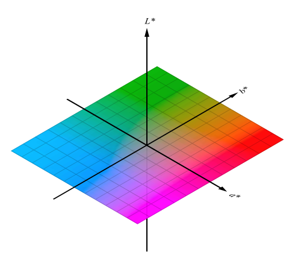

# [Draft] 2회차 Chapter 7. SDR(Standard Dynamic Range)에서 HDR(High Dynamic Range)로

## 학습 목표

이 장의 목표는 SDR(Standard Dynamic Range)의 한계에서 출발해 HDR(High Dynamic Range)이 해결하려는 문제가 무엇인지 이해하는 것이다. HDR은 단순히 화면을 더 밝게 만드는 기능이 아니라, 더 넓은 휘도(luminance) 범위와 더 정교한 하이라이트(highlight) 재현, 마스터링 디스플레이(mastering display), 전송 함수(transfer function), 메타데이터(metadata), 톤매핑(tone mapping)이 함께 얽힌 파이프라인이다.

이 장을 마치면 청중은 peak luminance, mastering display, PQ, HLG, HDR10, Dolby Vision의 기본 개념을 설명하고, wide gamut과 HDR이 관련은 있지만 같은 개념이 아니라는 점을 구분할 수 있어야 한다.

## 핵심 질문

- SDR(Standard Dynamic Range)은 어떤 밝기 재현 한계를 전제로 하는가?
- HDR(High Dynamic Range)의 목적은 단순히 더 밝은 화면인가?
- 최대 휘도(peak luminance)는 HDR 경험에 어떤 영향을 주는가?
- 마스터링 디스플레이(mastering display)는 왜 메타데이터에 등장하는가?
- PQ와 HLG는 HDR 신호를 어떻게 다르게 표현하는가?
- HDR10과 Dolby Vision은 어떤 차이를 개념적으로 갖는가?
- wide color gamut과 HDR은 왜 자주 함께 나오지만 같은 말은 아닌가?

## 상세 설명

### 1. SDR의 밝기 한계

SDR(Standard Dynamic Range)은 오랜 방송과 디스플레이 환경에서 안정적으로 동작하도록 만들어진 범위다. 일반적인 SDR 마스터링은 기준 흰색과 표시 환경이 비교적 제한된 밝기 범위를 전제로 한다. 전통적인 Rec.709 SDR 워크플로에서는 100 nits 근처의 기준 표시 환경을 자주 이야기한다.

이 범위는 웹, 방송, 일반 영상에는 오랫동안 충분했다. 하지만 현실 세계의 빛은 훨씬 넓은 범위를 가진다. 햇빛에 반짝이는 금속, 밤거리의 네온, 창밖 하늘, 자동차 헤드라이트 같은 하이라이트는 SDR 범위 안에 그대로 담기 어렵다. SDR에서는 이런 영역을 압축하거나 잘라내야 하므로, 밝은 장면의 인상과 디테일이 제한된다.

### 2. HDR의 목적

HDR(High Dynamic Range)의 목적은 "전체 화면을 무조건 밝게 만들기"가 아니다. 더 넓은 밝기 범위를 사용해 장면의 어두운 부분과 밝은 부분을 더 설득력 있게 재현하고, 하이라이트의 질감을 보존하며, 제작자가 의도한 대비와 광량감을 더 잘 전달하는 것이다.

좋은 HDR 영상은 평균 화면 밝기(Average Picture Level)를 무작정 올리지 않는다. 오히려 중간톤은 자연스럽게 유지하면서, 필요한 하이라이트에 추가 밝기 여유를 사용한다. 그래서 HDR의 핵심은 최대 휘도(peak luminance), 블랙 레벨(black level), 계조(gradation), 톤매핑(tone mapping)의 균형이다.

### 3. Peak luminance와 mastering display

최대 휘도(peak luminance)는 디스플레이가 낼 수 있는 가장 밝은 휘도 수준을 말한다. HDR 디스플레이는 SDR보다 높은 peak luminance를 제공할 수 있지만, 모든 HDR 디스플레이가 같은 밝기를 내는 것은 아니다. 600 nits, 1,000 nits, 2,000 nits 디스플레이는 같은 HDR 콘텐츠를 서로 다르게 표시할 수 있다.

마스터링 디스플레이(mastering display)는 콘텐츠 제작자가 색과 밝기를 판단한 기준 디스플레이다. HDR10 메타데이터에는 마스터링 디스플레이의 원색, 화이트 포인트, 최소/최대 휘도 같은 정보가 들어갈 수 있다. 이 정보는 재생 장치가 콘텐츠를 자신의 표시 능력에 맞춰 톤매핑하는 데 참고 자료가 된다.

다만 mastering metadata는 완벽한 지시서가 아니라 힌트에 가깝다. 실제 표시 결과는 TV나 모니터의 톤매핑 알고리즘, 사용자 설정, 주변 밝기, OS와 플레이어 처리에 따라 달라질 수 있다.

### 4. PQ와 HLG

PQ(Perceptual Quantizer)는 HDR 휘도 범위를 절대 밝기 기준으로 표현하는 전송 방식이다. ST 2084 EOTF로 표준화되어 있으며, 코드값이 특정 절대 휘도에 대응한다. HDR10은 대표적으로 PQ를 사용한다.

HLG(Hybrid Log-Gamma)는 상대 밝기 기반의 HDR 방식이다. 방송 워크플로와 SDR 호환성을 고려해 설계되었고, 메타데이터 의존도가 낮다. 라이브 방송처럼 장면마다 정교한 메타데이터를 전달하기 어려운 환경에서 장점이 있다.

두 방식 모두 HDR을 위한 전송 특성이지만 철학이 다르다.

```text
PQ  = 절대 휘도 기준, 마스터링/OTT/영화 맥락에 강함
HLG = 상대 밝기 기준, 방송/라이브/호환성 맥락에 강함
```

### 5. HDR10

HDR10은 가장 널리 알려진 HDR 영상 방식 중 하나다. 보통 Rec.2020 계열 색 정보, PQ/ST 2084 전송 함수, 10비트(bit) 신호, 정적 메타데이터(static metadata)를 사용한다.

HDR10의 정적 메타데이터는 콘텐츠 전체에 대해 하나의 마스터링 정보와 MaxCLL(Maximum Content Light Level), MaxFALL(Maximum Frame-Average Light Level) 같은 정보를 제공할 수 있다. 장면마다 달라지는 톤매핑 지시를 세밀하게 전달하지는 않는다.

그래서 HDR10 재생에서는 디스플레이의 자체 톤매핑 판단이 중요하다. 콘텐츠의 마스터링 피크가 디스플레이의 peak luminance보다 높으면, 하이라이트를 어떻게 압축할지 결정해야 한다.

### 6. Dolby Vision 개념

Dolby Vision은 HDR 생태계에서 동적 메타데이터(dynamic metadata)를 활용할 수 있는 방식으로 이해하면 좋다. 장면 또는 샷 단위로 톤매핑 관련 정보를 전달해, 다양한 표시 장치에서 제작 의도에 더 가까운 결과를 목표로 한다.

이 장에서는 Dolby Vision의 세부 프로파일(profile)이나 라이선스 구조까지 들어가지는 않는다. 핵심은 HDR10이 정적 메타데이터 중심이라면, Dolby Vision은 동적 메타데이터를 통해 장면별 표시 최적화를 더 적극적으로 지원할 수 있다는 개념이다.

### 7. Wide gamut과 HDR은 같은 말이 아니다

HDR 콘텐츠는 Rec.2020 같은 넓은 색역(wide color gamut)과 함께 등장하는 경우가 많다. 그래서 wide gamut과 HDR을 같은 것으로 오해하기 쉽다. 하지만 둘은 다른 축의 개념이다.

wide gamut은 CIE xy 색도도에서 더 넓은 색도 범위를 표현하는 문제다. HDR은 더 넓은 밝기 범위와 전송 함수, 표시 재현 문제다. 넓은 색역 SDR도 가능하고, 이론적으로는 좁은 색역 HDR도 가능하다.

실무적으로는 HDR과 wide gamut이 함께 쓰이는 경우가 많기 때문에 둘을 동시에 관리해야 한다. 하지만 분석할 때는 색역, 전송 함수, range, 메타데이터, 톤매핑을 분리해서 읽어야 한다.

## 용어 노트

### SDR(Standard Dynamic Range)

SDR은 전통적인 방송과 디스플레이 환경에서 쓰이는 표준 동적 범위다. Rec.709 SDR 워크플로와 함께 자주 다뤄진다.

### HDR(High Dynamic Range)

HDR은 더 넓은 밝기 범위와 하이라이트 재현을 목표로 하는 영상 방식이다. 전송 함수, 비트 심도, 메타데이터, 디스플레이 성능, 톤매핑이 함께 중요하다.

### 최대 휘도(Peak Luminance)

최대 휘도(peak luminance)는 디스플레이나 콘텐츠가 표현하는 가장 밝은 휘도 수준이다. nit 또는 cd/m2로 표현한다.

### 마스터링 디스플레이(Mastering Display)

마스터링 디스플레이(mastering display)는 콘텐츠 제작자가 색과 밝기를 판단한 기준 표시 장치다. HDR 메타데이터에서 중요한 힌트로 쓰인다.

### HDR10

HDR10은 PQ/ST 2084, 10비트 신호, 정적 메타데이터를 사용하는 대표적인 HDR 방식이다.

### Dolby Vision

Dolby Vision은 동적 메타데이터를 활용해 장면별 또는 샷별 표시 최적화를 지원할 수 있는 HDR 방식이다. 이 장에서는 개념 수준으로 다룬다.

## 그림 후보

> 아래 그림은 슬라이드 제작 시 후보로 검토할 자료다. 최종 사용 전에는 각 출처 페이지에서 라이선스와 저작자 표기를 확인한다.

- `SDR 색역과 HDR 색역`: [CIE1931xy gamut comparison of sRGB, Display P3, Rec.2020](https://commons.wikimedia.org/wiki/File:CIE1931xy_gamut_comparison_of_sRGB_P3_Rec2020.svg) - SDR/HDR 차이가 gamut만의 문제가 아니라는 출발점으로 사용.
  
- `PQ 곡선`: [PQ EOTF (SMPTE2084)](https://commons.wikimedia.org/wiki/File:PQ_EOTF_%28SMPTE2084%29.png) - HDR은 더 넓은 휘도 범위와 전송 함수를 포함한다는 설명에 사용.
- `색도와 밝기 분리`: [The principle of the CIELAB colour space](https://commons.wikimedia.org/wiki/File:The_principle_of_the_CIELAB_colour_space.svg) - SDR에서 HDR로 갈 때 밝기 축을 따로 봐야 한다는 설명의 보조 그림.
  

## 실무 예시와 데모 아이디어

### 예시 1. SDR 클리핑과 HDR 하이라이트 비교

창밖 하늘이나 금속 반사처럼 밝은 영역이 있는 장면을 SDR과 HDR로 비교한다. SDR에서는 하이라이트가 뭉개지거나 잘리고, HDR에서는 더 많은 밝기 계조를 유지할 수 있음을 보여준다.

### 예시 2. 1,000 nits 콘텐츠를 600 nits 디스플레이에 표시하기

마스터링 피크가 디스플레이 peak luminance보다 높을 때 톤매핑이 필요하다는 점을 설명한다. 하이라이트를 클리핑할지, 전체를 압축할지, 중간톤을 유지할지 같은 선택이 생긴다.

### 예시 3. HDR10 메타데이터 읽기

`ffprobe`나 편집툴에서 primaries, transfer, matrix, mastering display metadata, MaxCLL, MaxFALL을 확인한다. 메타데이터는 표시 장치의 톤매핑에 힌트를 주지만 결과를 완전히 고정하지는 않는다는 점을 설명한다.

### 예시 4. Wide gamut SDR과 HDR 비교

Display P3 SDR 이미지와 Rec.709 HDR 또는 Rec.2020 HDR 개념을 비교해, 색역과 밝기 범위가 별도 축이라는 점을 보여준다.

## 추천 진행 흐름

### 1. SDR의 한계에서 시작하기

SDR이 실패하는 장면, 특히 하이라이트가 많은 장면을 보여준다. HDR이 왜 필요한지 감각적으로 열어 준다.

### 2. HDR을 "더 밝게"가 아니라 "더 넓게"로 설명하기

전체 화면 밝기보다 밝기 범위, 하이라이트 디테일, 계조 보존을 강조한다.

### 3. Peak luminance와 mastering display를 연결하기

콘텐츠가 만들어진 기준과 실제 표시 장치의 능력이 다를 수 있음을 설명하고 톤매핑 필요성을 소개한다.

### 4. PQ/HLG/HDR10/Dolby Vision을 큰 지도에 배치하기

PQ와 HLG는 전송 방식, HDR10과 Dolby Vision은 HDR 전달 방식 또는 생태계로 구분해서 설명한다.

### 5. Wide gamut과 HDR을 분리해서 마무리하기

색역과 밝기 범위가 서로 다른 축이라는 점을 다시 확인하고, 다음 장의 컬러 볼륨으로 연결한다.

## 짧은 마무리 요약

SDR(Standard Dynamic Range)은 제한된 밝기 범위를 전제로 하므로 현실 세계의 강한 하이라이트와 넓은 명암 범위를 그대로 담기 어렵다. HDR(High Dynamic Range)은 더 넓은 휘도 범위와 계조를 사용해 장면의 밝기 인상을 더 잘 전달하려는 기술이다.

HDR을 이해하려면 peak luminance, mastering display, PQ, HLG, HDR10, Dolby Vision 같은 요소를 함께 봐야 한다. 또한 wide gamut은 색도 범위의 문제이고 HDR은 밝기 범위의 문제이므로, 둘은 관련되어 있지만 같은 개념은 아니다.
