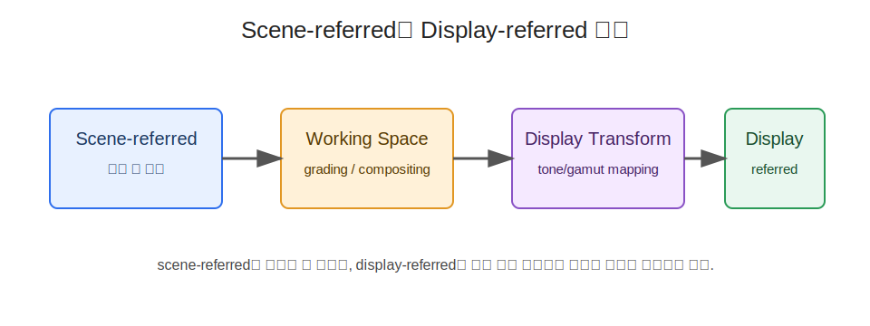

# [Draft] 2회차 Chapter 10. Scene-referred와 Display-referred

## 학습 목표

이 장의 목표는 장면 기준(Scene-referred)과 표시 기준(Display-referred)을 구분하는 것이다. 같은 RGB 값이나 영상 파일이라도 그것이 실제 장면의 빛을 기준으로 한 중간 데이터인지, 특정 디스플레이(display)에서 어떻게 보일지를 정한 출력물인지에 따라 의미가 달라진다.

이 장을 마치면 청중은 다음을 설명할 수 있어야 한다.

- scene-referred와 display-referred의 차이는 무엇인가
- RAW, log, ACES가 왜 scene-referred 제작 워크플로와 연결되는가
- SDR Rec.709, HDR10, HLG 출력물이 왜 display-referred 성격을 갖는가
- 노출(exposure), 화이트 밸런스(white balance), 그레이딩(grading), 출력 변환(output transform), 톤매핑(tone mapping)이 어느 단계에서 등장하는가
- HDR/SDR 변환에서 이 구분이 왜 중요한가

## 핵심 질문

- 카메라 log 영상은 왜 처음 열면 회색빛이고 낮은 대비로 보이는가?
- RAW 파일은 HDR 디스플레이에 바로 표시할 수 있는 완성본인가?
- HDR10 파일의 RGB 또는 YCbCr 값은 장면의 실제 빛을 그대로 의미하는가?
- tone mapping은 단순한 밝기 압축인가, scene과 display 사이의 관계를 정하는 과정인가?
- 같은 RGB 값이 scene-referred인지 display-referred인지에 따라 왜 다른 의미를 갖는가?

## 상세 설명

### 1. Scene-referred는 장면의 빛을 기준으로 한다

장면 기준(scene-referred) 데이터는 카메라가 본 장면의 빛(scene light)을 기준으로 색과 밝기를 표현하려는 데이터다. 특정 디스플레이의 최대 휘도(peak luminance), 블랙 레벨(black level), SDR/HDR 출력 조건에 아직 강하게 묶이지 않은 상태라고 볼 수 있다.

카메라 RAW(camera RAW), 카메라 log(camera log), ACES(Academy Color Encoding System) 같은 제작 워크플로가 여기에 연결된다. 이 데이터는 넓은 동적 범위(dynamic range)와 색 정보를 보존해 후반 작업에서 노출, 화이트 밸런스, 색 보정, 룩(look), 출력 변환을 유연하게 적용할 수 있도록 한다.

예를 들어 log 영상은 처음 보면 대비가 낮고 채도가 약해 보인다. 이것은 실패한 이미지가 아니라, 장면의 넓은 밝기 범위를 제한된 코드값(code value) 안에 효율적으로 담아 후반 작업 여지를 남긴 표현이다.

### 2. Display-referred는 표시 결과를 기준으로 한다

표시 기준(display-referred) 데이터는 특정 표시 조건에서 어떻게 보일지를 기준으로 만들어진다. SDR Rec.709, HDR10, HLG 출력물은 보통 display-referred 결과물로 이해한다. 이들은 원색(color primaries), 전송 특성(transfer characteristics), 행렬 계수(matrix coefficients), 색 범위(color range), 필요하면 HDR 메타데이터(metadata)를 통해 재생 장치가 어떻게 표시해야 하는지 알려 준다.

예를 들어 Rec.709 SDR 마스터는 일반적인 SDR 디스플레이와 시청 환경을 전제로 한다. HDR10 마스터는 PQ(Perceptual Quantizer) EOTF와 마스터링 디스플레이 메타데이터(mastering display metadata)를 통해 높은 밝기 표시를 전제로 한다.

display-referred 데이터는 이미 "어떻게 보일 것인가"에 대한 창작 결정이 상당 부분 반영된 결과물이다. 그래서 display-referred 데이터를 다시 다른 display-referred 환경으로 옮길 때는 단순 색공간 변환(color space conversion)뿐 아니라 톤매핑(tone mapping)과 gamut mapping이 필요할 수 있다.

### 3. Scene에서 display로 가는 과정

scene-referred 데이터가 display-referred 출력물이 되기까지는 여러 단계가 있다.

```text
Scene-referred source
-> exposure / white balance
-> working color space
-> grading
-> output transform
-> tone mapping
-> display-referred output
```

노출(exposure)은 장면의 밝기 정보를 어떤 기준으로 배치할지 정한다. 화이트 밸런스(white balance)는 장면의 조명색과 흰색 기준을 조정한다. 그레이딩(grading)은 창작 의도에 따라 대비, 색상, 채도, 룩을 만든다.

출력 변환(output transform)은 작업 공간의 색과 밝기를 목표 출력 조건으로 보내는 단계다. ACES에서는 Output Transform 또는 RRT/ODT 같은 개념이 여기에 해당한다. 톤매핑(tone mapping)은 장면 또는 HDR 범위의 밝기를 대상 디스플레이가 표현 가능한 범위로 재설계한다.

중요한 점은 이 과정이 단순한 기술 변환만은 아니라는 것이다. 무엇을 보존하고 무엇을 압축할지, 하이라이트를 어떻게 굴릴지, 암부를 얼마나 살릴지, 채도를 어떻게 유지할지는 창작과 기술이 함께 결정하는 문제다.

### 4. RAW/log/ACES와 SDR/HDR 출력의 위치

RAW와 log는 보통 입력 또는 중간 제작 단계에 가깝다. RAW는 센서 데이터와 카메라 메타데이터를 바탕으로 나중에 색과 밝기를 해석할 여지를 준다. log는 카메라 제조사별 또는 표준화된 로그 곡선을 사용해 넓은 동적 범위를 코드값 안에 담는다.

ACES는 여러 카메라와 VFX, 합성, 그레이딩을 하나의 색 관리 체계 안에서 다루기 위한 제작 워크플로다. ACEScg, ACES2065-1, ACEScct 같은 공간은 목적이 다르지만, 공통적으로 display-referred 최종 결과를 만들기 전의 scene-referred 또는 작업 공간 개념과 연결된다.

반면 SDR Rec.709, HDR10, HLG는 배포와 표시를 위한 출력 조건에 가깝다. 물론 HLG는 상대 밝기 기반이라 PQ와 성격이 다르고, 방송 수신 장치의 렌더링에 여지가 있지만, 일반적인 전달물 관점에서는 특정 표시 해석을 전제로 한 display-referred 쪽에 놓고 설명할 수 있다.

### 5. 왜 이 구분이 중요한가

scene-referred와 display-referred를 구분하지 않으면 변환 방향을 잘못 잡기 쉽다. 예를 들어 log 소스를 HDR10처럼 표시하면 화면이 평평해 보일 수 있고, HDR10 완성본을 scene-referred 원본처럼 다루면 이미 적용된 표시 의도와 톤매핑을 무시하게 된다.

HDR을 SDR로 변환할 때도 이 구분은 중요하다. scene-referred 원본에서 SDR을 만드는 것과 HDR10 display-referred 마스터에서 SDR 버전을 만드는 것은 다른 작업이다. 전자는 아직 출력 변환을 설계할 여지가 많고, 후자는 이미 HDR 표시 기준으로 만들어진 결과를 SDR 표시 기준으로 다시 해석해야 한다.

따라서 실무 질문은 다음과 같아야 한다.

```text
이 소스는 장면의 빛을 담은 중간 데이터인가?
아니면 특정 디스플레이에서 보일 결과를 정한 출력물인가?
```

## 용어 노트

### Scene-referred(장면 기준)

Scene-referred는 특정 디스플레이보다 촬영된 장면의 빛을 기준으로 색과 밝기를 표현하는 방식이다. RAW, log, ACES 제작 워크플로와 연결된다.

### Display-referred(표시 기준)

Display-referred는 특정 표시 조건이나 디스플레이 재현을 기준으로 색과 밝기를 표현하는 방식이다. SDR Rec.709, HDR10, HLG 같은 전달 출력물과 연결된다.

### 출력 변환(Output Transform)

출력 변환(output transform)은 작업 공간의 색과 밝기를 목표 디스플레이 또는 배포 표준에 맞게 변환하는 단계다. tone mapping, gamut mapping, transfer 적용이 함께 포함될 수 있다.

### 톤매핑(Tone Mapping)

톤매핑(tone mapping)은 장면 또는 HDR 밝기 범위를 대상 표시 환경의 밝기 범위 안에 배치하는 과정이다. 단순한 clipping이 아니라 하이라이트, 중간톤, 암부의 관계를 재설계하는 작업이다.

## 그림 후보

> 아래 그림은 슬라이드 제작 시 후보로 검토할 자료다. 최종 사용 전에는 각 출처 페이지에서 라이선스와 저작자 표기를 확인한다.

- `Scene-linear 개념`: [OpenEXR scene linear documentation](https://openexr.com/en/latest/SceneLinear.html) - scene-referred/scene-linear 워크플로를 설명하는 공식 문서 후보.
  
- `OCIO 워크플로`: [OpenColorIO documentation](https://opencolorio.readthedocs.io/) - scene-referred와 display transform을 분리하는 컬러 관리 흐름의 공식 참조.
- `ACES 개념`: [ACES documentation](https://docs.acescentral.com/) - ACES에서 scene-referred 이미지와 display rendering transform을 설명할 때 사용할 후보.
- `display-referred 보조`: [PQ EOTF (SMPTE2084)](https://commons.wikimedia.org/wiki/File:PQ_EOTF_%28SMPTE2084%29.png) - PQ의 display-referred 성격을 설명할 때 사용.

## 실무 예시와 데모 아이디어

### 예시 1. Log 영상을 그대로 보기와 LUT 적용 후 비교

카메라 log 영상을 일반 플레이어에서 그대로 열어 낮은 대비로 보이는 상태를 보여준다. 이후 Rec.709 변환 LUT 또는 color managed pipeline을 적용해 display-referred 결과가 만들어지는 과정을 비교한다.

### 예시 2. OpenEXR linear 이미지의 표시 문제

linear OpenEXR 이미지를 색관리 없이 열었을 때 너무 어둡거나 이상하게 보일 수 있음을 보여준다. 이는 파일이 표시 결과가 아니라 scene-referred 또는 linear 작업 데이터를 담고 있기 때문이다.

### 예시 3. HDR10 마스터에서 SDR 버전 만들기

HDR10 완성본을 SDR로 변환할 때 단순히 Rec.2020을 Rec.709로 바꾸는 것만으로 부족하다는 점을 보여준다. PQ 밝기 범위를 SDR 밝기 범위로 톤매핑해야 한다.

## 추천 진행 흐름

### 1. Log 영상의 이상한 첫인상으로 시작

처음에는 log 영상이 왜 흐리고 밋밋하게 보이는지 묻는다. 여기서 "잘못된 색"이 아니라 아직 display-referred 결과가 아니기 때문이라고 설명한다.

### 2. 두 기준 정의하기

scene-referred는 장면 빛 기준, display-referred는 표시 결과 기준이라고 분리한다. 이 정의를 RAW/log/ACES와 Rec.709/HDR10/HLG 예시에 연결한다.

### 3. 변환 단계 설명하기

exposure, white balance, grading, output transform, tone mapping이 scene에서 display로 가는 과정에서 어떤 역할을 하는지 설명한다.

### 4. 실무 위험 정리하기

마지막에는 source가 어느 기준인지 모르면 잘못된 LUT, 잘못된 tone mapping, 중복 변환이 발생할 수 있음을 짚는다.

## 짧은 마무리 요약

Scene-referred는 장면의 빛을 어떻게 기록했는가에 가깝고, display-referred는 특정 표시 환경에서 어떻게 보이게 할 것인가에 가깝다. RAW, log, ACES는 제작과 중간 처리에, SDR Rec.709, HDR10, HLG는 배포와 표시 결과에 더 가깝다.

이 구분은 HDR/SDR 변환에서 특히 중요하다. 같은 RGB 값이라도 장면 기준인지 표시 기준인지에 따라 의미가 달라지고, 톤매핑(tone mapping)은 두 기준 사이의 관계를 정하는 핵심 단계가 된다.
