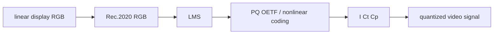

# [Draft] Appendix. ICtCp Color Space

## 이 appendix의 목적

이 appendix는 HDR(High Dynamic Range)과 WCG(Wide Color Gamut) 영상 시스템에서 자주 등장하는 ICtCp color space를 보조 설명하기 위한 문서다. 본문에서는 CIE XYZ, CIE xyY, CIELAB, RGB/YCbCr, HDR transfer function을 차례로 다루기 때문에, ICtCp는 그 흐름의 뒤쪽에서 "HDR 비디오 신호를 사람 눈에 더 맞게 분리하려는 색공간"으로 소개하면 좋다.

핵심 메시지는 다음과 같다.

```text
ICtCp = HDR/WCG 비디오를 위해 설계된 intensity + opponent chroma 계열 색 표현
```

즉 ICtCp는 디스플레이 원색 자체를 정의하는 RGB color space가 아니고, CIELAB처럼 일반적인 색차 품질 관리만을 목적으로 만든 공간도 아니다. BT.2100 HDR 비디오 파이프라인에서 밝기와 색차를 더 지각적으로 잘 분리하기 위해 사용하는 신호 표현 방식에 가깝다.

## 왜 ICtCp가 필요했나

전통적인 비디오 시스템에서는 RGB 신호를 그대로 저장하거나 전송하지 않고, 보통 YCbCr로 변환한다. YCbCr는 밝기 성분(luma)과 색차 성분(chroma)을 분리해서 압축, 전송, chroma subsampling에 유리하다.

하지만 YCbCr는 SDR(Standard Dynamic Range)과 Rec.709 중심의 시대에 매우 실용적이었던 설계다. HDR과 Rec.2020처럼 훨씬 넓은 밝기 범위와 색역을 다루면 다음 문제가 더 잘 드러난다.

- 밝기 범위가 커질수록 신호 차이와 지각 차이가 잘 맞지 않을 수 있다.
- 넓은 색역에서는 색차 성분의 왜곡이 더 눈에 띌 수 있다.
- chroma subsampling 또는 압축 과정에서 색상 변화가 예상보다 거슬릴 수 있다.
- 톤매핑(tone mapping)과 색역 매핑(gamut mapping)에서 밝기와 색상 변화가 서로 간섭하기 쉽다.

ICtCp는 이런 문제를 줄이기 위해 등장했다. 목표는 단순히 RGB를 다른 축으로 회전하는 것이 아니라, 인간 시각의 cone response와 HDR transfer function을 고려해서 밝기와 색차를 더 유용하게 분리하는 것이다.

## 이름의 의미

ICtCp의 세 축은 다음처럼 이해할 수 있다.

- `I`: intensity 성분. HDR 영상의 밝기 인상과 강하게 연결되는 축이다.
- `Ct`: tritan 계열 색차 성분. 대략 blue-yellow 방향의 색차를 담는다.
- `Cp`: protan 계열 색차 성분. 대략 red-green 방향의 색차를 담는다.

여기서 `Ct`, `Cp`는 CIELAB의 `a*`, `b*`처럼 opponent color 구조를 떠올리게 하지만, 완전히 같은 축은 아니다. CIELAB은 기준 흰색에 대한 상대 명도와 색차를 다루는 장치 독립 색공간이고, ICtCp는 HDR 비디오 신호 처리에 맞춘 색 표현이다.

## 개념적 변환 흐름

ICtCp의 개념적 흐름은 다음과 같이 설명할 수 있다.


조금 더 풀어 쓰면 다음 순서다.

1. Rec.2020 계열 RGB 값을 인간 원추세포 응답에 가까운 LMS 공간으로 변환한다.
2. LMS 값에 HDR transfer function을 적용해 지각적으로 더 적절한 비선형 신호로 만든다.
3. 비선형 LMS 값을 다시 조합해 `I`, `Ct`, `Cp` 축을 만든다.

이 흐름에서 중요한 부분은 RGB에서 바로 밝기/색차를 뽑지 않는다는 점이다. 중간에 LMS 계열 응답을 사용하기 때문에, 단순한 RGB 차이보다 인간 시각의 반응을 더 의식한 구조가 된다.

## LMS는 무엇인가

LMS는 인간 눈의 세 종류 원추세포(cone) 반응을 모델링한 색 표현이다.

- `L`: long-wavelength cone response. 긴 파장에 민감한 원추세포 반응이다.
- `M`: medium-wavelength cone response. 중간 파장에 민감한 원추세포 반응이다.
- `S`: short-wavelength cone response. 짧은 파장에 민감한 원추세포 반응이다.

여기서 주의할 점은 LMS가 RGB와 같은 것이 아니라는 점이다. RGB는 디스플레이나 카메라 시스템의 원색 신호이고, LMS는 사람 시각계의 생리적 반응에 가까운 중간 표현이다. ICtCp에서는 Rec.2020 RGB를 LMS 계열 응답으로 바꾼 뒤, 각 채널에 PQ 계열 비선형 변환을 적용하고, 그 결과를 다시 `I`, `Ct`, `Cp`로 조합한다.

LMS는 ICtCp에서만 쓰이는 특수한 공간은 아니다. 색각 이상 시뮬레이션, chromatic adaptation, CIECAM02/CAM16 같은 색 외관 모델에서도 원추세포 반응에 가까운 공간이 중요하게 등장한다. 다만 CIELAB의 표준 변환은 보통 `RGB -> XYZ -> Lab` 흐름으로 설명하며, 직접 LMS를 거치지는 않는다.

```text
CIELAB: RGB -> XYZ -> L*a*b*
ICtCp:  Rec.2020 RGB -> LMS -> PQ-coded L'M'S' -> I Ct Cp
```

따라서 CIELAB과 ICtCp가 모두 "사람 눈"을 고려한다는 점은 비슷하지만, 사용하는 중간 모델과 목적은 다르다. CIELAB은 기준 흰색 대비 상대 명도와 색차를 다루는 측색/색차 공간이고, ICtCp는 HDR 비디오 신호에서 밝기 성분과 색차 성분을 안정적으로 분리하기 위한 표현이다.

## I 축은 nits인가

ICtCp의 `I` 축은 nits 또는 cd/m2 같은 물리 밝기 단위가 아니다. `I`는 intensity 성분이지만, 실제로는 LMS에 PQ 비선형 변환을 적용한 뒤 만들어지는 무차원 신호값에 가깝다.

```text
Rec.2020 RGB
-> LMS
-> PQ-coded L'M'S'
-> I Ct Cp
```

즉 `I=0.5`는 `0.5 nit`도 아니고, 단순히 `최대 밝기의 50%`도 아니다. PQ 기반 ICtCp에서는 `I`가 PQ로 압축된 밝기 계열 신호와 연결된다. 중성 회색처럼 `Ct=0`, `Cp=0`에 가까운 경우에는 `I`를 PQ code value처럼 직관적으로 해석할 수 있지만, 색차가 있는 색에서는 같은 `I`라도 실제 CIE XYZ의 `Y` 휘도는 달라질 수 있다.

xyY의 `Y` 축은 조건을 정하면 nits 같은 절대 휘도와 직접 연결할 수 있다. 반면 ICtCp의 `I` 축은 실제 휘도 축이라기보다 HDR 비디오 신호 안에서 밝기 성분을 분리한 축이다. 따라서 데모에서 `I` 축을 `nits`로 라벨링하면 부정확하고, `I (PQ-coded intensity)` 또는 `I (intensity signal)`처럼 표현하는 편이 안전하다.

## PQ-coded 값에서 실제 nits로 가는 과정

PQ-coded 값이 실제 nits로 바뀌려면 ST 2084 PQ EOTF(Electro-Optical Transfer Function)를 적용해야 한다. 정규화된 PQ code value를 `N`이라고 하면, 실제 휘도 `L`은 다음 형태로 계산된다.

```text
N = normalized PQ code value, 0.0 ~ 1.0

L = 10000 * ((max(N^(1/m2) - c1, 0)) / (c2 - c3 * N^(1/m2)))^(1/m1)

m1 = 2610 / 16384
m2 = 2523 / 32
c1 = 3424 / 4096
c2 = 2413 / 128
c3 = 2392 / 128
```

여기서 `L`의 단위는 `cd/m2`, 즉 nits다. PQ는 이론적으로 10000 nits까지의 절대 휘도 범위를 기준으로 설계되었기 때문에 마지막에 `10000`이 곱해진다.

다만 ICtCp의 `I`는 단일 PQ code value 그 자체가 아니다. `I`는 PQ가 적용된 `L'`, `M'` 성분을 조합한 값이고, `Ct`, `Cp`도 함께 있어야 원래의 `L'M'S'`를 복원할 수 있다. 따라서 색이 있는 ICtCp 값에서 실제 nits를 얻으려면 개념적으로 다음 역변환이 필요하다.


중성축에서는 `I ≈ PQ code value`로 볼 수 있어 설명이 단순해진다. 하지만 일반 색에서는 `I` 하나만으로 실제 휘도를 확정할 수 없고, `Ct`, `Cp`, RGB/XYZ 변환 조건까지 함께 필요하다.

## PQ와 HLG에서 ICtCp 코드값 변환/역변환

BT.2100의 ICtCp는 같은 `I`, `Ct`, `Cp`라는 이름을 쓰더라도, PQ와 HLG에서 비선형 변환의 의미가 다르다. 핵심 차이는 다음과 같다.

```text
PQ  ICtCp: display-referred luminance 쪽에 가까운 PQ-coded LMS를 사용
HLG ICtCp: scene-referred 상대 신호 쪽에 가까운 HLG OETF-coded LMS를 사용
```

즉 PQ에서는 코드값이 절대 표시 휘도와 직접 연결되기 쉽고, HLG에서는 코드값만으로 절대 nits가 바로 정해지지 않는다. HLG는 수신 디스플레이의 OOTF, system gamma, peak luminance 조건을 거쳐 최종 표시 밝기가 결정된다.

### 공통 1단계: Rec.2020 RGB에서 LMS로

PQ와 HLG 모두 먼저 BT.2100/Rec.2020 계열 RGB를 LMS로 바꾼다.

```text
L = (1688R + 2146G +  262B) / 4096
M = ( 683R + 2951G +  462B) / 4096
S = (  99R +  309G + 3688B) / 4096
```

이때 `R`, `G`, `B`가 무엇을 의미하는지는 PQ와 HLG에서 다르게 읽어야 한다. PQ 쪽은 표시광(display light)에 가까운 선형 성분으로 해석하고, HLG 쪽은 장면광(scene light)에 가까운 상대 성분으로 해석한다.

### PQ에서의 순방향 변환

PQ 방식에서는 LMS의 선형 표시광 성분을 PQ inverse EOTF, 즉 PQ 인코딩 함수로 감싼다.

```text
L' = PQ_encode(L)
M' = PQ_encode(M)
S' = PQ_encode(S)
```

여기서 `PQ_encode`는 실제 nits 또는 10000 nits 기준 정규화 값을 0~1 PQ code value로 바꾸는 함수다. 그다음 `L'`, `M'`, `S'`를 ICtCp 행렬로 조합한다.

```text
I  = 0.5L' + 0.5M'

Ct = ( 6610L' - 13613M' + 7003S') / 4096
Cp = (17933L' - 17390M' -  543S') / 4096
```

이 단계가 끝나면 `I`는 0~1 범위의 밝기 계열 신호가 되고, `Ct`, `Cp`는 대략 0을 중심으로 하는 색차 신호가 된다.

### PQ에서의 역방향 변환

수신 쪽에서는 먼저 `I`, `Ct`, `Cp`에서 PQ-coded `L'`, `M'`, `S'`를 복원한다.

```text
L' ≈ I + 0.008609Ct + 0.111030Cp
M' ≈ I - 0.008609Ct - 0.111030Cp
S' ≈ I + 0.560031Ct - 0.320627Cp
```

그다음 각 채널에 PQ EOTF를 적용한다.

```text
L = PQ_decode(L')
M = PQ_decode(M')
S = PQ_decode(S')
```

`PQ_decode`는 0~1 PQ code value를 실제 표시 휘도, 즉 nits 계열 값으로 되돌리는 함수다. 마지막으로 LMS를 다시 Rec.2020 RGB 또는 XYZ로 변환하면 실제 표시광 기준의 색과 휘도를 얻을 수 있다.


### HLG에서의 순방향 변환

HLG 방식에서도 LMS를 사용하지만, PQ처럼 절대 표시 휘도에 바로 묶이지 않는다. HLG는 상대 scene light를 OETF로 인코딩한다.

```text
L' = HLG_OETF(L)
M' = HLG_OETF(M)
S' = HLG_OETF(S)
```

BT.2100 HLG OETF는 다음과 같은 형태다.

```text
E' = sqrt(3E)                         for 0 <= E <= 1/12
E' = a * ln(12E - b) + c              for 1/12 < E <= 1

a = 0.17883277
b = 1 - 4a = 0.28466892
c = 0.5 - a * ln(4a) = 0.55991073
```

HLG용 ICtCp에서는 색차 행렬이 PQ와 다르다.

```text
I  = 0.5L' + 0.5M'

Ct = (3625L' - 7465M' + 3840S') / 4096
Cp = (9500L' - 9212M' -  288S') / 4096
```

HLG에서 이렇게 다른 계수를 쓰는 이유는 HLG OETF의 비선형 특성이 PQ와 다르기 때문이다. 같은 `Ct`, `Cp` 축 이름을 쓰더라도, PQ와 HLG의 코드값은 같은 수치 의미를 갖지 않는다.

### HLG에서의 역방향 변환

HLG ICtCp를 복원할 때는 먼저 HLG용 inverse ICtCp 행렬을 적용한다.

```text
L' ≈ I + 0.015719Ct + 0.209581Cp
M' ≈ I - 0.015719Ct - 0.209581Cp
S' ≈ I + 1.021271Ct - 0.605274Cp
```

그다음 HLG inverse OETF로 상대 scene-light LMS를 얻는다.

```text
E = (E'^2) / 3                         for 0 <= E' <= 0.5
E = (exp((E' - c) / a) + b) / 12       for 0.5 < E' <= 1
```

여기까지는 아직 절대 nits가 아니다. HLG에서 실제 표시 밝기를 얻으려면 HLG OOTF/EOTF와 표시 장치 조건을 추가로 적용해야 한다. 즉 HLG ICtCp의 역방향은 다음처럼 두 층으로 나누어 설명하는 것이 좋다.


이 차이 때문에 HLG에서 `I=0.5`라고 해서 특정 nits를 바로 말할 수 없다. HLG는 방송 호환성을 위해 상대 밝기 기반으로 설계되었고, 최종 표시 밝기는 system gamma와 display peak luminance에 따라 달라진다.

### 디지털 코드값으로 양자화하기

ICtCp의 수학적 값은 보통 0~1 또는 -0.5~+0.5 부근의 정규화 값으로 설명한다. 하지만 실제 영상 파일이나 인터페이스에서는 10-bit 또는 12-bit 정수 코드값으로 양자화된다.

`I`는 luma 계열 성분처럼 저장한다.

```text
narrow range:
D_I = round((219 * I + 16) * 2^(n-8))

full range:
D_I = round((2^n - 1) * I)
```

`Ct`, `Cp`는 chroma 계열 성분처럼 0을 중앙값에 놓고 저장한다.

```text
narrow range:
D_C = round((224 * C + 128) * 2^(n-8))

full range:
D_C = round((2^n - 1) * C + 2^(n-1))
```

여기서 `C`는 `Ct` 또는 `Cp`다. 10-bit narrow range라면 `I=0`은 64, `I=1`은 940 근처에 놓이고, `Ct=0`, `Cp=0`은 512 근처에 놓인다. full range에서는 `I=0`이 0, `I=1`이 1023이고, 색차 0은 512 근처가 된다.

역방향에서는 이 과정을 먼저 풀어 정규화된 `I`, `Ct`, `Cp`를 복원한 뒤, PQ 또는 HLG에 맞는 inverse ICtCp 행렬과 transfer inverse를 적용한다.

```text
narrow I:
I ≈ (D_I / 2^(n-8) - 16) / 219

narrow Ct/Cp:
C ≈ (D_C / 2^(n-8) - 128) / 224

full I:
I ≈ D_I / (2^n - 1)

full Ct/Cp:
C ≈ (D_C - 2^(n-1)) / (2^n - 1)
```

### PQ와 HLG를 나란히 비교하기

| 단계 | PQ ICtCp | HLG ICtCp |
|---|---|---|
| 선형 입력의 성격 | display light 기준에 가까움 | scene light 기준에 가까움 |
| 비선형 인코딩 | PQ inverse EOTF | HLG OETF |
| `I`의 의미 | PQ-coded intensity | HLG OETF-coded intensity |
| 실제 nits 복원 | PQ EOTF로 직접 연결하기 쉬움 | inverse OETF 뒤 OOTF/display 조건 필요 |
| 색차 행렬 | PQ용 `Ct/Cp` 계수 | HLG용 `Ct/Cp` 계수 |
| 필요한 추가 정보 | range, bit depth, mastering/display 조건 | range, bit depth, OOTF, system gamma, display peak |

따라서 교재에서는 "ICtCp는 하나의 공간"이라고만 설명하기보다, "BT.2100 안에서 PQ와 HLG transfer에 따라 코드값의 의미와 역변환 경로가 달라진다"고 강조하는 편이 좋다.

## 실제 밝기 신호는 ICtCp로 어떻게 전달되는가

ICtCp는 실제 nits 숫자를 그대로 담는 포맷이라기보다, PQ 또는 HDR transfer로 인코딩된 밝기 정보를 intensity/chroma 구조로 분리해 전달한다. HDR10/PQ 맥락에서는 대략 다음 순서로 이해할 수 있다.



수신 쪽에서는 반대 방향으로 해석한다.


즉 밝기 신호는 `I` 하나에 nits로 저장되는 것이 아니라, `I`, `Ct`, `Cp` 전체가 PQ-coded LMS 신호를 복원할 수 있도록 전달된다. PQ는 절대 휘도 체계에 가까우므로 정규화 code value `1.0`은 이론상 10000 nits에 대응한다. 하지만 실제 표시에서는 콘텐츠 메타데이터와 디스플레이 성능에 따라 tone mapping이 들어간다.

## 실제 nits 해석에 필요한 정보

ICtCp 값에서 실제 밝기 또는 디스플레이 출력을 해석하려면 다음 정보가 필요하다.

- transfer function: PQ인지 HLG인지, 또는 다른 curve인지 확인해야 한다.
- 전체 ICtCp 좌표: `I`만으로는 부족하고 `Ct`, `Cp`까지 필요하다.
- 기준 원색과 행렬: 보통 BT.2100/Rec.2020을 전제로 하지만, 다른 원색이면 변환 행렬이 달라진다.
- signal range: full range인지 limited/video range인지 확인해야 한다.
- bit depth와 code value mapping: 10-bit HDR 신호라면 legal range를 먼저 정규화해야 할 수 있다.
- mastering metadata: mastering display peak, MaxCLL, MaxFALL은 표시 적응과 tone mapping의 중요한 힌트다.
- 표시 장치 조건: 실제 패널 peak luminance, black level, gamut, tone mapping 정책에 따라 최종 출력이 달라진다.

데모에서는 설명을 단순하게 하기 위해 `BT.2100 / Rec.2020 / PQ / normalized full range / 10000 nits 기준`을 기본 가정으로 두는 것이 가장 명확하다. 그 위에서 "사용자 모니터 피크 기준 표현" 같은 옵션은 실제 표준 신호 자체를 바꾸는 것이 아니라, 데모 화면에서 볼 수 있도록 표시 밝기를 재해석하는 시각화 옵션이라고 설명하면 된다.

## YCbCr와의 차이

YCbCr와 ICtCp는 둘 다 밝기 계열 성분과 색차 계열 성분을 분리한다. 하지만 설계 관점이 다르다.

| 구분 | YCbCr | ICtCp |
|---|---|---|
| 주된 배경 | SDR/비디오 압축/전송 | HDR/WCG 비디오 |
| 밝기 성분 | luma `Y'` | intensity `I` |
| 색차 성분 | `Cb`, `Cr` | `Ct`, `Cp` |
| 시각 모델 반영 | 제한적 | LMS와 HDR transfer 기반으로 더 강함 |
| HDR 적합성 | 가능하지만 한계가 있음 | HDR/WCG용으로 설계 |

YCbCr는 여전히 매우 중요하고 널리 쓰인다. 다만 HDR/WCG 조건에서는 ICtCp가 색차 성분을 더 안정적으로 다룰 수 있다. 특히 색차 서브샘플링, 압축, 색역 매핑에서 같은 수치 오류가 발생해도 ICtCp 쪽이 사람이 느끼는 오류를 줄이는 데 더 유리할 수 있다.

## CIELAB와의 차이

CIELAB과 ICtCp는 모두 인간 시각을 고려한다는 점에서 비슷해 보인다. 하지만 목적이 다르다.

CIELAB은 CIE XYZ와 기준 흰색(reference white)을 바탕으로 `L*`, `a*`, `b*`를 계산한다. 색차(Delta E), 인쇄/디스플레이 캘리브레이션, 품질 관리처럼 "두 색이 얼마나 다르게 보이는가"를 비교하는 데 많이 쓰인다.

ICtCp는 HDR 비디오 신호 처리에서 밝기와 색차를 더 잘 분리하기 위한 공간이다. 특히 BT.2100 계열 HDR 시스템에서 Rec.2020 RGB, PQ/HLG, 색차 처리와 함께 이해하는 것이 자연스럽다.

정리하면 다음과 같다.

```text
CIELAB: 기준 흰색 대비 상대 명도 + 색차 비교에 강한 측색/품질 관리용 공간
ICtCp: HDR/WCG 비디오 신호의 intensity/chroma 분리에 강한 영상 처리용 공간
```

또한 CIELAB의 `L*`는 nits 축이 아니며, ICtCp의 `I`도 단순한 선형 nits 축은 아니다. `I`는 HDR transfer를 거친 intensity 성분으로 이해해야 한다.

## ICtCp의 장점

ICtCp의 장점은 다음처럼 정리할 수 있다.

- HDR 밝기 범위에서 신호 차이와 시각 차이를 더 잘 맞추려 한다.
- 넓은 색역에서 밝기와 색차의 간섭을 줄이는 데 유리하다.
- chroma subsampling과 압축에서 색 오류가 덜 눈에 띄도록 설계되었다.
- tone mapping과 gamut mapping에서 색상 보존을 설명하기 좋은 기반이 된다.
- `Delta ICtCp`처럼 HDR/WCG 조건의 색차를 비교하는 방식과도 연결된다.

이 장점들은 "ICtCp가 항상 모든 상황에서 CIELAB보다 낫다"는 뜻이 아니다. 용도가 다르다. HDR 비디오 신호 처리에서는 ICtCp가 더 적합한 선택지가 될 수 있고, 인쇄나 일반 색차 관리에서는 여전히 CIELAB/Delta E 계열이 중요하다.

## 세미나 데모와 연결하기

데모에서는 ICtCp 탭을 다음 순서로 설명하면 좋다.

1. 먼저 CIE XYZ 탭에서 물리적 색 자극과 RGB/XYZ 변환을 본다.
2. CIE xyY 탭에서 색도와 휘도 축이 분리되는 것을 본다.
3. CIELAB 탭에서 상대 명도와 opponent color axis를 본다.
4. ICtCp 탭에서 HDR 비디오용 intensity/chroma 분리가 어떻게 다른 관점인지 본다.

ICtCp 탭의 시각 요소는 다음처럼 해석한다.

- `I` 축: HDR 비디오 신호에서 밝기 성분을 담당하는 intensity 축
- `Ct`, `Cp` 축: LMS와 HDR transfer를 거친 뒤 만들어지는 색차 축
- Rec.2020 RGB 색상 볼륨: RGB cube가 ICtCp 공간에서 어떻게 휘고 눌리는지 보여주는 개념도
- 중성축: `R=G=B`인 회색 계열이 Ct/Cp 중심 근처를 따라 이동하는 모습
- 폴리곤 밝기 옵션: 실제 신호 변환이 아니라, 모니터에서 밝기 차이를 더 직관적으로 보이게 하는 시각화 옵션

이때 주의할 점은, 데모의 3D 렌더링은 이해를 돕기 위한 정규화된 시각화라는 것이다. 실제 표준 구현에서는 전송 함수, 정규화 범위, signal range, metadata, 디스플레이 조건을 함께 고려해야 한다.

## 실무에서 등장하는 위치

ICtCp는 다음 주제와 연결해서 언급할 수 있다.

- BT.2100 HDR 시스템
- Rec.2020 wide color gamut
- PQ와 HLG transfer function
- HDR 영상 압축과 chroma subsampling
- Dolby Vision, HDR10 계열의 색 처리 개념
- HDR tone mapping과 gamut mapping
- HDR/WCG 색차 평가

특히 "HDR에서는 왜 단순 RGB나 YCbCr만으로 설명하기 어려운가?"라는 질문에 답할 때 ICtCp가 좋은 연결고리가 된다.

## 짧은 마무리 요약

ICtCp는 HDR/WCG 비디오를 위해 설계된 intensity + chroma 계열 색공간이다. Rec.2020 RGB를 LMS cone response로 변환하고, HDR transfer function을 거친 뒤, `I`, `Ct`, `Cp` 축으로 다시 조합한다.

YCbCr가 SDR 비디오 압축과 전송에 매우 실용적인 구조였다면, ICtCp는 HDR과 넓은 색역에서 밝기와 색차를 더 시각적으로 안정되게 분리하려는 구조다. CIELAB처럼 opponent color 개념을 떠올릴 수 있지만, CIELAB은 색차/측색 관리에 가깝고 ICtCp는 HDR 비디오 신호 처리에 더 가깝다.
