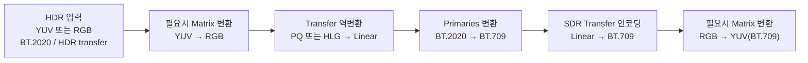
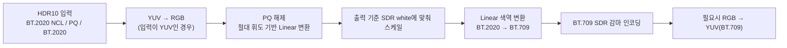
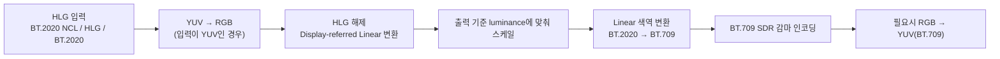
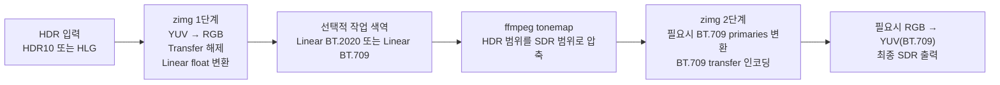
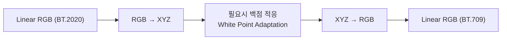

# zimg에서 HDR10 / HLG를 BT.709 SDR로 변환하는 과정

이 문서는 `zimg`가 HDR 계열 입력을 `BT.709 SDR`로 바꿀 때, 내부적으로 어떤 **색공간 변환 흐름**을 거치는지 설명한다.
소스코드 해설이 아니라, `zimg`가 변환을 어떤 단계로 쪼개서 처리하는지에 초점을 둔다.

## 먼저 정리할 점

`zimg`는 색공간 변환을 보통 아래 3개 축으로 나눠서 처리한다.

- `matrix` : YUV ↔ RGB 같은 행렬 계열 변환
- `transfer` : PQ, HLG, BT.709 같은 감마/전달함수 변환
- `primaries` : BT.2020, BT.709 같은 원색(색역) 변환

즉, `HDR10 -> BT.709` 같은 요청도 내부적으로는 보통 다음처럼 분해된다.

1. 필요하면 `YUV -> RGB`
2. HDR 전달함수를 풀어서 `linear light`로 변환
3. `BT.2020 -> BT.709` 색역 변환
4. `BT.709 SDR` 전달함수로 다시 인코딩
5. 필요하면 `RGB -> YUV`

## 공통 블록 다이어그램

핵심은 두 가지다.

- **색역 변환은 선형광(linear light)에서 수행**된다.
- `BT.709` 출력이 RGB인지 YUV인지에 따라 마지막 `matrix` 단계가 붙을 수도 있고 생략될 수도 있다.

---

## 1) HDR10 → BT.709 SDR

여기서 말하는 HDR10 입력은 보통 다음 조합을 뜻한다.

- `Matrix`: `BT.2020 NCL`
- `Transfer`: `ST.2084 (PQ)`
- `Primaries`: `BT.2020`

### 변환 흐름

### 각 단계의 의미

#### 1. YUV → RGB
- 입력이 HDR10 영상이라면 대개 YUV로 들어온다.
- `zimg`는 먼저 이를 RGB 영역으로 풀어낸다.
- 이미 RGB라면 이 단계는 생략된다.

#### 2. PQ(ST.2084) → Linear
- PQ는 **절대 휘도 기반** 전달함수다.
- `zimg`는 PQ를 풀어 선형광으로 바꾼다.
- 이때 결과는 단순한 “감마 제거”가 아니라, **실제 휘도 레벨을 반영한 선형값**에 가깝다.

#### 3. SDR 기준 white로 스케일
- `zimg`에는 `nominal_peak_luminance` 개념이 있다.
- 기본적으로 SDR 기준 white를 `100 cd/m²`로 보는 쪽에 가깝다.
- 그래서 PQ를 선형광으로 푼 뒤, HDR 휘도를 SDR 기준 white에 대한 **배수** 형태로 정규화한다.

예를 들어 개념적으로는 다음처럼 이해하면 된다.

- `100 nit` 부근은 `linear 1.0`
- `1000 nit`는 `linear 10.0`
- `4000 nit`는 `linear 40.0`

즉, 이 단계만으로는 HDR 하이라이트가 SDR 범위 안으로 들어오지 않는다.

#### 4. BT.2020 → BT.709 색역 변환
- 색역 변환은 **선형광 상태**에서 수행된다.
- `zimg`는 `BT.2020` 원색계에서 `BT.709` 원색계로 3x3 행렬 변환을 적용한다.
- HDR10과 BT.709는 모두 보통 `D65` 백점을 쓰므로, 백점 적응은 거의 문제가 되지 않는다.

#### 5. BT.709 SDR로 인코딩
- 선형 `BT.709 RGB`를 다시 SDR 전달함수로 인코딩한다.
- 실사용 관점에서는 `BT.709 SDR 디스플레이용 감마`로 내보낸다고 보면 된다.

#### 6. 필요시 RGB → YUV(BT.709)
- 최종 출력이 파일/비디오용 YUV 709라면 마지막에 이 단계가 붙는다.
- 출력이 RGB 709라면 생략된다.

### 중요한 제한 사항

`zimg`는 여기서 **진짜 HDR→SDR 톤매핑**을 해주지 않는다.

즉,

- 하이라이트 롤오프
- perceptual compression
- highlight desaturation
- scene-adaptive tone mapping

같은 처리는 기본 변환 체인에 없다.

그래서 HDR10을 그대로 `BT.709 SDR`로 보내면,

- 선형 단계에서 `1.0`을 초과하는 값이 많이 생길 수 있고
- 최종 SDR 범위에 맞추는 과정에서 **클리핑** 또는 **너무 강한 대비**가 생길 수 있다

즉, `zimg`는 **색공간 변환은 해주지만, 보기 좋게 SDR로 눌러주는 톤매퍼는 아니다**.

---

## 2) HLG → BT.709 SDR

여기서 말하는 HLG 입력은 보통 다음 조합을 뜻한다.

- `Matrix`: `BT.2020 NCL`
- `Transfer`: `ARIB B67 (HLG)`
- `Primaries`: `BT.2020`

### 변환 흐름

### 각 단계의 의미

#### 1. YUV → RGB
- HDR10과 마찬가지로, 입력이 YUV라면 먼저 RGB로 변환한다.

#### 2. HLG → Linear
- HLG는 PQ와 달리 완전한 절대 휘도 신호라기보다 **상대적 성격**이 강하다.
- `zimg`는 HLG를 선형광으로 풀 때, 사용 모드에 따라 scene-referred 또는 display-referred 해석을 할 수 있다.
- 일반적인 SDR 출력 변환 관점에서는 **display-referred linear**로 해석하는 흐름으로 보면 된다.

#### 3. 출력 기준 luminance로 스케일
- `zimg`는 HLG를 선형화한 뒤에도 출력 기준 휘도에 맞춰 스케일링한다.
- 따라서 HLG 역시 선형 단계에서 SDR white보다 큰 값이 남을 수 있다.

#### 4. BT.2020 → BT.709 색역 변환
- 이 단계는 HDR10과 동일하다.
- 반드시 **선형광**에서 처리하는 것이 핵심이다.

#### 5. BT.709 SDR로 인코딩
- 선형 `BT.709` 결과를 SDR용 `BT.709` 감마 신호로 다시 인코딩한다.

#### 6. 필요시 RGB → YUV(BT.709)
- 출력 형식이 방송/압축 비디오용이면 마지막에 YUV 709 행렬 변환이 붙는다.

### HLG에서 봐야 할 점

HLG는 PQ보다 SDR 친화적으로 느껴질 수 있지만, `zimg`가 자동으로 “좋은 SDR 톤”을 만들어 주는 것은 아니다.

즉 HLG → BT.709도 결국은:

- 전달함수 해제
- 선형 색역 변환
- SDR 전달함수 재인코딩

이라는 **색공간 변환 중심**의 처리이며, 별도의 톤매핑 없이 바로 내보내면

- 밝은 부분이 기대보다 강하게 남거나
- SDR 범위에서 눌리면서 자연스럽지 않게 보일 수 있다

---

## HDR10과 HLG의 차이 요약

| 항목 | HDR10 → BT.709 | HLG → BT.709 |
|---|---|---|
| 입력 전달함수 | PQ / ST.2084 | HLG / ARIB B67 |
| 전달함수 성격 | 절대 휘도 기반 | 상대적/방송 지향 성격 |
| 선형화 후 의미 | 실제 휘도에 가까운 값 | display 기준 해석이 개입된 선형값 |
| 공통점 | 선형화 후 BT.2020 → BT.709 색역 변환 | 선형화 후 BT.2020 → BT.709 색역 변환 |
| 위험 요소 | 밝은 하이라이트가 쉽게 SDR 범위를 초과 | SDR 출력 시 기대보다 강한 하이라이트가 남을 수 있음 |
| zimg 기본 역할 | 색공간 변환 | 색공간 변환 |
| zimg가 기본으로 안 해주는 것 | 본격적인 톤매핑 | 본격적인 톤매핑 |

---

## 실무적으로 어떻게 이해하면 되는가

`zimg`만 놓고 보면 `HDR10/HLG -> BT.709`는 아래처럼 이해하는 게 정확하다.

- `zimg`는 **전달함수 변환 + 색역 변환 + YUV/RGB 행렬 변환**을 수행한다.
- 이 과정은 기술적으로 올바른 **색공간 변환**이다.
- 하지만 HDR 영상을 SDR에서 보기 좋게 만들기 위한 **톤매핑 엔진**은 별도로 생각해야 한다.

즉, 실무 파이프라인은 보통 이렇게 나뉜다.

1. `zimg`로 HDR 신호를 선형광으로 해제
2. 필요하면 별도 톤매핑 수행
3. `BT.709 SDR`로 다시 인코딩

---

## 3) `ffmpeg tonemap` 알고리즘을 `zimg` 사이에 넣는 경우

중요한 점부터 정리하면, 이것은 `zimg` 내부에 톤매핑 기능을 넣는 것이 아니라
`ffmpeg` 필터 그래프에서 보통 `zscale(zimg) -> tonemap -> zscale(zimg)` 형태로 구성하는 것이다.

즉 역할 분담은 다음과 같다.

- 앞단 `zimg` : HDR 신호를 **float + linear light** 작업 공간으로 변환
- `ffmpeg tonemap` : HDR 밝기 범위를 SDR 범위 안으로 압축
- 뒷단 `zimg` : `BT.709` 색역/전달함수/매트릭스로 최종 인코딩

### 왜 중간에 들어가야 하는가

`ffmpeg`의 `tonemap` 필터는 다음 조건을 전제로 동작한다.

- 입력이 **single precision float**
- 입력이 **linear light**
- 출력이 범위를 벗어날 수도 있으므로, 뒤에서 다시 `zimg` 같은 필터로 usable format으로 변환 필요

즉 `zimg`가 먼저 해줘야 하는 일은 “톤매핑 가능한 작업 공간 만들기”다.

### 전체 파이프라인

### HDR10에서의 흐름

HDR10이라면 보통 다음 순서로 이해하면 된다.

1. `zimg`가 `PQ`를 풀어 선형광으로 만든다.
2. 필요하면 작업 색역을 `BT.2020` 또는 `BT.709` 선형 RGB로 맞춘다.
3. `ffmpeg tonemap`이 선형광 상태에서 하이라이트를 SDR 범위 안으로 눌러준다.
4. `zimg`가 결과를 `BT.709 SDR` 감마와 필요시 `BT.709 YUV`로 인코딩한다.

여기서 핵심 변화는, 기존 `zimg` 단독 경로에서는 `linear 1.0`을 넘는 HDR 하이라이트가 그대로 남았지만,
`tonemap`이 들어가면 이 구간이 SDR 범위 안으로 압축된다는 점이다.

### HLG에서의 흐름

HLG도 구조는 같다.

1. `zimg`가 `HLG`를 선형광으로 푼다.
2. `ffmpeg tonemap`이 선형광에서 SDR에 맞게 밝기 범위를 압축한다.
3. `zimg`가 `BT.709 SDR`로 인코딩한다.

즉 HLG가 PQ보다 SDR 친화적이라 해도, 톤매핑을 사이에 넣으면
밝은 영역을 더 안정적으로 제어할 수 있다.

### `tonemap` 알고리즘이 하는 일

`ffmpeg tonemap`은 선형광에서 픽셀의 밝기 신호를 기준으로 압축 곡선을 적용하고,
그 결과를 RGB 채널 전체에 같은 비율로 반영해 색 비율이 크게 깨지지 않도록 처리한다.

대표 알고리즘의 성격은 다음과 같다.

| 알고리즘 | 성격 |
|---|---|
| `none` | 톤매핑은 하지 않고, 너무 밝은 영역에 desaturation만 적용 |
| `clip` | 범위를 넘는 값을 하드 클리핑 |
| `linear` | 전체 범위를 선형 비율로 축소 |
| `gamma` | 감마 계열 곡선으로 압축 |
| `reinhard` | 전체 밝기 보존에 유리하지만 평탄해질 수 있음 |
| `hable` | 밝은/어두운 디테일 보존이 좋고 전체가 약간 어두워질 수 있음 |
| `mobius` | 일정 구간 아래는 거의 1:1로 유지하고, 초과 구간만 부드럽게 압축 |

실무적으로는 아래처럼 이해하면 된다.

- 색 정확도를 우선하면 `mobius`
- 단순하고 예측 가능한 결과가 필요하면 `clip` 또는 `linear`
- 밝기 균형을 쉽게 잡고 싶으면 `reinhard`
- 하이라이트와 암부 디테일을 더 살리고 싶으면 `hable`

### 함께 조정하는 옵션

`ffmpeg tonemap`을 끼우면 보통 아래 파라미터를 같이 보게 된다.

- `param` : 알고리즘별 곡선 모양 조절
- `desat` : 과포화 하이라이트를 흰색 쪽으로 얼마나 부드럽게 보내는지 조절
- `peak` : 소스 peak 정보를 강제로 지정할 때 사용

특히 메타데이터의 peak 정보가 부정확하면, `peak` 설정이 결과에 직접적인 영향을 준다.

### 결과적으로 변환 과정이 어떻게 달라지는가

`zimg`만 사용할 때:

1. 선형화
2. 색역 변환
3. SDR 인코딩

`zimg + tonemap + zimg`를 사용할 때:

1. 선형화
2. HDR 범위 압축
3. 색역/전달함수 최종 인코딩

즉 `tonemap`이 추가되면, 전체 과정은 더 이상 단순한 **색공간 변환**이 아니라
`HDR의 동적 범위를 SDR의 표현 한계에 맞게 재배치하는 과정`까지 포함하게 된다.

---

## 4) 이론적으로 보면 왜 `XYZ`가 등장하는가

앞의 블록도에서는 `XYZ`를 독립 단계로 그리지 않았지만,
색역 변환을 이론적으로 풀어 쓰면 `XYZ`는 분명히 등장한다.

핵심은 다음이다.

- 실무 파이프라인 관점에서는 `zimg`가 `linear RGB -> linear RGB` 행렬로 바로 처리한다.
- 이 행렬은 수학적으로는 `RGB -> XYZ -> RGB`를 접어 놓은 형태다.
- 따라서 `XYZ`는 **명시적 작업 공간**이라기보다 **색역 변환 행렬을 만드는 기준 공간**으로 이해하는 편이 정확하다.

### 이론적 색역 변환 다이어그램

### 왜 메인 블록도에는 뺐는가

메인 블록도는 **실제 필터 체인**을 보여주기 위한 것이다.
`zimg`는 보통 중간 프레임을 `XYZ` 포맷으로 노출하지 않고, 위 과정을 하나의 `gamut matrix`로 합쳐서 적용한다.

즉 사용자 관점의 실제 처리 순서는 보통 이렇게 보인다.

1. `PQ` 또는 `HLG`를 풀어 `linear RGB`로 변환
2. `BT.2020 -> BT.709` gamut matrix 적용
3. 필요하면 `tonemap`
4. `BT.709 SDR`로 인코딩

하지만 이 2번의 내부 수학을 풀어 쓰면 사실상 아래와 같다.

1. `Linear RGB (BT.2020) -> XYZ`
2. 필요하면 백점 적응
3. `XYZ -> Linear RGB (BT.709)`

### `tonemap`과 `XYZ`의 관계

여기서 중요한 점은 `ffmpeg tonemap`을 설명할 때도 `XYZ`를 메인 단계로 넣지 않는 것이 더 실용적이라는 것이다.

- `tonemap` 필터는 **linear light**를 요구한다.
- 보통 실무에서는 `linear RGB` 상태에서 톤매핑을 적용한다.
- 즉 `XYZ`는 색역 변환의 이론 설명에는 유용하지만, 톤매핑이 직접 작동하는 대표 작업 공간으로 설명할 필요는 없다.

그래서 문서 구조를 다음처럼 나눈 것이다.

- 메인 블록도: 실제 필터 체인
- 보조 블록도: 색역 변환의 이론적 `XYZ` 경유 설명

### BT.2020 → BT.709에서의 해석

HDR10이든 HLG든, 원색이 `BT.2020`이고 출력이 `BT.709`라면
색역 변환 부분의 이론은 동일하다.

- 입력 원색계의 선형 RGB를 `XYZ`로 보낸다.
- 필요하면 백점 보정을 고려한다.
- 출력 원색계의 선형 RGB로 되돌린다.

`BT.2020`과 `BT.709`는 보통 둘 다 `D65`를 사용하므로, 실제 구현에서는
백점 적응이 거의 항등에 가깝게 동작하는 경우가 많다.

즉 정리하면:

- 메인 파이프라인에서 `XYZ`가 안 보이는 것은 **생략**이 아니라 **행렬 내부로 접혀 있기 때문**
- 이론적으로는 `BT.2020 RGB -> XYZ -> BT.709 RGB`로 이해하는 것이 맞음

---

## 한 줄 요약

- `HDR10 -> BT.709`: **PQ를 풀고, BT.2020을 BT.709로 바꾸고, SDR 감마로 다시 감싼다**
- `HLG -> BT.709`: **HLG를 풀고, BT.2020을 BT.709로 바꾸고, SDR 감마로 다시 감싼다**
- 둘 다 `zimg`만으로는 **완성도 높은 HDR→SDR 톤매핑**까지 자동으로 해결하지는 않는다
- `ffmpeg tonemap`을 그 사이에 넣으면, **linear light 단계에서 HDR 밝기 범위를 SDR용으로 압축한 뒤** `BT.709`로 마무리하게 된다
